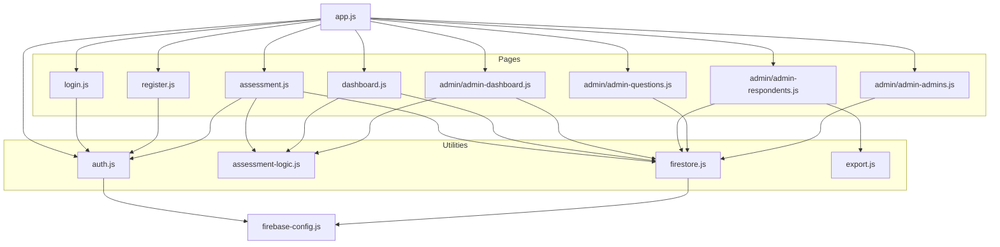
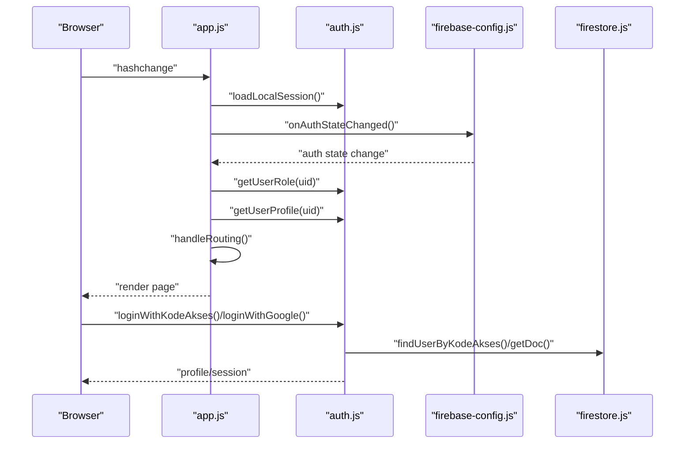
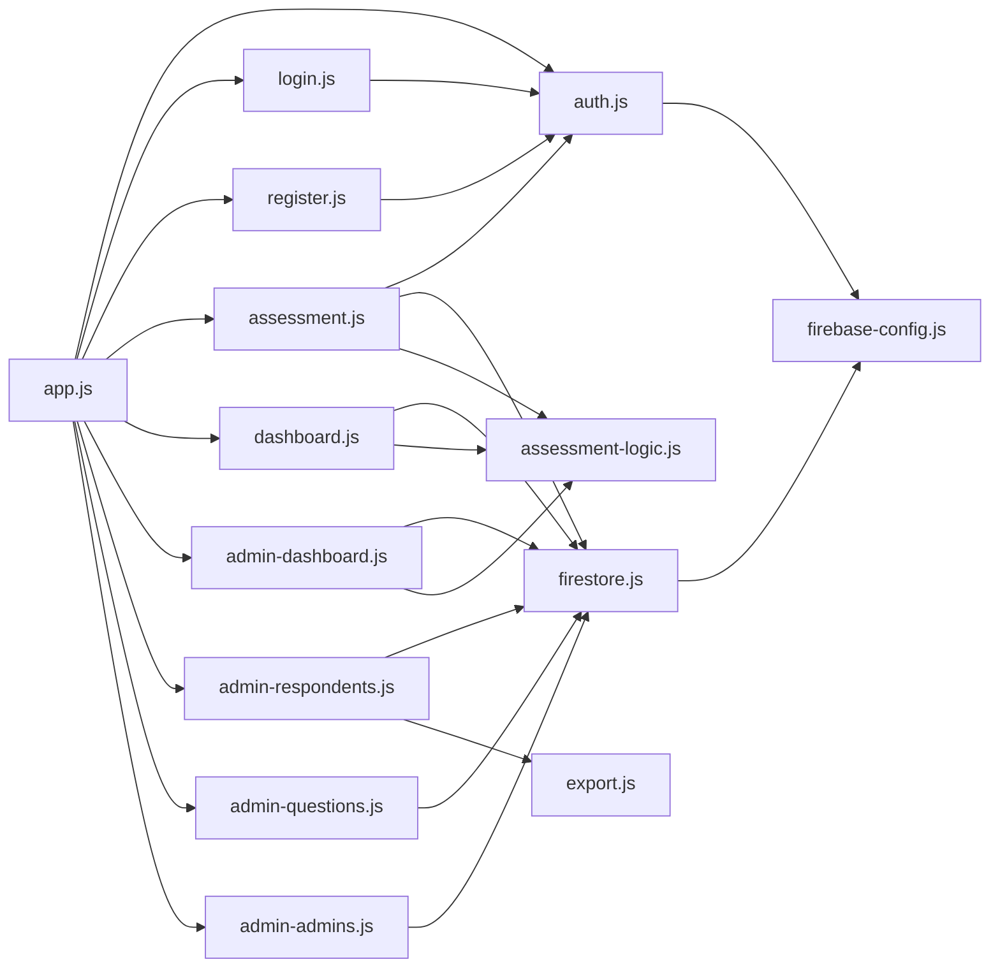

# API Reference

<cite>
**Referenced Files in This Document**
- [auth.js](file://utils/auth.js)
- [assessment-logic.js](file://utils/assessment-logic.js)
- [firestore.js](file://utils/firestore.js)
- [export.js](file://utils/export.js)
- [login.js](file://pages/login.js)
- [register.js](file://pages/register.js)
- [assessment.js](file://pages/assessment.js)
- [dashboard.js](file://pages/dashboard.js)
- [admin-dashboard.js](file://pages/admin/admin-dashboard.js)
- [admin-respondents.js](file://pages/admin/admin-respondents.js)
- [admin-questions.js](file://pages/admin/admin-questions.js)
- [admin-admins.js](file://pages/admin/admin-admins.js)
- [app.js](file://app.js)
- [firebase-config.js](file://firebase-config.js)
</cite>

## Table of Contents
1. [Introduction](#introduction)
2. [Project Structure](#project-structure)
3. [Core Components](#core-components)
4. [Architecture Overview](#architecture-overview)
5. [Detailed Component Analysis](#detailed-component-analysis)
6. [Dependency Analysis](#dependency-analysis)
7. [Performance Considerations](#performance-considerations)
8. [Troubleshooting Guide](#troubleshooting-guide)
9. [Conclusion](#conclusion)

## Introduction
This API Reference documents the public interfaces and utility functions of the CGMI Assessment App. It covers:
- Authentication API endpoints for user login/logout and session management
- Assessment API for scoring, recommendations, and result calculation
- Firestore operations API for CRUD and query methods
- Export API for CSV generation and analytics
- Practical usage scenarios and integration guidelines

## Project Structure
The application follows a modular structure with utilities encapsulating shared logic and pages orchestrating UI and user flows.

**Diagram sources**
- [app.js:1-173](file://app.js#L1-L173)
- [auth.js:1-172](file://utils/auth.js#L1-L172)
- [assessment-logic.js:1-211](file://utils/assessment-logic.js#L1-L211)
- [firestore.js:1-180](file://utils/firestore.js#L1-L180)
- [export.js:1-66](file://utils/export.js#L1-L66)
- [login.js:1-131](file://pages/login.js#L1-L131)
- [register.js:1-160](file://pages/register.js#L1-L160)
- [assessment.js:1-193](file://pages/assessment.js#L1-L193)
- [dashboard.js:1-237](file://pages/dashboard.js#L1-L237)
- [admin-dashboard.js:1-165](file://pages/admin/admin-dashboard.js#L1-L165)
- [admin-respondents.js:1-217](file://pages/admin/admin-respondents.js#L1-L217)
- [admin-questions.js:1-252](file://pages/admin/admin-questions.js#L1-L252)
- [admin-admins.js:1-146](file://pages/admin/admin-admins.js#L1-L146)
- [firebase-config.js:1-30](file://firebase-config.js#L1-L30)

**Section sources**
- [app.js:1-173](file://app.js#L1-L173)
- [firebase-config.js:1-30](file://firebase-config.js#L1-L30)

## Core Components
- Authentication Utilities: user registration, login, logout, session persistence, and role/profile retrieval
- Assessment Logic: scoring, maturity levels, and recommendations
- Firestore Operations: CRUD and query helpers for questions, assessments, users, and admins
- Export Utilities: CSV conversion and download
- Pages: UI orchestration for login, registration, assessment, dashboard, and admin panels

**Section sources**
- [auth.js:1-172](file://utils/auth.js#L1-L172)
- [assessment-logic.js:1-211](file://utils/assessment-logic.js#L1-L211)
- [firestore.js:1-180](file://utils/firestore.js#L1-L180)
- [export.js:1-66](file://utils/export.js#L1-L66)

## Architecture Overview
The app integrates Firebase Authentication and Firestore. The SPA router coordinates route guards and renders pages. Authentication is hybrid: local storage for user sessions and Firebase for admin sessions.

**Diagram sources**
- [app.js:47-166](file://app.js#L47-L166)
- [auth.js:32-171](file://utils/auth.js#L32-L171)
- [firebase-config.js:10-27](file://firebase-config.js#L10-L27)
- [firestore.js:104-116](file://utils/firestore.js#L104-L116)

## Detailed Component Analysis

### Authentication API
Public functions for user and admin authentication, session management, and role/profile retrieval.

- registerUser({ instansi, lamaBekerja, jabatan })
  - Purpose: Create a new user record with a generated UUID and 6-digit Kode Akses
  - Parameters:
    - instansi: string
    - lamaBekerja: string
    - jabatan: string
  - Returns: object with uuid, kodeAkses, and profile fields
  - Errors: None thrown by function; errors surfaced via exceptions
  - Usage scenario: New organization registration
  - Integration: Called from registration page initialization

- loginWithKodeAkses(kodeAkses)
  - Purpose: Authenticate user by Kode Akses
  - Parameters:
    - kodeAkses: string (6 digits)
  - Returns: user profile object
  - Errors: Throws error if Kode Akses not found
  - Usage scenario: User login via Kode Akses
  - Integration: Used in login page form submission

- loginWithGoogle()
  - Purpose: Admin Google OAuth login with whitelist verification
  - Parameters: none
  - Returns: object with user and adminData
  - Errors: Throws error if not whitelisted
  - Usage scenario: Admin login via Google
  - Integration: Used in login page Google button

- logout()
  - Purpose: Admin Firebase logout
  - Parameters: none
  - Returns: void
  - Errors: None thrown by function
  - Usage scenario: Admin logout
  - Integration: Admin layout logout action

- logoutUser()
  - Purpose: Clear user session from localStorage
  - Parameters: none
  - Returns: void
  - Errors: None thrown by function
  - Usage scenario: User logout
  - Integration: User navigation actions

- saveUserSession(profile)
  - Purpose: Persist user session to localStorage
  - Parameters: profile object
  - Returns: void
  - Errors: None thrown by function
  - Usage scenario: Session persistence after login
  - Integration: Used after successful login

- getUserSession()
  - Purpose: Retrieve persisted user session
  - Parameters: none
  - Returns: session object or null
  - Errors: None thrown by function
  - Usage scenario: Hydration on app load
  - Integration: Used by router

- getUserRole(uid)
  - Purpose: Determine role by checking admins collections
  - Parameters: uid string
  - Returns: 'admin' | 'user' | null
  - Errors: None thrown by function
  - Usage scenario: Route guards and UI rendering
  - Integration: Used by router and admin pages

- getUserProfile(uid)
  - Purpose: Fetch full user/admin profile
  - Parameters: uid string
  - Returns: profile object or null
  - Errors: None thrown by function
  - Usage scenario: Dashboard and admin panels
  - Integration: Used by dashboard and admin pages

- onAuthStateChanged(callback)
  - Purpose: Subscribe to Firebase auth state changes
  - Parameters: callback function
  - Returns: unsubscribe function
  - Errors: None thrown by function
  - Usage scenario: Real-time auth updates
  - Integration: Used by router

Practical examples:
- User registration flow: registerUser -> saveUserSession -> redirect to dashboard
- User login flow: loginWithKodeAkses -> saveUserSession -> redirect to dashboard
- Admin login flow: loginWithGoogle -> getUserRole -> redirect to admin dashboard
- Session hydration: getUserSession -> onAuthStateChanged

**Section sources**
- [auth.js:32-171](file://utils/auth.js#L32-L171)
- [login.js:70-129](file://pages/login.js#L70-L129)
- [register.js:91-158](file://pages/register.js#L91-L158)
- [app.js:47-166](file://app.js#L47-L166)

### Assessment API
Scoring algorithms, maturity level determination, and recommendation generation.

- DIMENSIONS
  - Type: Array of objects with keys: key, label
  - Usage: Defines assessment dimensions for UI and calculations

- LIKERT_LABELS
  - Type: Object mapping 1-5 to descriptive labels
  - Usage: UI labels for Likert scale

- DEFAULT_QUESTIONS
  - Type: Array of question objects with id, dimension, dimensionKey, order, text
  - Usage: Seed data for admin panel

- MATURITY_LEVELS
  - Type: Array of maturity level objects with thresholds and styling
  - Usage: Maturity classification and UI badges

- RECOMMENDATIONS
  - Type: Object keyed by dimension key with threshold and text
  - Usage: Generate actionable recommendations

- getMaturityLevel(score)
  - Purpose: Map numeric score to maturity level object
  - Parameters: score number
  - Returns: maturity level object
  - Errors: None thrown by function
  - Usage scenario: Dashboard and admin charts

- calculateScores(questions, answers)
  - Purpose: Compute per-dimension averages and total average
  - Parameters:
    - questions: array of question objects
    - answers: object mapping questionId to score (1-5)
  - Returns: { scoresPerDimension, totalAverageScore }
  - Errors: None thrown by function
  - Usage scenario: Assessment submission

- getRecommendations(scoresPerDimension)
  - Purpose: Generate recommendations for low-scoring dimensions
  - Parameters: scoresPerDimension object
  - Returns: array of recommendation objects
  - Errors: None thrown by function
  - Usage scenario: Dashboard recommendations panel

Practical examples:
- Scoring pipeline: collect answers -> calculateScores -> getMaturityLevel -> persist assessment
- Recommendation engine: pass scoresPerDimension -> getRecommendations -> render cards

**Section sources**
- [assessment-logic.js:6-211](file://utils/assessment-logic.js#L6-L211)
- [assessment.js:170-187](file://pages/assessment.js#L170-L187)
- [dashboard.js:153-173](file://pages/dashboard.js#L153-L173)

### Firestore Operations API
CRUD and query helpers for questions, assessments, users, and admins.

- Questions
  - getQuestions(): returns ordered questions
  - addQuestion(data): adds a new question
  - updateQuestion(id, data): updates a question
  - deleteQuestion(id): deletes a question
  - seedQuestions(defaultQuestions): seeds default questions if collection is empty

- Assessments
  - submitAssessment(data): creates a new assessment
  - getUserAssessments(userId): retrieves all assessments for a user
  - getLatestAssessment(userId): retrieves the latest assessment for a user
  - getAllAssessments(): retrieves all assessments
  - getAssessmentById(id): retrieves a specific assessment

- Users
  - getUser(uid): retrieves a user by ID
  - getAllUsers(): retrieves all users
  - findUserByKodeAkses(kodeAkses): finds user by Kode Akses
  - saveUserProfile(uuid, data): saves user profile

- Admins
  - getAllAdmins(): retrieves all admins
  - addAdmin(uid, data): adds admin with normalized email
  - deleteAdmin(uid): deletes admin
  - isAdminEmail(email): checks if email is admin
  - getAdminByEmail(email): retrieves admin by email (with fallbacks)

- Utility
  - normalizeEmail(email): lowercases and trims email

Practical examples:
- Admin panel CRUD: seedQuestions -> addQuestion/updateQuestion/deleteQuestion
- Assessment submission: submitAssessment with calculated scores
- Dashboard data: getLatestAssessment -> render radar chart
- Admin analytics: getAllAssessments -> compute stats and distributions

**Section sources**
- [firestore.js:20-179](file://utils/firestore.js#L20-L179)
- [assessment.js:70-79](file://pages/assessment.js#L70-L79)
- [admin-questions.js:94-251](file://pages/admin/admin-questions.js#L94-L251)
- [admin-respondents.js:87-216](file://pages/admin/admin-respondents.js#L87-L216)
- [admin-dashboard.js:80-164](file://pages/admin/admin-dashboard.js#L80-L164)

### Export API
CSV generation and download utilities for analytics.

- assessmentsToCsv(assessments)
  - Purpose: Convert assessment list to CSV string
  - Parameters: assessments array
  - Returns: CSV string with headers and rows
  - Errors: None thrown by function
  - Usage scenario: Admin respondents export

- downloadCsv(csvContent, filename)
  - Purpose: Trigger browser download of CSV
  - Parameters:
    - csvContent: string
    - filename: string (optional)
  - Returns: void
  - Errors: None thrown by function
  - Usage scenario: Export trigger

- exportAssessments(assessments)
  - Purpose: One-shot CSV generation and download
  - Parameters: assessments array
  - Returns: void
  - Errors: None thrown by function
  - Usage scenario: Admin export action

Practical examples:
- Bulk export: exportAssessments(allAssessments) -> downloads CSV
- Custom filename: downloadCsv(csv, 'custom-filename.csv')

**Section sources**
- [export.js:9-65](file://utils/export.js#L9-L65)
- [admin-respondents.js:152-162](file://pages/admin/admin-respondents.js#L152-L162)

### Page-Level Integration Examples

#### Login Page
- Renders dual tabs for user and admin login
- Handles Kode Akses validation and submission
- Integrates Google OAuth for admin login
- Uses toast notifications for feedback

Integration guidelines:
- Import loginWithKodeAkses and loginWithGoogle from auth.js
- Use saveUserSession after successful login
- Redirect to dashboard or admin based on role

**Section sources**
- [login.js:9-131](file://pages/login.js#L9-L131)

#### Registration Page
- Collects organization details and generates Kode Akses
- Displays generated Kode Akses in modal
- Saves session and redirects to dashboard

Integration guidelines:
- Import registerUser from auth.js
- Use saveUserSession after registration
- Validate form inputs before submission

**Section sources**
- [register.js:47-160](file://pages/register.js#L47-L160)

#### Assessment Page
- Loads questions from Firestore or defaults
- Renders Likert scale questions grouped by dimension
- Calculates scores and submits assessment
- Updates progress indicator

Integration guidelines:
- Import getQuestions and submitAssessment from firestore.js
- Import calculateScores and getMaturityLevel from assessment-logic.js
- Ensure all questions are answered before submission

**Section sources**
- [assessment.js:10-193](file://pages/assessment.js#L10-L193)

#### Dashboard Page
- Displays latest assessment results
- Renders radar chart visualization
- Shows maturity level and recommendations
- Provides link to retake assessment

Integration guidelines:
- Import getLatestAssessment from firestore.js
- Import getMaturityLevel and getRecommendations from assessment-logic.js
- Initialize Chart.js radar chart with DIMENSIONS and scores

**Section sources**
- [dashboard.js:10-237](file://pages/dashboard.js#L10-L237)

#### Admin Panels
- Admin Dashboard: aggregates statistics and displays maturity distribution
- Admin Respondents: manages CSV export and details modal
- Admin Questions: CRUD for questionnaire management
- Admin Admins: manages admin whitelist

Integration guidelines:
- Use getAllAssessments for analytics
- Use exportAssessments for CSV export
- Use seedQuestions for initial setup
- Use addAdmin/deleteAdmin for access management

**Section sources**
- [admin-dashboard.js:10-165](file://pages/admin/admin-dashboard.js#L10-L165)
- [admin-respondents.js:11-217](file://pages/admin/admin-respondents.js#L11-L217)
- [admin-questions.js:10-252](file://pages/admin/admin-questions.js#L10-L252)
- [admin-admins.js:9-146](file://pages/admin/admin-admins.js#L9-L146)

## Dependency Analysis
The system exhibits clear separation of concerns:
- Utilities encapsulate business logic and data access
- Pages depend on utilities for functionality
- Router coordinates navigation and authentication state
- Firebase provides backend services

**Diagram sources**
- [auth.js:6-15](file://utils/auth.js#L6-L15)
- [firestore.js:6-10](file://utils/firestore.js#L6-L10)
- [assessment.js:6-8](file://pages/assessment.js#L6-L8)
- [admin-respondents.js:6-7](file://pages/admin/admin-respondents.js#L6-L7)
- [app.js:7-24](file://app.js#L7-L24)

**Section sources**
- [auth.js:6-15](file://utils/auth.js#L6-L15)
- [firestore.js:6-10](file://utils/firestore.js#L6-L10)
- [assessment.js:6-8](file://pages/assessment.js#L6-L8)
- [admin-respondents.js:6-7](file://pages/admin/admin-respondents.js#L6-L7)
- [app.js:7-24](file://app.js#L7-L24)

## Performance Considerations
- Use Firestore queries with orderBy and where clauses to minimize data transfer
- Batch operations where possible (e.g., seedQuestions uses Promise.all)
- Debounce search inputs in admin panels
- Lazy-load Chart.js instances and destroy them on route changes
- Cache frequently accessed data (e.g., latest assessment) in memory
- Optimize CSV generation for large datasets by streaming or chunking

## Troubleshooting Guide
Common issues and resolutions:
- Authentication failures:
  - Verify Firebase configuration and credentials
  - Check admin whitelist entries for Google login
  - Ensure localStorage is accessible for user sessions
- Firestore permission denied:
  - Review Firestore rules for collections
  - Confirm user/admin roles and document ownership
- Assessment submission errors:
  - Validate all questions are answered
  - Check network connectivity and serverTimestamp usage
- CSV export issues:
  - Verify assessments array is not empty
  - Check browser download permissions
- Chart rendering problems:
  - Ensure canvas elements exist
  - Destroy previous chart instances before reinitialization

**Section sources**
- [login.js:100-107](file://pages/login.js#L100-L107)
- [assessment.js:164-168](file://pages/assessment.js#L164-L168)
- [admin-respondents.js:154-161](file://pages/admin/admin-respondents.js#L154-L161)
- [dashboard.js:233-235](file://pages/dashboard.js#L233-L235)

## Conclusion
This API Reference provides comprehensive coverage of the CGMI Assessment App's public interfaces and utilities. The modular design enables clear separation of concerns, while the hybrid authentication model supports both user and admin workflows. The assessment logic, Firestore operations, and export utilities form a cohesive foundation for data-driven collaboration governance evaluation.