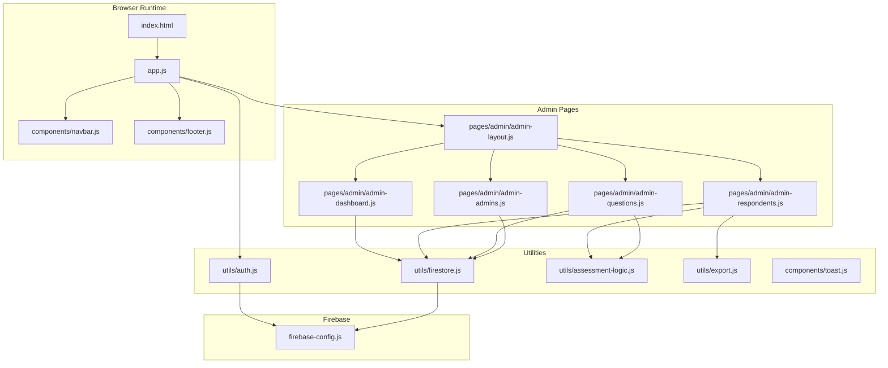
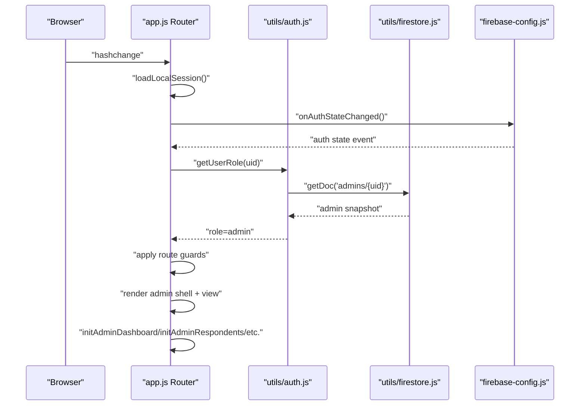
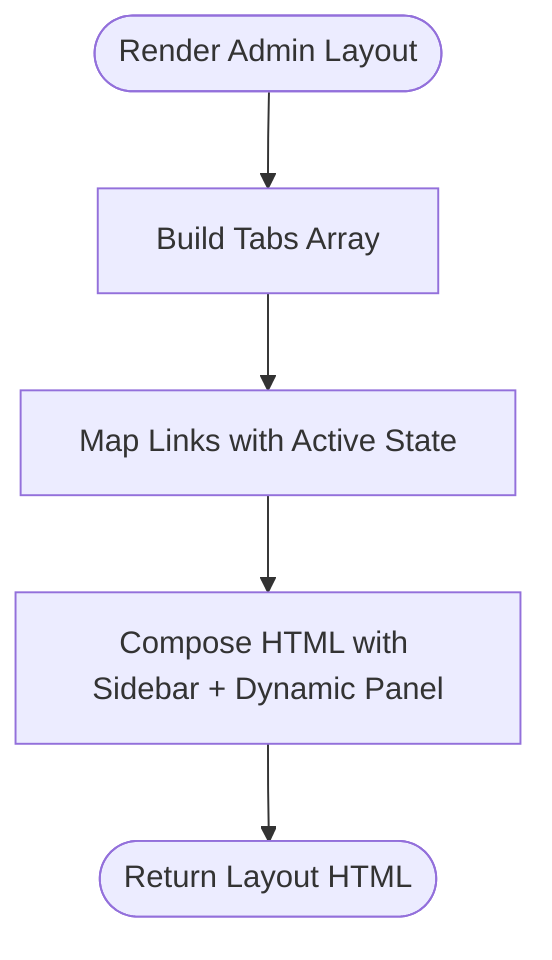
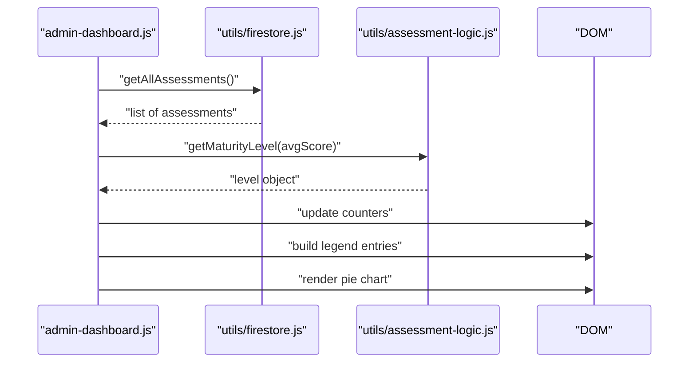
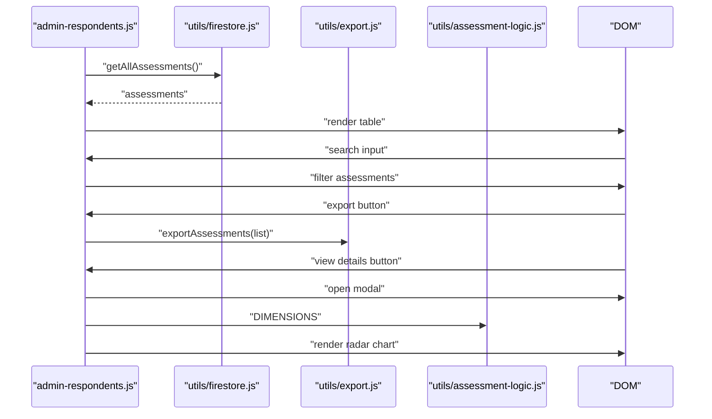
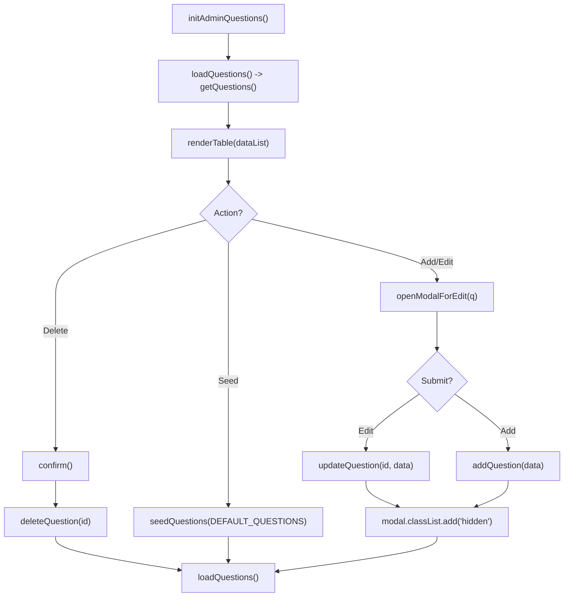
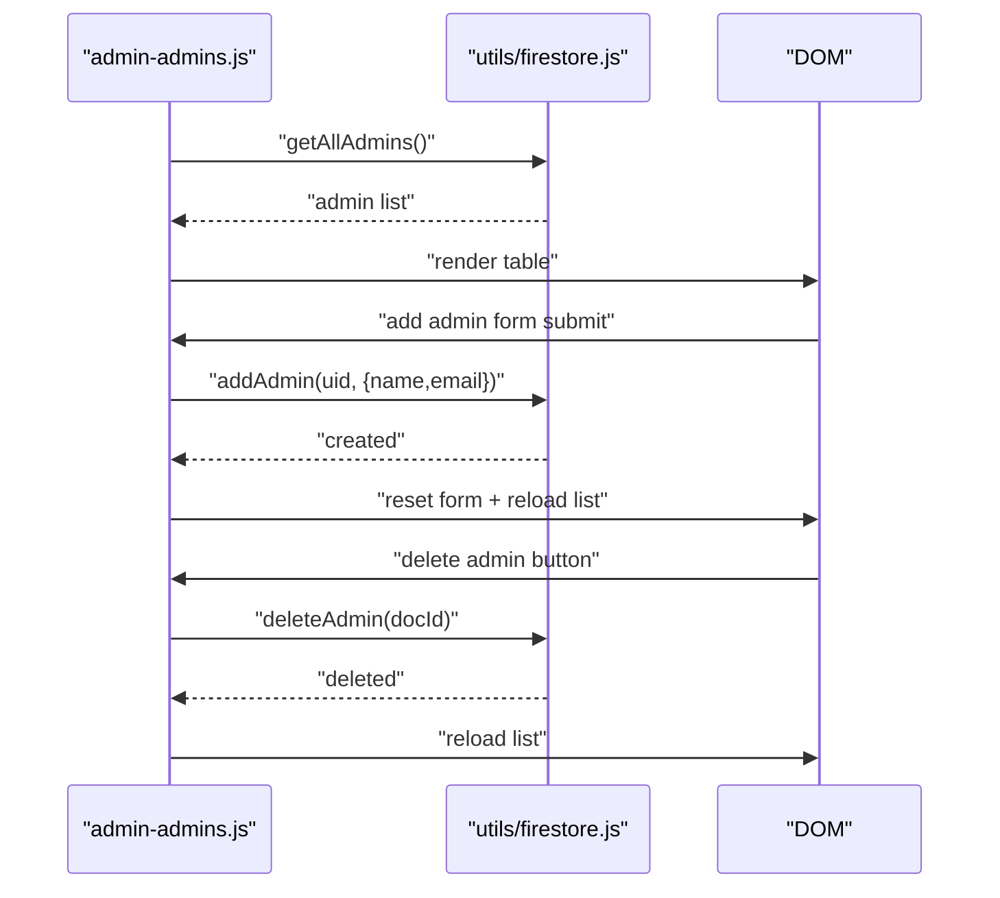
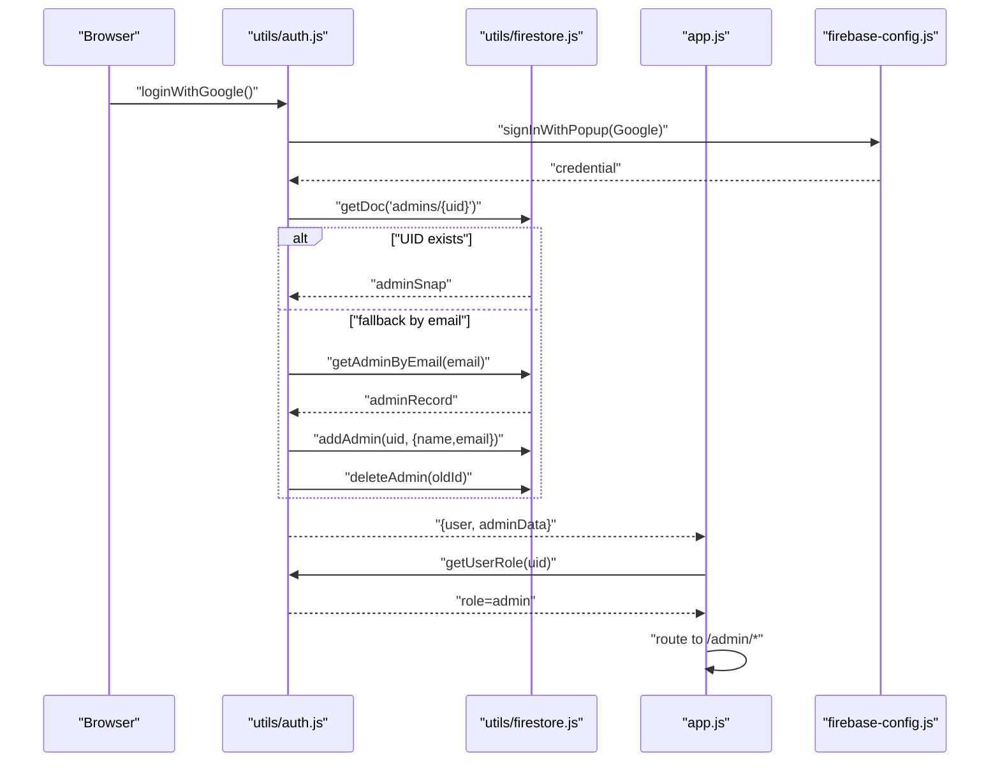
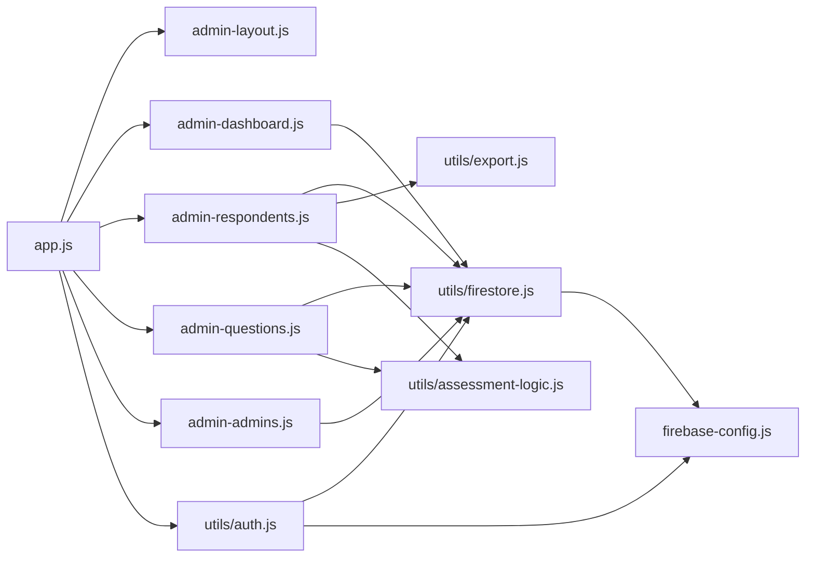

# Admin Panel

<cite>
**Referenced Files in This Document**
- [index.html](file://index.html)
- [app.js](file://app.js)
- [firebase-config.js](file://firebase-config.js)
- [pages/admin/admin-layout.js](file://pages/admin/admin-layout.js)
- [pages/admin/admin-dashboard.js](file://pages/admin/admin-dashboard.js)
- [pages/admin/admin-respondents.js](file://pages/admin/admin-respondents.js)
- [pages/admin/admin-questions.js](file://pages/admin/admin-questions.js)
- [pages/admin/admin-admins.js](file://pages/admin/admin-admins.js)
- [utils/auth.js](file://utils/auth.js)
- [utils/firestore.js](file://utils/firestore.js)
- [utils/assessment-logic.js](file://utils/assessment-logic.js)
- [utils/export.js](file://utils/export.js)
- [components/toast.js](file://components/toast.js)
</cite>

## Table of Contents
1. [Introduction](#introduction)
2. [Project Structure](#project-structure)
3. [Core Components](#core-components)
4. [Architecture Overview](#architecture-overview)
5. [Detailed Component Analysis](#detailed-component-analysis)
6. [Dependency Analysis](#dependency-analysis)
7. [Performance Considerations](#performance-considerations)
8. [Troubleshooting Guide](#troubleshooting-guide)
9. [Conclusion](#conclusion)

## Introduction
This document describes the administrative panel system for the CGMI assessment application. It covers the admin layout and navigation, dashboard analytics and reporting, CRUD operations for questions and administrators, user administration, and the admin authentication and role-based access control flow. It also documents the question creation/editing workflow, respondent management, and admin user management processes, along with examples of admin interface components and data manipulation patterns.

## Project Structure
The admin panel is a single-page application built with vanilla JavaScript and Firebase. The admin pages are organized under the pages/admin directory and integrated into the main routing system. The admin shell composes a sidebar navigation with dynamic content areas. The admin pages rely on shared utilities for authentication, Firestore operations, assessment logic, and notifications.

**Diagram sources**
- [index.html:63-78](file://index.html#L63-L78)
- [app.js:11-25](file://app.js#L11-L25)
- [pages/admin/admin-layout.js:6-62](file://pages/admin/admin-layout.js#L6-L62)
- [pages/admin/admin-dashboard.js:6-76](file://pages/admin/admin-dashboard.js#L6-L76)
- [pages/admin/admin-respondents.js:6-83](file://pages/admin/admin-respondents.js#L6-L83)
- [pages/admin/admin-questions.js:6-92](file://pages/admin/admin-questions.js#L6-L92)
- [pages/admin/admin-admins.js:6-62](file://pages/admin/admin-admins.js#L6-L62)
- [utils/auth.js:6-172](file://utils/auth.js#L6-L172)
- [utils/firestore.js:6-180](file://utils/firestore.js#L6-L180)
- [utils/assessment-logic.js:6-211](file://utils/assessment-logic.js#L6-L211)
- [utils/export.js:6-66](file://utils/export.js#L6-L66)
- [components/toast.js:6-83](file://components/toast.js#L6-L83)
- [firebase-config.js:10-30](file://firebase-config.js#L10-L30)

**Section sources**
- [index.html:63-78](file://index.html#L63-L78)
- [app.js:32-45](file://app.js#L32-L45)

## Core Components
- Admin Layout Shell: Provides a responsive two-column layout with a vertical sidebar and a dynamic content area. The active tab highlights the current admin subpage.
- Dashboard Analytics: Renders counters and a pie chart distribution of organizational maturity levels derived from assessment submissions.
- Respondent Management: Lists assessments with search, export to CSV, and a details modal with a radar chart per dimension.
- Questions Management: CRUD for questionnaire items with dimension grouping, ordering, and a bulk seeding mechanism.
- Multi-Admin Management: Whitelist management for admin users via Google email or UID-based records.

**Section sources**
- [pages/admin/admin-layout.js:6-62](file://pages/admin/admin-layout.js#L6-L62)
- [pages/admin/admin-dashboard.js:10-76](file://pages/admin/admin-dashboard.js#L10-L76)
- [pages/admin/admin-respondents.js:11-83](file://pages/admin/admin-respondents.js#L11-L83)
- [pages/admin/admin-questions.js:10-92](file://pages/admin/admin-questions.js#L10-L92)
- [pages/admin/admin-admins.js:9-62](file://pages/admin/admin-admins.js#L9-L62)

## Architecture Overview
The admin panel leverages a hybrid authentication model:
- Users authenticate with a code-based method and are stored locally in sessions.
- Admins authenticate via Google OAuth and are authorized against a whitelist stored in Firestore.

Routing enforces guest-only, authentication, and role-based guards. The admin shell composes views and initializes page-specific logic.

**Diagram sources**
- [app.js:62-127](file://app.js#L62-L127)
- [utils/auth.js:132-149](file://utils/auth.js#L132-L149)
- [utils/firestore.js:122-125](file://utils/firestore.js#L122-L125)
- [firebase-config.js:25-27](file://firebase-config.js#L25-L27)

## Detailed Component Analysis

### Admin Layout and Navigation
The admin layout renders a card header, a sidebar with four navigational links, and a dynamic content panel. The active tab is highlighted based on the current subview key.

**Diagram sources**
- [pages/admin/admin-layout.js:6-62](file://pages/admin/admin-layout.js#L6-L62)

**Section sources**
- [pages/admin/admin-layout.js:6-62](file://pages/admin/admin-layout.js#L6-L62)

### Admin Dashboard Analytics
The dashboard loads all assessments, computes totals, averages, and top maturity level, and renders a pie chart and legend. It uses Chart.js for visualization and displays skeleton loaders while loading.

**Diagram sources**
- [pages/admin/admin-dashboard.js:80-164](file://pages/admin/admin-dashboard.js#L80-L164)
- [utils/firestore.js:79-83](file://utils/firestore.js#L79-L83)
- [utils/assessment-logic.js:98-119](file://utils/assessment-logic.js#L98-L119)

**Section sources**
- [pages/admin/admin-dashboard.js:10-76](file://pages/admin/admin-dashboard.js#L10-L76)
- [pages/admin/admin-dashboard.js:80-164](file://pages/admin/admin-dashboard.js#L80-L164)

### Respondent Management
The respondents page lists assessments with search and export capabilities. Clicking “View Details” opens a modal with a radar chart of per-dimension scores and summary metrics.

**Diagram sources**
- [pages/admin/admin-respondents.js:87-217](file://pages/admin/admin-respondents.js#L87-L217)
- [utils/firestore.js:79-83](file://utils/firestore.js#L79-L83)
- [utils/export.js:62-66](file://utils/export.js#L62-L66)
- [utils/assessment-logic.js:6-13](file://utils/assessment-logic.js#L6-L13)

**Section sources**
- [pages/admin/admin-respondents.js:11-83](file://pages/admin/admin-respondents.js#L11-L83)
- [pages/admin/admin-respondents.js:87-217](file://pages/admin/admin-respondents.js#L87-L217)

### Questions Management (CRUD + Seeding)
The questions page supports adding, editing, deleting, and seeding default questions. It maintains a table of questions grouped by dimension and ordered by sequence.

**Diagram sources**
- [pages/admin/admin-questions.js:94-252](file://pages/admin/admin-questions.js#L94-L252)
- [utils/firestore.js:20-49](file://utils/firestore.js#L20-L49)
- [utils/assessment-logic.js:24-96](file://utils/assessment-logic.js#L24-L96)

**Section sources**
- [pages/admin/admin-questions.js:10-92](file://pages/admin/admin-questions.js#L10-L92)
- [pages/admin/admin-questions.js:94-252](file://pages/admin/admin-questions.js#L94-L252)

### Multi-Admin Management (Whitelist)
The admins page allows registering new admins via name and Gmail, listing active whitelist entries, and revoking access.

**Diagram sources**
- [pages/admin/admin-admins.js:64-146](file://pages/admin/admin-admins.js#L64-L146)
- [utils/firestore.js:122-141](file://utils/firestore.js#L122-L141)

**Section sources**
- [pages/admin/admin-admins.js:9-62](file://pages/admin/admin-admins.js#L9-L62)
- [pages/admin/admin-admins.js:64-146](file://pages/admin/admin-admins.js#L64-L146)

### Admin Authentication Flow and Role-Based Access Control
Admins authenticate via Google OAuth. The system checks Firestore for an admin record by UID or email and enforces role-based routing.

**Diagram sources**
- [utils/auth.js:58-104](file://utils/auth.js#L58-L104)
- [utils/firestore.js:122-141](file://utils/firestore.js#L122-L141)
- [app.js:40-45](file://app.js#L40-L45)
- [firebase-config.js:25-27](file://firebase-config.js#L25-L27)

**Section sources**
- [utils/auth.js:58-104](file://utils/auth.js#L58-L104)
- [utils/auth.js:131-149](file://utils/auth.js#L131-L149)
- [app.js:40-45](file://app.js#L40-L45)

## Dependency Analysis
The admin pages depend on shared utilities for data access, logic, and presentation. The router coordinates rendering and initialization of admin views.

**Diagram sources**
- [app.js:11-25](file://app.js#L11-L25)
- [pages/admin/admin-dashboard.js:6-8](file://pages/admin/admin-dashboard.js#L6-L8)
- [pages/admin/admin-respondents.js:6-9](file://pages/admin/admin-respondents.js#L6-L9)
- [pages/admin/admin-questions.js:6-8](file://pages/admin/admin-questions.js#L6-L8)
- [pages/admin/admin-admins.js:6-7](file://pages/admin/admin-admins.js#L6-L7)
- [utils/firestore.js:6-10](file://utils/firestore.js#L6-L10)
- [utils/export.js:6-66](file://utils/export.js#L6-L66)
- [utils/assessment-logic.js:6-211](file://utils/assessment-logic.js#L6-L211)
- [utils/auth.js:6-172](file://utils/auth.js#L6-L172)
- [firebase-config.js:10-30](file://firebase-config.js#L10-L30)

**Section sources**
- [app.js:11-25](file://app.js#L11-L25)
- [utils/firestore.js:6-180](file://utils/firestore.js#L6-L180)

## Performance Considerations
- Dashboard computations: The dashboard aggregates all assessments and calculates counts and averages. For very large datasets, consider pagination or server-side aggregation.
- Charts: Destroy previous Chart.js instances before creating new ones to prevent memory leaks.
- Rendering: Large tables are paginated implicitly by client-side filtering; consider virtualization for thousands of rows.
- Network: Firestore queries are executed on demand; cache results where appropriate to reduce repeated reads.

## Troubleshooting Guide
Common issues and resolutions:
- Admin login failures: Ensure the Google account is present in the admins collection by UID or email whitelist. The system clears local user sessions upon admin login.
- Empty dashboards: Verify assessments exist; the dashboard shows placeholders when no data is found.
- CSV export errors: Confirm assessments are loaded before exporting; the export utility handles missing data gracefully.
- Toast notifications: The toast system provides feedback for success, error, warning, and info messages.

**Section sources**
- [utils/auth.js:106-114](file://utils/auth.js#L106-L114)
- [pages/admin/admin-dashboard.js:90-95](file://pages/admin/admin-dashboard.js#L90-L95)
- [pages/admin/admin-respondents.js:152-162](file://pages/admin/admin-respondents.js#L152-L162)
- [components/toast.js:41-83](file://components/toast.js#L41-L83)

## Conclusion
The admin panel integrates a clean layout, robust analytics, and practical administrative tools. It supports secure admin access via Google OAuth, manages questionnaire content, and provides comprehensive reporting on organizational collaboration maturity. The modular design and shared utilities enable maintainable extensions and enhancements.