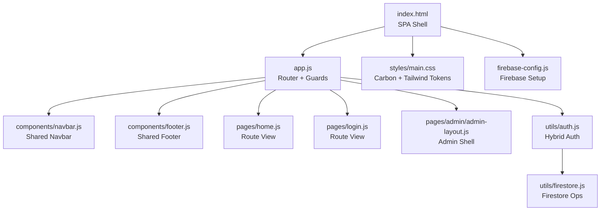
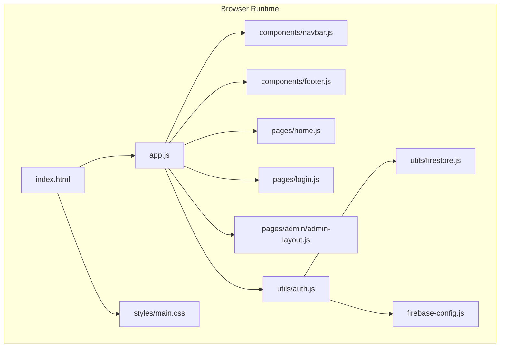
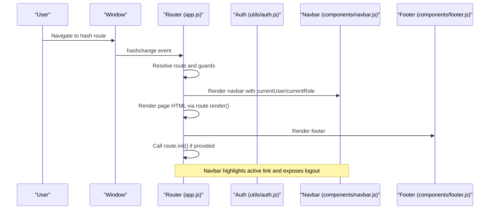
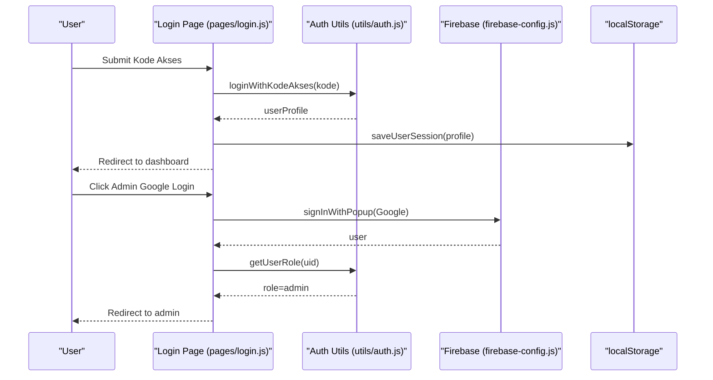
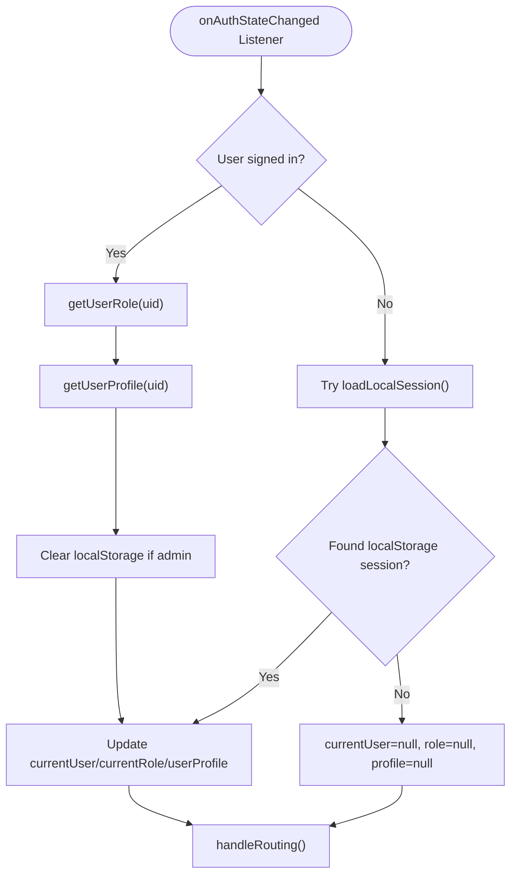
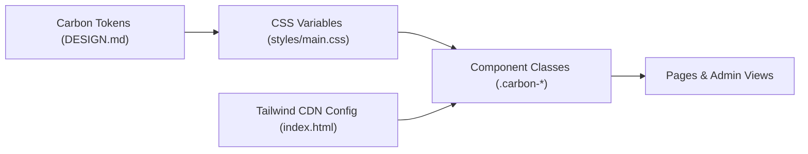
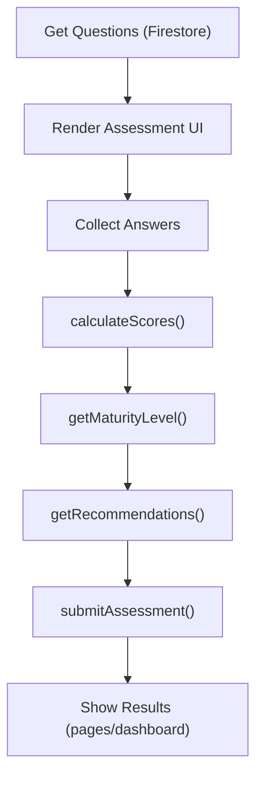
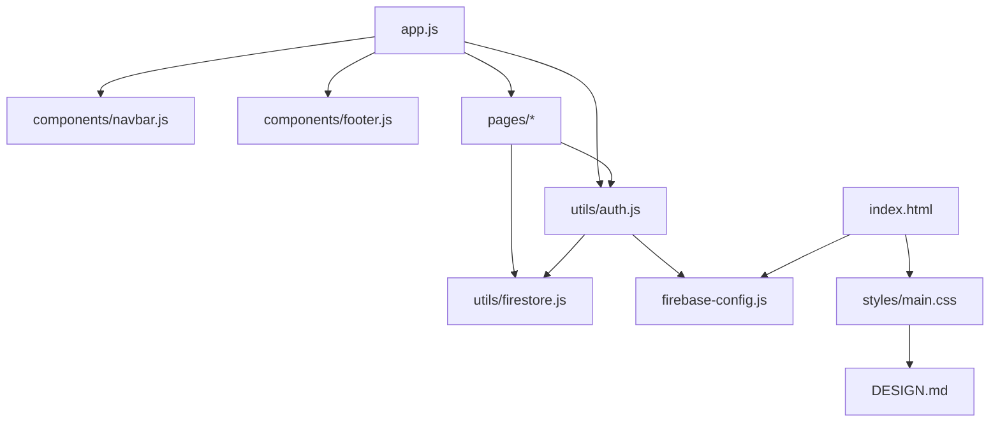

# Architecture & Design

<cite>
**Referenced Files in This Document**
- [index.html](file://index.html)
- [app.js](file://app.js)
- [firebase-config.js](file://firebase-config.js)
- [utils/auth.js](file://utils/auth.js)
- [utils/firestore.js](file://utils/firestore.js)
- [components/navbar.js](file://components/navbar.js)
- [components/footer.js](file://components/footer.js)
- [pages/home.js](file://pages/home.js)
- [pages/login.js](file://pages/login.js)
- [pages/admin/admin-layout.js](file://pages/admin/admin-layout.js)
- [utils/assessment-logic.js](file://utils/assessment-logic.js)
- [styles/main.css](file://styles/main.css)
- [package.json](file://package.json)
- [DESIGN.md](file://DESIGN.md)
</cite>

## Table of Contents
1. [Introduction](#introduction)
2. [Project Structure](#project-structure)
3. [Core Components](#core-components)
4. [Architecture Overview](#architecture-overview)
5. [Detailed Component Analysis](#detailed-component-analysis)
6. [Dependency Analysis](#dependency-analysis)
7. [Performance Considerations](#performance-considerations)
8. [Troubleshooting Guide](#troubleshooting-guide)
9. [Conclusion](#conclusion)
10. [Appendices](#appendices)

## Introduction
This document describes the architecture and design of the CGMI Assessment App as a single-page application (SPA) built with ES6 modules, hash-based routing, and a component-based design pattern. The system integrates a hybrid authentication model: Firebase Authentication for administrators (Google OAuth) and a local “Kode Akses” session for respondents. The design system follows IBM Carbon Design principles with Tailwind CSS integration for utility-first styling. Cross-cutting concerns include route protection, session management, and real-time-like data synchronization via Firestore.

## Project Structure
The application is organized into clear layers:
- Entry point and shell: index.html hosts the SPA shell and loads app.js as an ES module.
- Application router and lifecycle: app.js orchestrates routing, guards, and initialization.
- Authentication and persistence: utils/auth.js coordinates Firebase and localStorage sessions.
- Data access: utils/firestore.js encapsulates Firestore CRUD operations.
- UI primitives and shared components: components/* provide navbar, footer, and toast.
- Pages: pages/* define route views and initialization logic.
- Admin shell: pages/admin/* composes admin layouts and subviews.
- Design system and styles: styles/main.css defines Carbon-inspired tokens and utilities; Tailwind is configured via CDN in index.html.
- Supporting assets and design specs: assets/* and DESIGN.md define branding and tokens.

**Diagram sources**
- [index.html](file://index.html)
- [app.js](file://app.js)
- [components/navbar.js](file://components/navbar.js)
- [components/footer.js](file://components/footer.js)
- [pages/home.js](file://pages/home.js)
- [pages/login.js](file://pages/login.js)
- [pages/admin/admin-layout.js](file://pages/admin/admin-layout.js)
- [utils/auth.js](file://utils/auth.js)
- [utils/firestore.js](file://utils/firestore.js)
- [styles/main.css](file://styles/main.css)
- [firebase-config.js](file://firebase-config.js)

**Section sources**
- [index.html](file://index.html)
- [app.js](file://app.js)
- [styles/main.css](file://styles/main.css)
- [firebase-config.js](file://firebase-config.js)

## Core Components
- Router and Guards (app.js): Hash-based routing with guest-only, authentication-required, and role-based route guards. Renders shared navbar/footer, initializes page-specific logic, and manages global user state.
- Authentication Utilities (utils/auth.js): Hybrid auth with Firebase onAuthStateChanged listener, Google sign-in for admins, localStorage session for users, and helper functions to resolve roles and profiles.
- Firestore Utilities (utils/firestore.js): Centralized CRUD for questions, assessments, users, and admins; includes seeding and lookup helpers.
- Shared Components (components/*): Navbar renders auth-aware links and highlights active routes; Footer provides navigational and attribution content.
- Admin Shell (pages/admin/admin-layout.js): Provides a sidebar-based layout for admin subviews.
- Design System (styles/main.css + DESIGN.md): Carbon-inspired tokens, typography, spacing, and component classes; Tailwind CDN config extends fonts.

**Section sources**
- [app.js](file://app.js)
- [utils/auth.js](file://utils/auth.js)
- [utils/firestore.js](file://utils/firestore.js)
- [components/navbar.js](file://components/navbar.js)
- [components/footer.js](file://components/footer.js)
- [pages/admin/admin-layout.js](file://pages/admin/admin-layout.js)
- [styles/main.css](file://styles/main.css)
- [DESIGN.md](file://DESIGN.md)

## Architecture Overview
The SPA uses a modular ES6 architecture with:
- Hash-based routing: app.js listens to hashchange and renders route handlers.
- Component-based rendering: each page exports render and init functions; shared components are rendered into slots in index.html.
- Hybrid auth: Firebase handles admin sessions; localStorage stores user sessions; onAuthStateChanged drives global state.
- Data access abstraction: utils/firestore.js isolates Firestore operations; utils/auth.js resolves roles/profiles.
- Design system: Carbon tokens and component classes are applied consistently; Tailwind utilities complement Carbon styles.

**Diagram sources**
- [index.html](file://index.html)
- [app.js](file://app.js)
- [components/navbar.js](file://components/navbar.js)
- [components/footer.js](file://components/footer.js)
- [pages/home.js](file://pages/home.js)
- [pages/login.js](file://pages/login.js)
- [pages/admin/admin-layout.js](file://pages/admin/admin-layout.js)
- [utils/auth.js](file://utils/auth.js)
- [utils/firestore.js](file://utils/firestore.js)
- [styles/main.css](file://styles/main.css)
- [firebase-config.js](file://firebase-config.js)

## Detailed Component Analysis

### Router and Route Guards
The router maps hash paths to render/init functions, enforces guest-only, auth-required, and role-based access, and updates shared UI. It initializes the app by attempting a localStorage session, subscribing to Firebase auth changes, and rendering the initial route.

**Diagram sources**
- [app.js](file://app.js)
- [components/navbar.js](file://components/navbar.js)
- [components/footer.js](file://components/footer.js)

**Section sources**
- [app.js](file://app.js)

### Hybrid Authentication System
The system supports two authentication modes:
- Admins: Firebase Google OAuth; onAuthStateChanged updates global state and clears stale user sessions.
- Respondents: Local “Kode Akses” registration/login stored in localStorage; saved via utils/auth.js.

**Diagram sources**
- [pages/login.js](file://pages/login.js)
- [utils/auth.js](file://utils/auth.js)
- [firebase-config.js](file://firebase-config.js)

**Section sources**
- [utils/auth.js](file://utils/auth.js)
- [pages/login.js](file://pages/login.js)
- [firebase-config.js](file://firebase-config.js)

### Observer Pattern for Firebase Auth State Monitoring
The app subscribes to Firebase’s onAuthStateChanged to reactively update global user state and re-render the UI. This provides a reactive observer pattern for auth events.

**Diagram sources**
- [app.js](file://app.js)
- [utils/auth.js](file://utils/auth.js)

**Section sources**
- [app.js](file://app.js)
- [utils/auth.js](file://utils/auth.js)

### Design System Implementation (IBM Carbon + Tailwind)
The design system is grounded in IBM Carbon Design tokens and typography, implemented via CSS custom properties and component classes. Tailwind CSS is configured via CDN to extend fonts and neutralize certain utilities to match Carbon’s flat aesthetic.

**Diagram sources**
- [DESIGN.md](file://DESIGN.md)
- [styles/main.css](file://styles/main.css)
- [index.html](file://index.html)

**Section sources**
- [DESIGN.md](file://DESIGN.md)
- [styles/main.css](file://styles/main.css)
- [index.html](file://index.html)

### Assessment Logic and Data Flow
Assessment scoring and maturity calculation are encapsulated in utils/assessment-logic.js. Pages consume Firestore data via utils/firestore.js to build questionnaires and persist submissions.

**Diagram sources**
- [utils/assessment-logic.js](file://utils/assessment-logic.js)
- [utils/firestore.js](file://utils/firestore.js)

**Section sources**
- [utils/assessment-logic.js](file://utils/assessment-logic.js)
- [utils/firestore.js](file://utils/firestore.js)

## Dependency Analysis
High-level dependencies:
- app.js depends on utils/auth.js, components/navbar.js, components/footer.js, and page modules.
- utils/auth.js depends on firebase-config.js and utils/firestore.js.
- pages/* depend on utils/auth.js and utils/firestore.js.
- styles/main.css depends on DESIGN.md tokens and Tailwind CDN configuration.

**Diagram sources**
- [app.js](file://app.js)
- [utils/auth.js](file://utils/auth.js)
- [utils/firestore.js](file://utils/firestore.js)
- [components/navbar.js](file://components/navbar.js)
- [components/footer.js](file://components/footer.js)
- [styles/main.css](file://styles/main.css)
- [DESIGN.md](file://DESIGN.md)
- [firebase-config.js](file://firebase-config.js)
- [index.html](file://index.html)

**Section sources**
- [app.js](file://app.js)
- [utils/auth.js](file://utils/auth.js)
- [utils/firestore.js](file://utils/firestore.js)
- [firebase-config.js](file://firebase-config.js)
- [styles/main.css](file://styles/main.css)
- [DESIGN.md](file://DESIGN.md)
- [index.html](file://index.html)

## Performance Considerations
- Minimize DOM work: render functions return HTML strings; initialization logic binds lightweight event listeners.
- Lazy initialization: route.init() executes only when a route is visited.
- Efficient auth state updates: onAuthStateChanged triggers a single routing pass per auth change.
- Tailwind utilities: CDN-based configuration reduces build overhead; custom CSS neutralizes conflicting utilities to preserve Carbon visuals.
- Firestore queries: selective field retrieval and ordered queries improve responsiveness.

## Troubleshooting Guide
Common issues and remedies:
- Hash routing not updating: ensure hashchange listener is attached and routes include guestOnly/auth/role flags as needed.
- Admin login fails silently: verify Firebase credentials and that admin records exist in Firestore; check error messages returned by loginWithGoogle.
- User session persists after admin logout: confirm that admin logout clears both Firebase and localStorage and that loadLocalSession() is invoked after auth state changes.
- Navbar active link highlighting incorrect: verify hash normalization and active-link class assignment logic.
- Styles overridden unexpectedly: confirm Tailwind CDN config and CSS specificity; avoid adding extra rounded/shadow utilities that conflict with Carbon.

**Section sources**
- [app.js](file://app.js)
- [utils/auth.js](file://utils/auth.js)
- [components/navbar.js](file://components/navbar.js)
- [styles/main.css](file://styles/main.css)
- [index.html](file://index.html)

## Conclusion
The CGMI Assessment App employs a clean, modular SPA architecture with hash-based routing, component-based rendering, and a robust hybrid authentication system. The design system rooted in IBM Carbon ensures consistency and accessibility, while Firestore integration enables scalable assessment workflows. The router and observer pattern for auth state provide predictable control flow and responsive UX.

## Appendices

### Technology Stack Rationale
- ES Modules and native modules: Enables tree-shakeable, structured code with import/export.
- Firebase Authentication and Firestore: Provides secure, real-time-like backend with minimal server code.
- Tailwind CSS (CDN): Rapid utility styling aligned with Carbon tokens.
- Carbon Design tokens: Ensures brand consistency and accessible UI primitives.

**Section sources**
- [package.json](file://package.json)
- [index.html](file://index.html)
- [DESIGN.md](file://DESIGN.md)