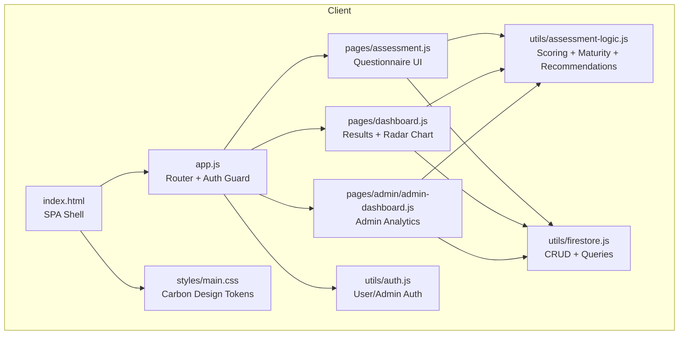
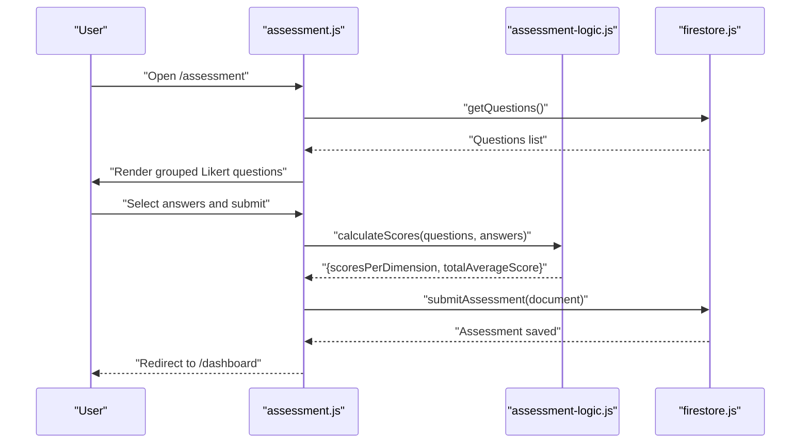
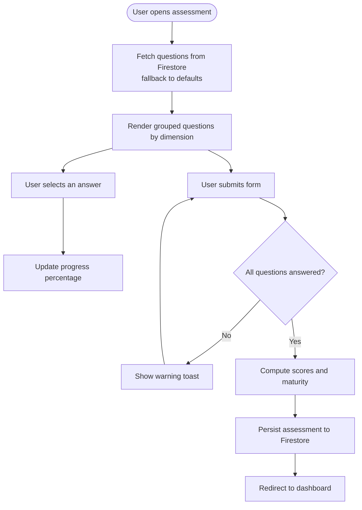
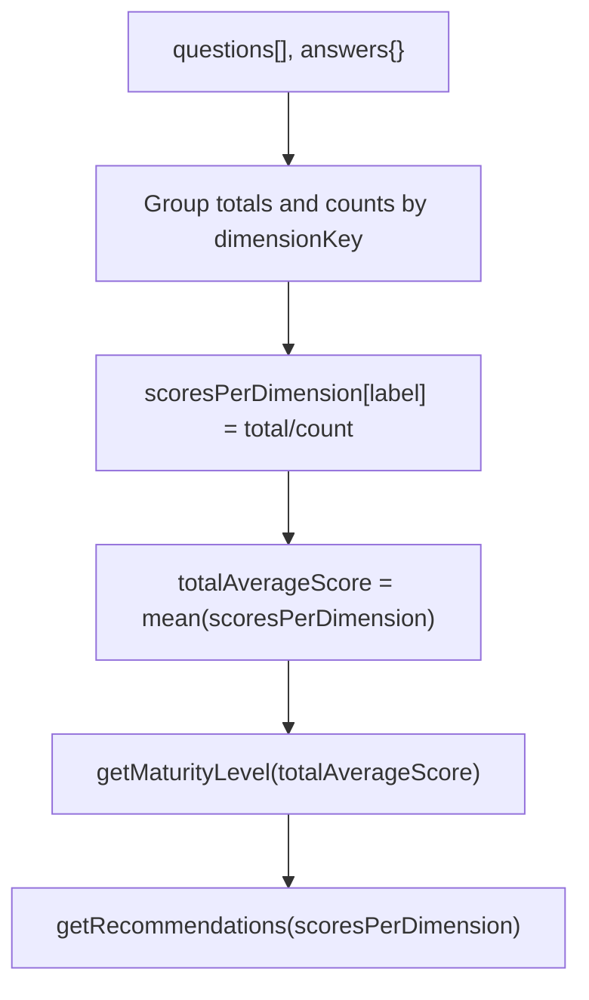
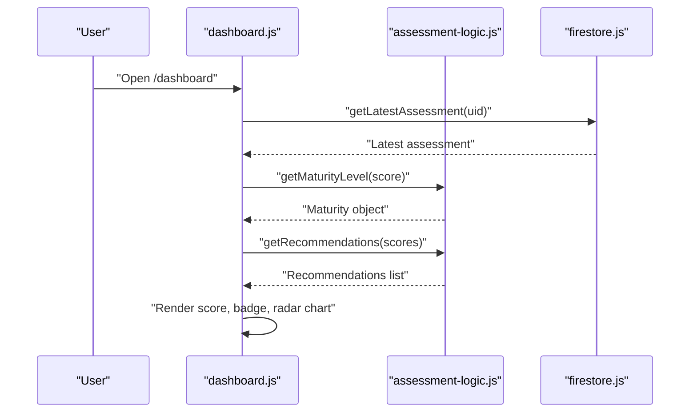
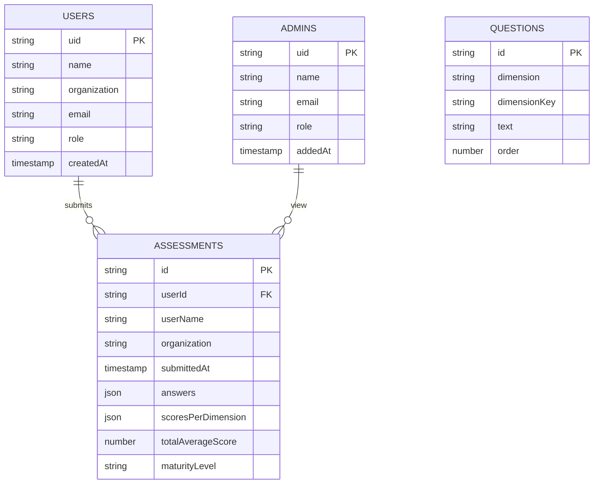
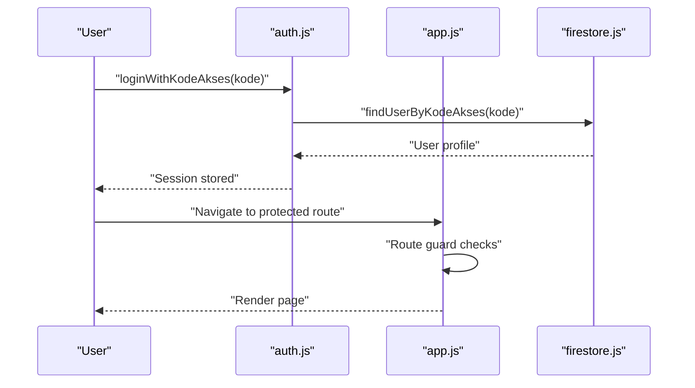
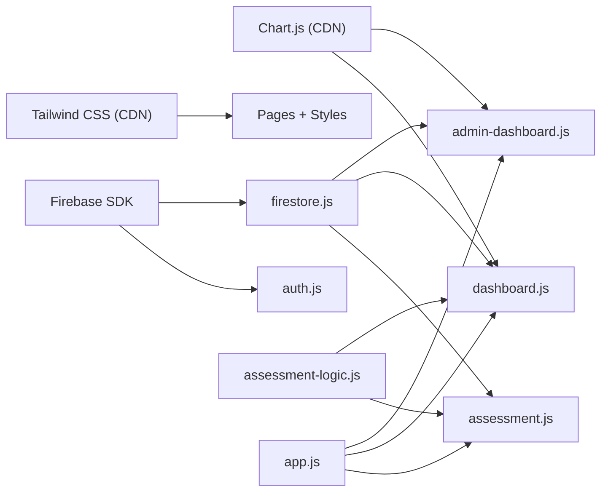

# Assessment System

<cite>
**Referenced Files in This Document**
- [assessment.js](file://pages/assessment.js)
- [assessment-logic.js](file://utils/assessment-logic.js)
- [dashboard.js](file://pages/dashboard.js)
- [firestore.js](file://utils/firestore.js)
- [app.js](file://app.js)
- [auth.js](file://utils/auth.js)
- [admin-dashboard.js](file://pages/admin/admin-dashboard.js)
- [implementation_plan.md](file://implementation_plan.md)
- [DESIGN.md](file://DESIGN.md)
- [index.html](file://index.html)
- [main.css](file://styles/main.css)
- [package.json](file://package.json)
</cite>

## Table of Contents
1. [Introduction](#introduction)
2. [Project Structure](#project-structure)
3. [Core Components](#core-components)
4. [Architecture Overview](#architecture-overview)
5. [Detailed Component Analysis](#detailed-component-analysis)
6. [Dependency Analysis](#dependency-analysis)
7. [Performance Considerations](#performance-considerations)
8. [Troubleshooting Guide](#troubleshooting-guide)
9. [Conclusion](#conclusion)
10. [Appendices](#appendices)

## Introduction
This document describes the assessment system that measures collaboration governance maturity using a 30-question Likert-scale questionnaire across six collaboration dimensions. It covers the questionnaire interface, scoring and maturity calculation, recommendation engine, real-time progress tracking, result visualization, response validation, data persistence, and the dashboard implementation for both users and administrators.

## Project Structure
The application is a single-page application (SPA) built with vanilla JavaScript and Firebase. Pages are rendered dynamically and routed via hash fragments. Charts are rendered client-side using Chart.js.

**Diagram sources**
- [index.html:1-79](file://index.html#L1-L79)
- [app.js:1-168](file://app.js#L1-L168)
- [assessment.js:1-193](file://pages/assessment.js#L1-L193)
- [dashboard.js:1-237](file://pages/dashboard.js#L1-L237)
- [admin-dashboard.js:1-165](file://pages/admin/admin-dashboard.js#L1-L165)
- [assessment-logic.js:1-211](file://utils/assessment-logic.js#L1-L211)
- [firestore.js:1-180](file://utils/firestore.js#L1-L180)
- [auth.js:1-172](file://utils/auth.js#L1-L172)
- [main.css:1-748](file://styles/main.css#L1-L748)

**Section sources**
- [implementation_plan.md:9-42](file://implementation_plan.md#L9-L42)
- [index.html:1-79](file://index.html#L1-L79)
- [app.js:1-168](file://app.js#L1-L168)

## Core Components
- Questionnaire page: Renders grouped questions by dimension, tracks progress, validates completion, computes scores, and persists results.
- Scoring and maturity logic: Computes per-dimension averages, total average, assigns maturity level, and generates recommendations.
- Dashboard: Displays latest assessment with radar chart, maturity badge, and actionable recommendations.
- Admin dashboard: Aggregates organization assessments into macro statistics and a maturity distribution pie chart.
- Persistence: Firestore collections for questions, assessments, users, and admins with role-based security.
- Authentication: Dual-mode user (organization) and admin (Google) authentication.

**Section sources**
- [assessment.js:10-193](file://pages/assessment.js#L10-L193)
- [assessment-logic.js:6-211](file://utils/assessment-logic.js#L6-L211)
- [dashboard.js:10-237](file://pages/dashboard.js#L10-L237)
- [admin-dashboard.js:10-165](file://pages/admin/admin-dashboard.js#L10-L165)
- [firestore.js:20-88](file://utils/firestore.js#L20-L88)
- [auth.js:32-172](file://utils/auth.js#L32-L172)

## Architecture Overview
The system follows a clean separation of concerns:
- Presentation: Pages render HTML templates and bind DOM events.
- Business logic: Utilities encapsulate scoring, maturity, and recommendations.
- Data access: Firestore utilities abstract CRUD and queries.
- Routing and auth: Router enforces guards and initializes views.

**Diagram sources**
- [assessment.js:62-193](file://pages/assessment.js#L62-L193)
- [assessment-logic.js:170-195](file://utils/assessment-logic.js#L170-L195)
- [firestore.js:55-59](file://utils/firestore.js#L55-L59)

## Detailed Component Analysis

### Questionnaire Interface and Real-Time Progress
- Renders questions grouped by dimension with a progress tracker updating in real time as users select answers.
- Uses a 1–5 Likert scale with Indonesian labels and requires selection of all questions before submission.
- On submit, validates completeness and computes scores and maturity level before persisting.

**Diagram sources**
- [assessment.js:62-193](file://pages/assessment.js#L62-L193)

**Section sources**
- [assessment.js:10-193](file://pages/assessment.js#L10-L193)

### Scoring Algorithm and Maturity Calculation
- Per-dimension average: Sums scores by dimensionKey and divides by question count.
- Total average: Mean of per-dimension averages.
- Maturity levels: Bounded ranges mapped to labels, colors, and descriptions.
- Threshold-based recommendations: Dimensions scoring below 3.0 trigger recommendations.

**Diagram sources**
- [assessment-logic.js:170-211](file://utils/assessment-logic.js#L170-L211)

**Section sources**
- [assessment-logic.js:6-211](file://utils/assessment-logic.js#L6-L211)

### Recommendation Engine
- Generates actionable recommendations for dimensions scoring below threshold (3.0).
- Provides dimension-specific guidance with emoji icons and localized text.

**Section sources**
- [assessment-logic.js:121-152](file://utils/assessment-logic.js#L121-L152)
- [assessment-logic.js:197-211](file://utils/assessment-logic.js#L197-L211)

### Result Visualization and Dashboard
- User dashboard displays:
  - Latest organization name and submission date.
  - Overall average score and maturity badge with color-coded label.
  - Radar chart of six dimensions.
  - Recommendations panel for low-scoring dimensions.
- Admin dashboard shows:
  - Total respondents, average score, and top maturity level.
  - Maturity distribution pie chart and legend.

**Diagram sources**
- [dashboard.js:117-237](file://pages/dashboard.js#L117-L237)
- [assessment-logic.js:157-162](file://utils/assessment-logic.js#L157-L162)
- [assessment-logic.js:200-210](file://utils/assessment-logic.js#L200-L210)
- [firestore.js:67-77](file://utils/firestore.js#L67-L77)

**Section sources**
- [dashboard.js:10-237](file://pages/dashboard.js#L10-L237)
- [assessment-logic.js:98-152](file://utils/assessment-logic.js#L98-L152)

### Data Persistence Patterns
- Questions: Ordered by dimensionKey and order; seeded if empty.
- Assessments: Persisted with user identity, organization metadata, answers, computed scores, and maturity label.
- Users and Admins: Role-based access enforced via Firestore rules.

**Diagram sources**
- [firestore.js:20-88](file://utils/firestore.js#L20-L88)
- [implementation_plan.md:64-115](file://implementation_plan.md#L64-L115)

**Section sources**
- [firestore.js:20-88](file://utils/firestore.js#L20-L88)
- [implementation_plan.md:62-115](file://implementation_plan.md#L62-L115)

### Authentication and Authorization
- Users: Local storage session persisted after registration; login via Kode Akses lookup.
- Admins: Google OAuth with whitelist enforcement; supports both UID and email-based admin records.
- Router guards: Enforce guest-only, authentication, and role-based access.

**Diagram sources**
- [auth.js:50-56](file://utils/auth.js#L50-L56)
- [auth.js:117-129](file://utils/auth.js#L117-L129)
- [app.js:75-101](file://app.js#L75-L101)

**Section sources**
- [auth.js:32-172](file://utils/auth.js#L32-L172)
- [app.js:32-122](file://app.js#L32-L122)

## Dependency Analysis
- External libraries:
  - Chart.js (CDN) for radar and pie charts.
  - Tailwind CSS (CDN) for styling.
  - Firebase SDK for authentication and Firestore.
- Internal dependencies:
  - Pages depend on utils for logic and persistence.
  - Router orchestrates initialization and guards.

**Diagram sources**
- [index.html:57-61](file://index.html#L57-L61)
- [package.json:6-10](file://package.json#L6-L10)
- [app.js:12-25](file://app.js#L12-L25)
- [assessment.js:6-8](file://pages/assessment.js#L6-L8)
- [dashboard.js:6-8](file://pages/dashboard.js#L6-L8)
- [admin-dashboard.js:6-8](file://pages/admin/admin-dashboard.js#L6-L8)

**Section sources**
- [index.html:57-61](file://index.html#L57-L61)
- [package.json:6-10](file://package.json#L6-L10)
- [app.js:12-25](file://app.js#L12-L25)

## Performance Considerations
- Rendering: Grouped questions are rendered once and updated reactively via event listeners; minimal DOM manipulation.
- Computation: Scoring and maturity calculations are O(n) over questions; negligible for 30 items.
- Network: Firestore queries are lightweight; caching via client-side state reduces repeated fetches.
- Charts: Destroy previous chart instances before rendering to prevent memory leaks.

## Troubleshooting Guide
Common issues and resolutions:
- Questions not loading: Ensure Firestore has seeded questions or network connectivity; fallback to default questions is automatic.
- Submission fails: Verify all questions are answered; the form prevents submission until completion.
- Dashboard empty state: Occurs when no assessments exist for the user; prompt to take the assessment.
- Admin access denied: Confirm Google account is whitelisted; router guard redirects unauthenticated users.
- Chart rendering errors: Ensure Chart.js CDN loads and canvas element exists; destroy previous instances before reinitialization.

**Section sources**
- [assessment.js:70-80](file://pages/assessment.js#L70-L80)
- [assessment.js:164-169](file://pages/assessment.js#L164-L169)
- [dashboard.js:129-133](file://pages/dashboard.js#L129-L133)
- [auth.js:58-104](file://utils/auth.js#L58-L104)
- [dashboard.js:179-181](file://pages/dashboard.js#L179-L181)

## Conclusion
The assessment system provides a robust, user-friendly interface for measuring collaboration governance maturity. It combines a clean questionnaire experience, accurate scoring and maturity computation, actionable recommendations, and insightful visualizations for both users and administrators. The modular design and Firebase backend enable easy maintenance and scalability.

## Appendices

### Assessment Logic Examples
- Example: Per-dimension average calculation for a dimension with three questions scored 4, 5, and 3 yields an average of 4.00.
- Example: Total average across six dimensions yields a final score; maturity level determined by bounded ranges.
- Example: Dimensions scoring below 3.0 trigger recommendations; otherwise, a positive feedback message is shown.

**Section sources**
- [assessment-logic.js:170-195](file://utils/assessment-logic.js#L170-L195)
- [assessment-logic.js:157-162](file://utils/assessment-logic.js#L157-L162)
- [assessment-logic.js:200-210](file://utils/assessment-logic.js#L200-L210)

### UI/UX Design System
- Carbon Design System-inspired theme with IBM Plex Sans, flat geometry, and a single accent color.
- Consistent spacing, typography, and component tokens across pages.

**Section sources**
- [DESIGN.md:262-313](file://DESIGN.md#L262-L313)
- [main.css:1-27](file://styles/main.css#L1-L27)