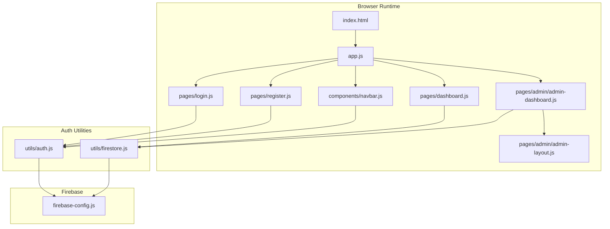
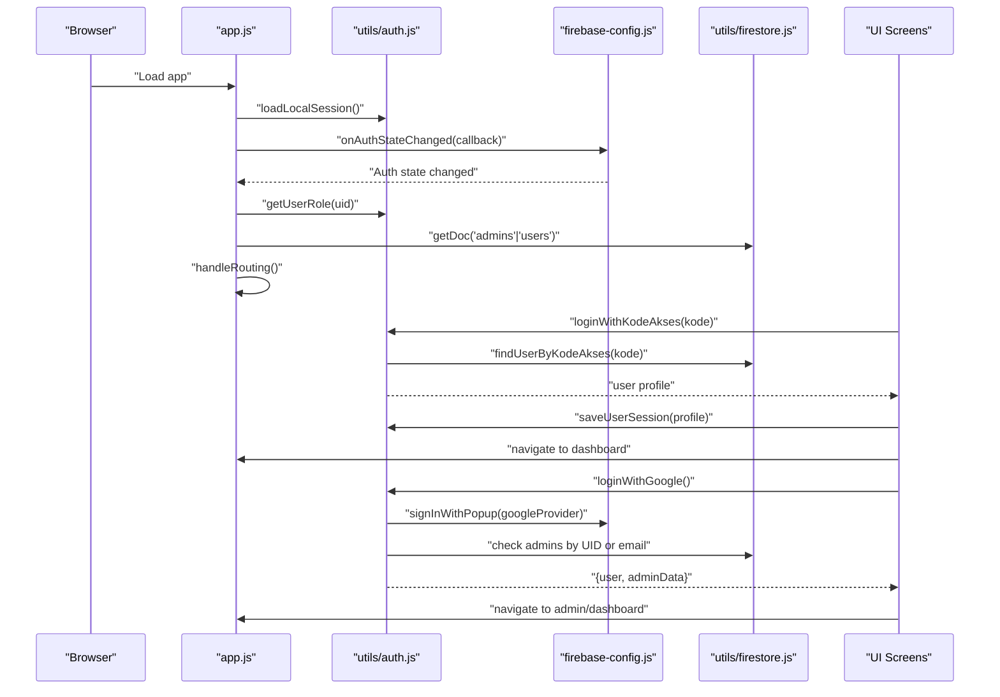
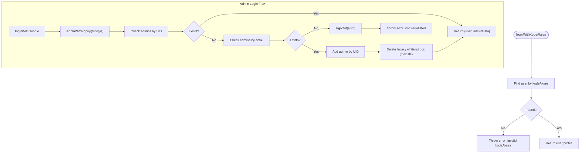
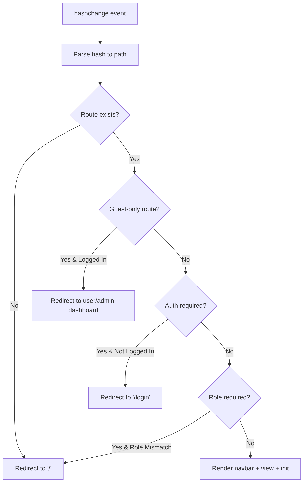
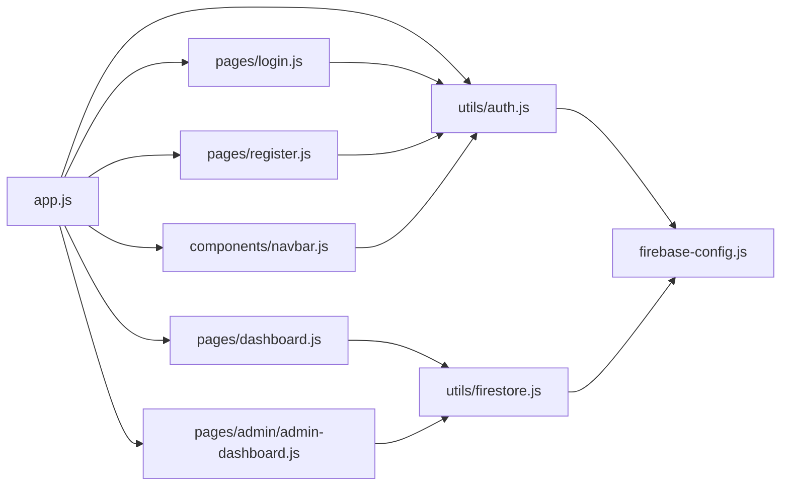

# Authentication System

<cite>
**Referenced Files in This Document**
- [firebase-config.js](file://firebase-config.js)
- [utils/auth.js](file://utils/auth.js)
- [utils/firestore.js](file://utils/firestore.js)
- [app.js](file://app.js)
- [pages/login.js](file://pages/login.js)
- [pages/register.js](file://pages/register.js)
- [components/navbar.js](file://components/navbar.js)
- [pages/admin/admin-layout.js](file://pages/admin/admin-layout.js)
- [pages/admin/admin-dashboard.js](file://pages/admin/admin-dashboard.js)
- [pages/dashboard.js](file://pages/dashboard.js)
- [index.html](file://index.html)
</cite>

## Table of Contents
1. [Introduction](#introduction)
2. [Project Structure](#project-structure)
3. [Core Components](#core-components)
4. [Architecture Overview](#architecture-overview)
5. [Detailed Component Analysis](#detailed-component-analysis)
6. [Dependency Analysis](#dependency-analysis)
7. [Performance Considerations](#performance-considerations)
8. [Troubleshooting Guide](#troubleshooting-guide)
9. [Conclusion](#conclusion)

## Introduction
This document explains the dual authentication system used by the CGMI Assessment App. It combines two distinct strategies:
- Institutional user login using a simple 6-digit Kode Akses (institutional access)
- Administrator login via Google OAuth (Firebase Auth)

The system manages authentication state across browser sessions using localStorage for institutional users and Firebase Auth for administrators. It enforces route protection for user and admin areas and provides seamless session persistence and automatic logout handling.

## Project Structure
The authentication system spans several modules:
- Firebase configuration and initialization
- Authentication utilities for user registration, login, logout, and session management
- Firestore helpers for user/admin metadata and data access
- Client-side router with route guards
- UI components for login, registration, and navigation
- Admin shell and dashboards

**Diagram sources**
- [index.html:74-76](file://index.html#L74-L76)
- [app.js:12-25](file://app.js#L12-L25)
- [utils/auth.js:6-15](file://utils/auth.js#L6-L15)
- [utils/firestore.js:6-10](file://utils/firestore.js#L6-L10)
- [firebase-config.js:10-27](file://firebase-config.js#L10-L27)

**Section sources**
- [index.html:63-79](file://index.html#L63-L79)
- [app.js:11-45](file://app.js#L11-L45)

## Core Components
- Firebase configuration and providers
- Authentication helpers (registration, login, logout, session persistence)
- Firestore helpers (user/admin metadata, queries)
- Router with route guards and auth-aware navigation
- UI screens for login, registration, and dashboards

Key responsibilities:
- Generate and persist institutional user sessions in localStorage
- Authenticate administrators via Google OAuth and resolve admin roles from Firestore
- Enforce guest-only, authentication-required, and role-based route protections
- Provide unified navigation and logout handling across both user and admin contexts

**Section sources**
- [firebase-config.js:14-27](file://firebase-config.js#L14-L27)
- [utils/auth.js:32-172](file://utils/auth.js#L32-L172)
- [utils/firestore.js:104-179](file://utils/firestore.js#L104-L179)
- [app.js:32-167](file://app.js#L32-L167)

## Architecture Overview
The authentication architecture blends localStorage and Firebase Auth:
- Institutional users: localStorage stores a compact session profile; login validates against Firestore users and persists a minimal profile
- Administrators: Firebase Auth handles Google sign-in; the app resolves admin role and profile from Firestore
- Router: Centralized route guards enforce guest-only, auth-required, and role-based access
- Navigation: Navbar adapts to current role and provides logout that clears both localStorage and Firebase Auth

**Diagram sources**
- [app.js:51-161](file://app.js#L51-L161)
- [utils/auth.js:50-104](file://utils/auth.js#L50-L104)
- [utils/firestore.js:104-179](file://utils/firestore.js#L104-L179)
- [firebase-config.js:25-27](file://firebase-config.js#L25-L27)

## Detailed Component Analysis

### Firebase Configuration
- Initializes Firebase app, Auth, Firestore, and GoogleAuthProvider
- Exposes auth, db, and googleProvider for use across the app

Security considerations:
- Ensure API keys and project identifiers are configured securely
- Restrict Firebase Auth providers and rules appropriately

**Section sources**
- [firebase-config.js:14-27](file://firebase-config.js#L14-L27)

### Authentication Utilities
Responsibilities:
- Generate random 6-digit Kode Akses and UUID
- Register institutional users with Firestore and return credentials
- Authenticate institutional users by validating Kode Akses
- Authenticate administrators via Google OAuth and resolve admin role/profile
- Persist and retrieve user sessions in localStorage
- Resolve user role and profile from Firestore
- Observe Firebase Auth state changes

Key flows:
- Institutional registration: creates a Firestore user record and returns generated credentials
- Institutional login: validates Kode Akses and saves a minimal session profile
- Admin login: signs in with Google, checks Firestore for admin by UID or email, and ensures only whitelisted admins can access admin routes
- Session persistence: localStorage for users; Firebase Auth for admins
- Role resolution: checks admins collections by UID and email, then falls back to users collection

**Diagram sources**
- [utils/auth.js:50-104](file://utils/auth.js#L50-L104)
- [utils/firestore.js:127-179](file://utils/firestore.js#L127-L179)

**Section sources**
- [utils/auth.js:18-172](file://utils/auth.js#L18-L172)
- [utils/firestore.js:104-179](file://utils/firestore.js#L104-L179)

### Firestore Helpers
Responsibilities:
- CRUD operations for assessments, questions, users, and admins
- Helper functions to find users by Kode Akses and manage admin whitelist entries
- Normalize emails for consistent lookups

Key functions:
- findUserByKodeAkses: queries users by kodeAkses
- addAdmin/getAdminByEmail/deleteAdmin: manage admin whitelist and metadata
- getAllUsers/getUser/getUserAssessments: support user data operations

**Section sources**
- [utils/firestore.js:104-179](file://utils/firestore.js#L104-L179)

### Router and Route Guards
Responsibilities:
- Define routes with auth and role requirements
- Load localStorage session on startup
- Listen for Firebase Auth state changes
- Enforce guest-only, auth-required, and role-based route protections
- Render navbar and views accordingly

Route definitions:
- Public routes: home, about
- Guest-only routes: login, register
- Protected user routes: assessment, dashboard
- Protected admin routes: admin dashboard, respondents, questions, admins

**Diagram sources**
- [app.js:63-122](file://app.js#L63-L122)

**Section sources**
- [app.js:32-167](file://app.js#L32-L167)

### Login Screen (Institutional and Admin)
Features:
- Tabbed interface: switch between institutional login and admin Google login
- Institutional login: validates 6-digit kodeAkses, authenticates via auth module, saves session, navigates to dashboard
- Admin login: triggers Google OAuth popup, resolves admin role, navigates to admin or user dashboard depending on role

Validation:
- Kode Akses length and numeric format validation
- Toast notifications for success/error feedback

**Section sources**
- [pages/login.js:9-131](file://pages/login.js#L9-L131)

### Registration Screen
Features:
- Collects institution, years of service, and position
- Registers user via auth module, persists session in localStorage
- Displays a modal with generated kodeAkses and navigates to dashboard

**Section sources**
- [pages/register.js:47-160](file://pages/register.js#L47-L160)

### Navigation Bar
Features:
- Renders links based on authentication and role
- Displays avatar initials and admin badge for admins
- Provides logout button that clears both localStorage and Firebase Auth

**Section sources**
- [components/navbar.js:9-117](file://components/navbar.js#L9-L117)

### Admin Shell and Dashboards
- Admin layout renders sidebar navigation and badges indicating Google authentication
- Admin dashboard aggregates macro statistics and distributions from Firestore

**Section sources**
- [pages/admin/admin-layout.js:6-62](file://pages/admin/admin-layout.js#L6-L62)
- [pages/admin/admin-dashboard.js:10-165](file://pages/admin/admin-dashboard.js#L10-L165)
- [pages/dashboard.js:10-237](file://pages/dashboard.js#L10-L237)

## Dependency Analysis
High-level dependencies:
- app.js depends on auth utilities and Firestore helpers for routing and guards
- UI screens depend on auth utilities for login/registration and on Firestore for data
- Navbar depends on auth utilities for logout and role-aware rendering
- Admin components depend on Firestore for macro analytics

**Diagram sources**
- [app.js:7-24](file://app.js#L7-L24)
- [utils/auth.js:6-15](file://utils/auth.js#L6-L15)
- [utils/firestore.js:6-10](file://utils/firestore.js#L6-L10)
- [firebase-config.js:10-27](file://firebase-config.js#L10-L27)

**Section sources**
- [app.js:7-24](file://app.js#L7-L24)
- [utils/auth.js:6-15](file://utils/auth.js#L6-L15)
- [utils/firestore.js:6-10](file://utils/firestore.js#L6-L10)
- [firebase-config.js:10-27](file://firebase-config.js#L10-L27)

## Performance Considerations
- Minimize Firestore reads by caching user/admin profiles locally during auth state transitions
- Debounce or disable form submission buttons while requests are pending to prevent duplicate submissions
- Lazy-load charts and heavy UI components only when routes are rendered
- Use efficient queries (limit, where clauses) for user/admin lookups

## Troubleshooting Guide
Common issues and resolutions:
- Invalid Kode Akses
  - Symptom: Login fails with an error message
  - Resolution: Verify the kodeAkses is exactly 6 digits and corresponds to a registered user
  - Related code: [utils/auth.js:50-56](file://utils/auth.js#L50-L56), [pages/login.js:77-80](file://pages/login.js#L77-L80)

- Admin not recognized
  - Symptom: Google login succeeds but access is denied
  - Resolution: Ensure the admin account is whitelisted either by UID or email in the admins collection
  - Related code: [utils/auth.js:59-104](file://utils/auth.js#L59-L104), [utils/firestore.js:127-179](file://utils/firestore.js#L127-L179)

- Session not restored after reload
  - Symptom: User appears logged out after refresh
  - Resolution: Confirm localStorage contains a valid session profile; ensure loadLocalSession runs before Firebase listeners
  - Related code: [app.js:51-60](file://app.js#L51-L60), [utils/auth.js:117-129](file://utils/auth.js#L117-L129)

- Route protection bypass attempts
  - Symptom: Directly accessing protected URLs
  - Resolution: Route guards redirect unauthorized users; ensure onAuthStateChanged updates currentRole promptly
  - Related code: [app.js:75-100](file://app.js#L75-L100), [app.js:129-157](file://app.js#L129-L157)

- Logout does not clear both sessions
  - Symptom: User remains logged in after logout
  - Resolution: Navbar logout clears both localStorage and Firebase Auth; verify both functions are invoked
  - Related code: [components/navbar.js:94-106](file://components/navbar.js#L94-L106), [utils/auth.js:107-114](file://utils/auth.js#L107-L114)

## Conclusion
The CGMI Assessment App implements a robust dual authentication system:
- Institutional users benefit from a lightweight, localStorage-backed session with simple 6-digit credentials
- Administrators gain secure, provider-driven authentication via Google OAuth with strict role enforcement
- The router enforces comprehensive access controls, while UI components adapt dynamically to the current role
- Session persistence and automatic logout handling provide a smooth user experience

Best practices observed:
- Separation of concerns between auth utilities, Firestore helpers, and UI components
- Defensive validation and error handling
- Role-based route protection and admin whitelist management
- Minimal session data stored in localStorage for institutional users