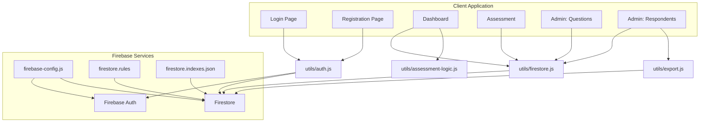
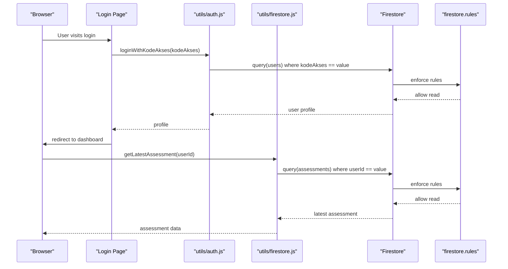
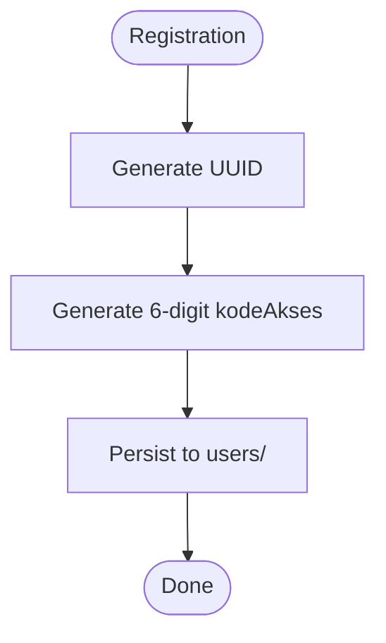
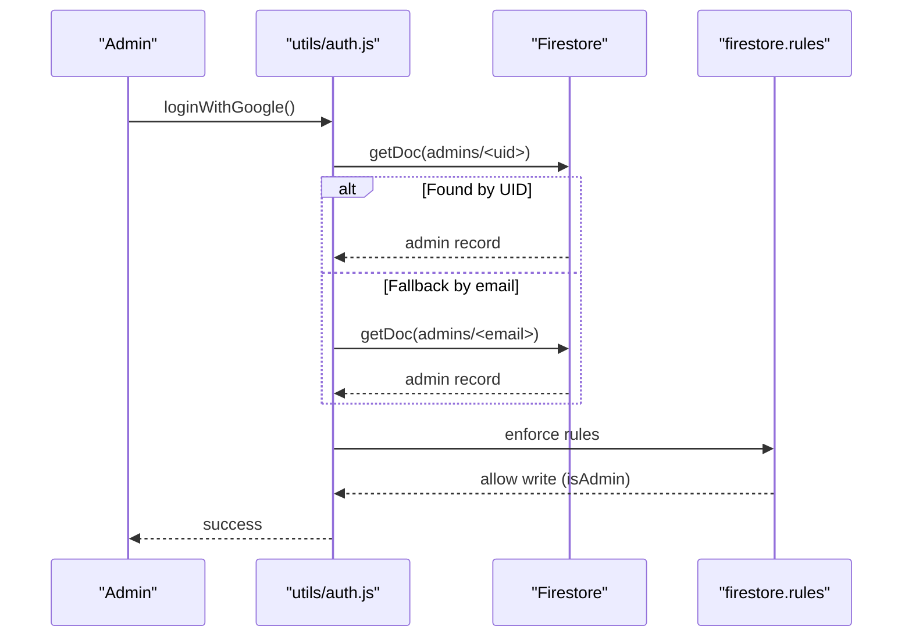
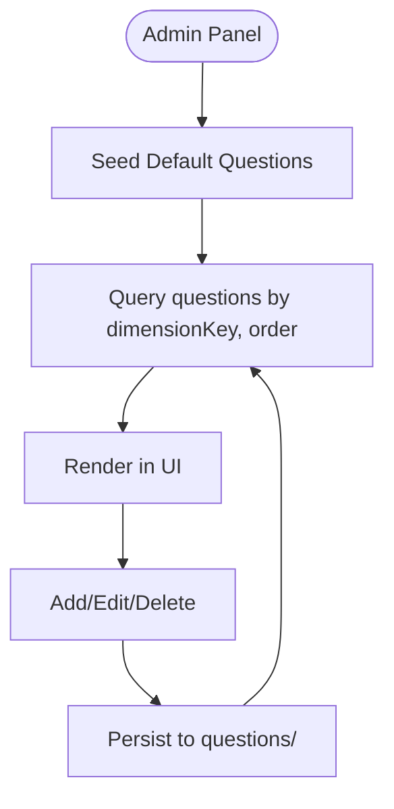
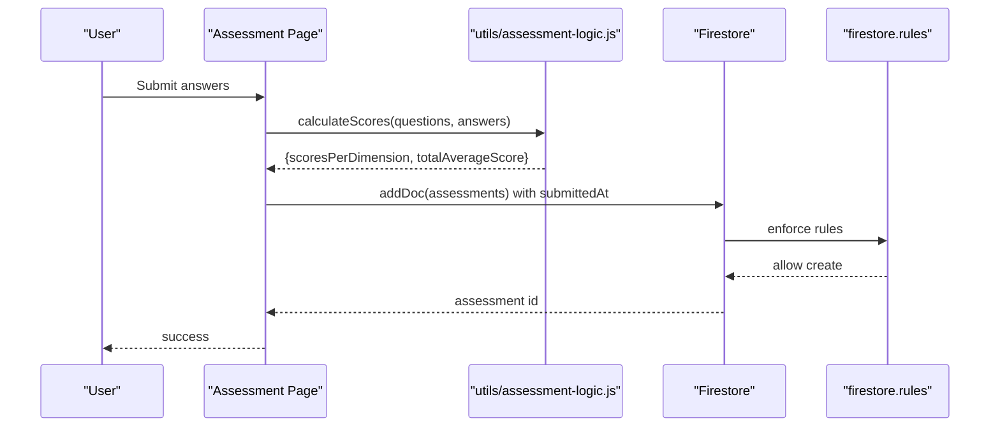
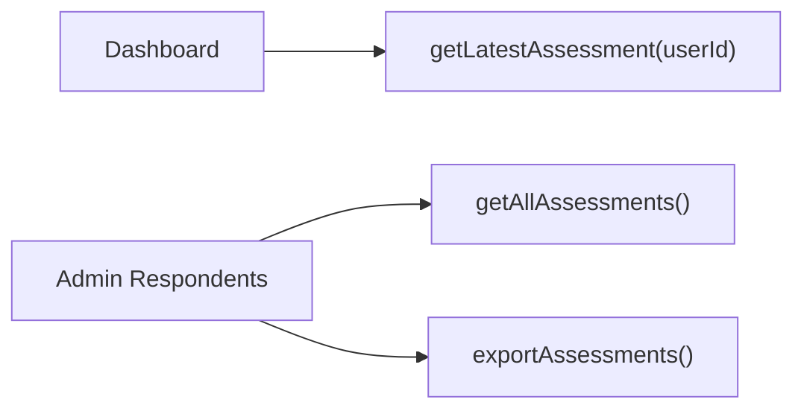
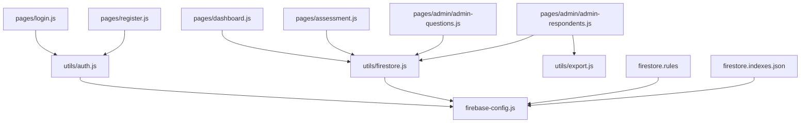

# Database Design

<cite>
**Referenced Files in This Document**
- [firestore.indexes.json](file://firestore.indexes.json)
- [firestore.rules](file://firestore.rules)
- [firebase.json](file://firebase.json)
- [utils/firestore.js](file://utils/firestore.js)
- [utils/auth.js](file://utils/auth.js)
- [utils/assessment-logic.js](file://utils/assessment-logic.js)
- [utils/export.js](file://utils/export.js)
- [pages/assessment.js](file://pages/assessment.js)
- [pages/dashboard.js](file://pages/dashboard.js)
- [pages/admin/admin-questions.js](file://pages/admin/admin-questions.js)
- [pages/admin/admin-respondents.js](file://pages/admin/admin-respondents.js)
- [pages/register.js](file://pages/register.js)
- [pages/login.js](file://pages/login.js)
- [firebase-config.js](file://firebase-config.js)
</cite>

## Table of Contents
1. [Introduction](#introduction)
2. [Project Structure](#project-structure)
3. [Core Components](#core-components)
4. [Architecture Overview](#architecture-overview)
5. [Detailed Component Analysis](#detailed-component-analysis)
6. [Dependency Analysis](#dependency-analysis)
7. [Performance Considerations](#performance-considerations)
8. [Troubleshooting Guide](#troubleshooting-guide)
9. [Conclusion](#conclusion)
10. [Appendices](#appendices)

## Introduction
This document provides comprehensive data model documentation for the Firestore database design used by the CGMI assessment application. It covers collections, entity relationships, field definitions, indexing strategy, security rules, validation patterns, access patterns, performance considerations, schema evolution, data lifecycle, and privacy/compliance considerations for public sector applications.

## Project Structure
The application uses a client-side Firebase configuration to connect to Firestore and Cloud Functions. Security and indexing are configured via Firebase project settings and local configuration files. The frontend pages orchestrate user flows and delegate persistence to Firestore through utility modules.

**Diagram sources**
- [firebase-config.js:14-27](file://firebase-config.js#L14-L27)
- [firebase.json:2-4](file://firebase.json#L2-L4)
- [firestore.rules:1-38](file://firestore.rules#L1-L38)
- [firestore.indexes.json:1-22](file://firestore.indexes.json#L1-L22)
- [utils/firestore.js:6-10](file://utils/firestore.js#L6-L10)
- [utils/auth.js:6-15](file://utils/auth.js#L6-L15)
- [utils/assessment-logic.js:6-13](file://utils/assessment-logic.js#L6-L13)
- [utils/export.js:9-41](file://utils/export.js#L9-L41)
- [pages/login.js:6-7](file://pages/login.js#L6-L7)
- [pages/register.js:91-148](file://pages/register.js#L91-L148)
- [pages/dashboard.js:6-8](file://pages/dashboard.js#L6-L8)
- [pages/assessment.js:6-8](file://pages/assessment.js#L6-L8)
- [pages/admin/admin-questions.js:6-8](file://pages/admin/admin-questions.js#L6-L8)
- [pages/admin/admin-respondents.js:6-9](file://pages/admin/admin-respondents.js#L6-L9)

**Section sources**
- [firebase.json:1-20](file://firebase.json#L1-L20)
- [firebase-config.js:14-27](file://firebase-config.js#L14-L27)

## Core Components
This section defines the core collections, their fields, and relationships.

- Collections
  - users
  - admins
  - questions
  - assessments

- Field definitions and types
  - users
    - uid: string
    - instansi: string
    - lamaBekerja: string
    - jabatan: string
    - kodeAkses: string
    - role: string
    - createdAt: timestamp
  - admins
    - uid: string
    - email: string
    - emailLower: string
    - role: string
    - addedAt: timestamp
  - questions
    - dimension: string
    - dimensionKey: string
    - text: string
    - order: number
    - createdAt: timestamp
  - assessments
    - userId: string
    - userName: string
    - organization: string
    - lamaBekerja: string
    - answers: map<string, number>
    - scoresPerDimension: map<string, number>
    - totalAverageScore: number
    - maturityLevel: string
    - submittedAt: timestamp

- Relationships
  - One-to-many: users to assessments (userId)
  - Many-to-one: assessments to users (userId)
  - Many-to-one: assessments to questions via answers (questionId -> question.id)
  - Many-to-one: questions to dimensions (dimensionKey)

- Access patterns
  - Users authenticate via kodeAkses and are stored under users/<uuid>.
  - Admins are whitelisted under admins/<uid> or admins/<lowercase_email>.
  - Questions are queried by dimensionKey and order.
  - Assessments are queried by userId and sorted by submittedAt descending.

**Section sources**
- [utils/firestore.js:94-116](file://utils/firestore.js#L94-L116)
- [utils/firestore.js:122-141](file://utils/firestore.js#L122-L141)
- [utils/firestore.js:20-49](file://utils/firestore.js#L20-L49)
- [utils/firestore.js:55-88](file://utils/firestore.js#L55-L88)
- [utils/assessment-logic.js:6-13](file://utils/assessment-logic.js#L6-L13)
- [pages/assessment.js:174-183](file://pages/assessment.js#L174-L183)
- [pages/admin/admin-questions.js:226-231](file://pages/admin/admin-questions.js#L226-L231)

## Architecture Overview
The application follows a straightforward client-driven architecture:
- Client initializes Firebase and authenticates users.
- Pages call utility modules to perform Firestore operations.
- Security rules enforce access control.
- Indexes optimize query performance.

**Diagram sources**
- [pages/login.js:70-109](file://pages/login.js#L70-L109)
- [utils/auth.js:50-56](file://utils/auth.js#L50-L56)
- [utils/firestore.js:67-77](file://utils/firestore.js#L67-L77)
- [firestore.rules:13-16](file://firestore.rules#L13-L16)
- [firestore.rules:30-35](file://firestore.rules#L30-L35)

## Detailed Component Analysis

### Users Collection
- Purpose: Store respondent profiles and kodeAkses for anonymous login.
- Fields
  - uid: unique identifier (UUID)
  - instansi: organization
  - lamaBekerja: years of service
  - jabatan: position
  - kodeAkses: 6-digit code for login
  - role: user
  - createdAt: server timestamp
- Access pattern
  - Registration generates a UUID and kodeAkses, persists to users/<uuid>.
  - Login queries users where kodeAkses equals input.
- Validation
  - kodeAkses is validated as a 6-digit number on the client.
- Privacy
  - Minimal PII stored; kodeAkses enables anonymous login without email/password.

**Diagram sources**
- [utils/auth.js:32-47](file://utils/auth.js#L32-L47)
- [pages/register.js:91-148](file://pages/register.js#L91-L148)

**Section sources**
- [utils/auth.js:32-47](file://utils/auth.js#L32-L47)
- [pages/register.js:91-148](file://pages/register.js#L91-L148)
- [pages/login.js:77-80](file://pages/login.js#L77-L80)

### Admins Collection
- Purpose: Whitelist administrators with UID or email-based fallback.
- Fields
  - uid: admin UID
  - email: admin email
  - emailLower: lowercase email
  - role: admin
  - addedAt: server timestamp
- Access pattern
  - Admin login uses Google OAuth; checks admins/<uid> first, then admins/<email>.
  - addAdmin normalizes email and writes to admins/<uid>.
- Validation
  - Email normalization ensures consistent lookup.
- Security
  - Access controlled by helper function isAdmin().

**Diagram sources**
- [utils/auth.js:59-104](file://utils/auth.js#L59-L104)
- [utils/firestore.js:127-141](file://utils/firestore.js#L127-L141)
- [firestore.rules:5-11](file://firestore.rules#L5-L11)
- [firestore.rules:18-22](file://firestore.rules#L18-L22)

**Section sources**
- [utils/auth.js:59-104](file://utils/auth.js#L59-L104)
- [utils/firestore.js:127-141](file://utils/firestore.js#L127-L141)
- [firestore.rules:5-11](file://firestore.rules#L5-L11)

### Questions Collection
- Purpose: Store assessment items grouped by dimensions.
- Fields
  - dimension: localized dimension label
  - dimensionKey: dimension key
  - text: question text
  - order: sort order within dimension
  - createdAt: server timestamp
- Access pattern
  - Queries ordered by dimensionKey ascending, then order ascending.
  - Admin panel supports CRUD and seeding default questions.
- Validation
  - Admin UI enforces numeric order range and dimension selection.

**Diagram sources**
- [utils/firestore.js:20-49](file://utils/firestore.js#L20-L49)
- [pages/admin/admin-questions.js:164-179](file://pages/admin/admin-questions.js#L164-L179)
- [pages/admin/admin-questions.js:215-247](file://pages/admin/admin-questions.js#L215-L247)

**Section sources**
- [utils/firestore.js:20-49](file://utils/firestore.js#L20-L49)
- [pages/admin/admin-questions.js:164-179](file://pages/admin/admin-questions.js#L164-L179)
- [pages/admin/admin-questions.js:215-247](file://pages/admin/admin-questions.js#L215-L247)

### Assessments Collection
- Purpose: Store completed assessments with calculated scores.
- Fields
  - userId: respondent identifier
  - userName: position name
  - organization: institution
  - lamaBekerja: years of service
  - answers: map<questionId, LikertScore>
  - scoresPerDimension: map<dimensionLabel, averageScore>
  - totalAverageScore: number
  - maturityLevel: string
  - submittedAt: server timestamp
- Access pattern
  - Submit assessment creates a new document with submittedAt.
  - Retrieve latest assessment by userId and sort by submittedAt desc.
  - Admin retrieves all assessments ordered by submittedAt desc.
- Scoring
  - Calculated server-side using assessment-logic utilities.

**Diagram sources**
- [pages/assessment.js:153-191](file://pages/assessment.js#L153-L191)
- [utils/assessment-logic.js:170-195](file://utils/assessment-logic.js#L170-L195)
- [utils/firestore.js:55-58](file://utils/firestore.js#L55-L58)
- [firestore.rules:30-35](file://firestore.rules#L30-L35)

**Section sources**
- [pages/assessment.js:153-191](file://pages/assessment.js#L153-L191)
- [utils/assessment-logic.js:170-195](file://utils/assessment-logic.js#L170-L195)
- [utils/firestore.js:55-58](file://utils/firestore.js#L55-L58)

### Dashboard and Admin Views
- Dashboard
  - Retrieves latest assessment for the current user.
  - Renders maturity level, radar chart, and recommendations.
- Admin Respondents
  - Lists all assessments, filters by organization/user name, exports CSV.

**Diagram sources**
- [pages/dashboard.js:117-136](file://pages/dashboard.js#L117-L136)
- [utils/firestore.js:67-83](file://utils/firestore.js#L67-L83)
- [utils/export.js:62-65](file://utils/export.js#L62-L65)
- [pages/admin/admin-respondents.js:96-101](file://pages/admin/admin-respondents.js#L96-L101)

**Section sources**
- [pages/dashboard.js:117-136](file://pages/dashboard.js#L117-L136)
- [pages/admin/admin-respondents.js:96-101](file://pages/admin/admin-respondents.js#L96-L101)
- [utils/export.js:62-65](file://utils/export.js#L62-L65)

## Dependency Analysis
- Frontend pages depend on utility modules for Firestore and authentication.
- Utilities encapsulate Firestore SDK usage and query construction.
- Security rules and indexes are declared in project configuration files.

**Diagram sources**
- [pages/login.js:6-7](file://pages/login.js#L6-L7)
- [pages/register.js:91-148](file://pages/register.js#L91-L148)
- [pages/dashboard.js:6-8](file://pages/dashboard.js#L6-L8)
- [pages/assessment.js:6-8](file://pages/assessment.js#L6-L8)
- [pages/admin/admin-questions.js:6-8](file://pages/admin/admin-questions.js#L6-L8)
- [pages/admin/admin-respondents.js:6-9](file://pages/admin/admin-respondents.js#L6-L9)
- [utils/auth.js:6-15](file://utils/auth.js#L6-L15)
- [utils/firestore.js:6-10](file://utils/firestore.js#L6-L10)
- [utils/export.js:1-66](file://utils/export.js#L1-L66)
- [firebase-config.js:14-27](file://firebase-config.js#L14-L27)
- [firestore.rules:1-38](file://firestore.rules#L1-L38)
- [firestore.indexes.json:1-22](file://firestore.indexes.json#L1-L22)

**Section sources**
- [firebase.json:2-4](file://firebase.json#L2-L4)

## Performance Considerations
- Indexing strategy
  - assessments: composite index on (userId ASC, submittedAt DESC) to support per-user latest assessment queries.
  - questions: composite index on (dimensionKey ASC, order ASC) to support ordered dimension queries.
- Query patterns
  - Prefer indexed fields in where/orderby clauses to avoid “unindexed” query errors.
  - Use orderBy with where on the same field when possible to leverage composite indexes.
- Data modeling
  - Denormalize frequently accessed aggregates (e.g., scoresPerDimension) to reduce join complexity.
  - Keep documents compact; avoid deeply nested arrays for frequent updates.
- Caching and offline
  - Firestore client caching reduces network latency; consider pagination for large lists.
- Cost control
  - Limit query result sets; use limit where appropriate.
  - Batch writes for bulk operations (e.g., seeding questions).

**Section sources**
- [firestore.indexes.json:3-18](file://firestore.indexes.json#L3-L18)
- [utils/firestore.js:61-77](file://utils/firestore.js#L61-L77)
- [utils/firestore.js:20-24](file://utils/firestore.js#L20-L24)

## Troubleshooting Guide
- Authentication issues
  - Kode Akses validation: ensure exactly 6 digits.
  - Admin login: verify UID/email whitelist presence.
- Firestore errors
  - Unindexed queries: add missing composite indexes.
  - Permission denied: review rules for collection-specific permissions.
- Data retrieval
  - Empty results: confirm document existence and field values.
  - Timestamp handling: convert serverTimestamp() to JS Date for display.
- Export failures
  - CSV generation requires assessments array; ensure data is loaded before export.

**Section sources**
- [pages/login.js:77-80](file://pages/login.js#L77-L80)
- [utils/auth.js:59-104](file://utils/auth.js#L59-L104)
- [utils/firestore.js:67-77](file://utils/firestore.js#L67-L77)
- [pages/admin/admin-respondents.js:152-162](file://pages/admin/admin-respondents.js#L152-L162)

## Conclusion
The Firestore data model is intentionally simple and optimized for the application’s core workflows: anonymous user registration, questionnaire administration, assessment submission, and reporting. Security is enforced via whitelisting and collection-level rules. Indexes align with common query patterns. The design balances ease of maintenance with performance and scalability for a public sector application.

## Appendices

### Security Rules Summary
- users: public read/write
- admins: read allowed for authenticated users; write allowed for whitelisted admins
- questions: public read; admin write
- assessments: public create/read; admin write

**Section sources**
- [firestore.rules:13-16](file://firestore.rules#L13-L16)
- [firestore.rules:18-22](file://firestore.rules#L18-L22)
- [firestore.rules:24-28](file://firestore.rules#L24-L28)
- [firestore.rules:30-35](file://firestore.rules#L30-L35)

### Indexes Summary
- assessments: composite index on (userId ASC, submittedAt DESC)
- questions: composite index on (dimensionKey ASC, order ASC)

**Section sources**
- [firestore.indexes.json:3-18](file://firestore.indexes.json#L3-L18)

### Data Lifecycle Management
- Creation
  - users: generated during registration
  - admins: added via admin flow
  - questions: seeded or managed via admin panel
  - assessments: created upon submission
- Updates
  - users: profile updates via saveUserProfile
  - questions: admin CRUD
  - assessments: read-only after submission
- Deletion
  - questions: admin delete
  - assessments: not applicable (read-only)
- Archival/Retention
  - Not defined in code; consider implementing retention policies at the application layer if required.

**Section sources**
- [utils/auth.js:32-47](file://utils/auth.js#L32-L47)
- [utils/firestore.js:111-116](file://utils/firestore.js#L111-L116)
- [utils/firestore.js:26-38](file://utils/firestore.js#L26-L38)
- [utils/firestore.js:55-58](file://utils/firestore.js#L55-L58)

### Backup Strategies
- Recommended approaches
  - Enable Firestore backups via Firebase console or CLI.
  - Periodic export of assessments using the admin export utility for offsite storage.
  - Version control non-sensitive configuration (rules, indexes) alongside application code.

**Section sources**
- [utils/export.js:62-65](file://utils/export.js#L62-L65)

### Privacy and Compliance Considerations
- Data minimization
  - Only kodeAkses and minimal profile fields are persisted for users.
- Access control
  - Admin-only operations restricted via rules and whitelisting.
- Auditability
  - submittedAt timestamps enable basic audit trails.
- Recommendations
  - Implement explicit consent mechanisms for data processing.
  - Consider anonymizing identifiers for public dashboards.
  - Align retention periods with public sector data governance policies.