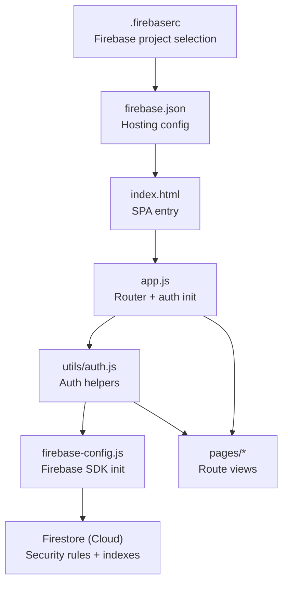
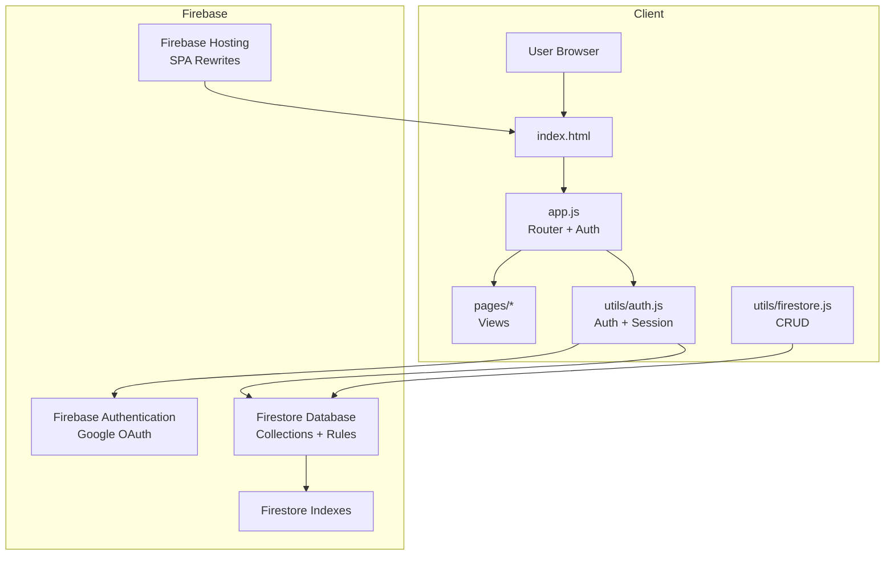
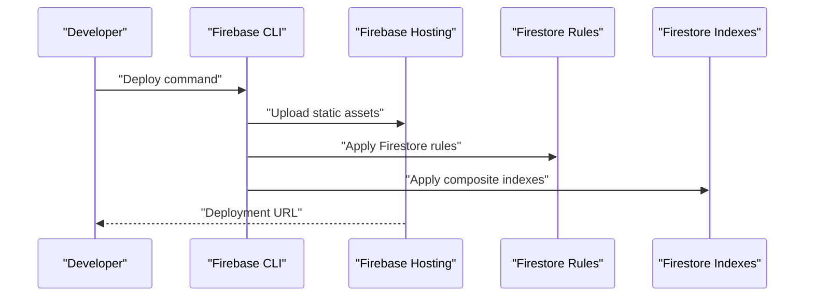
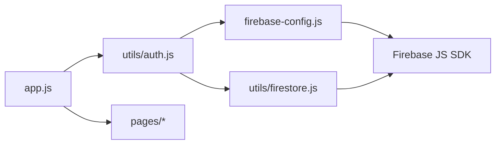
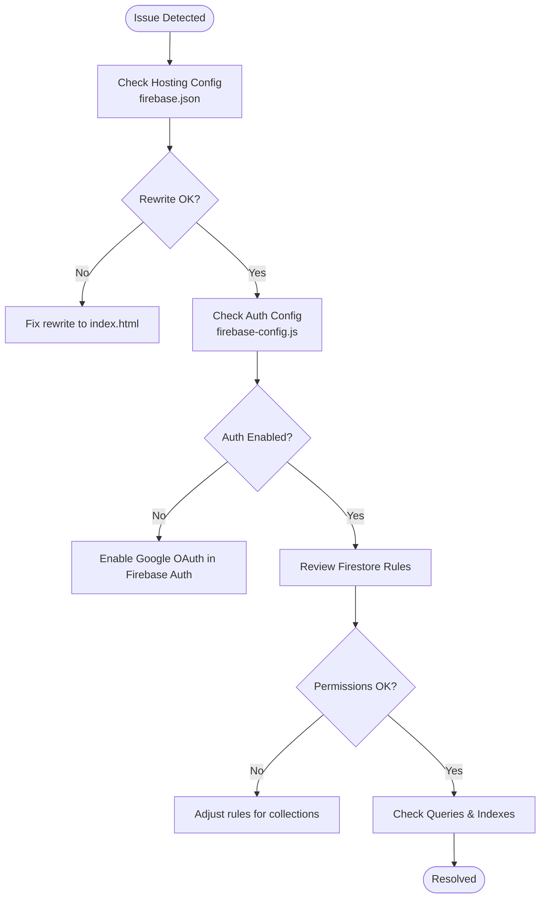

# Deployment & Maintenance

<cite>
**Referenced Files in This Document**
- [.firebaserc](file://.firebaserc)
- [firebase.json](file://firebase.json)
- [firebase-config.js](file://firebase-config.js)
- [firebase-run.js](file://firebase-run.js)
- [firestore.rules](file://firestore.rules)
- [firestore.indexes.json](file://firestore.indexes.json)
- [package.json](file://package.json)
- [index.html](file://index.html)
- [app.js](file://app.js)
- [utils/auth.js](file://utils/auth.js)
- [utils/firestore.js](file://utils/firestore.js)
- [pages/login.js](file://pages/login.js)
</cite>

## Table of Contents
1. [Introduction](#introduction)
2. [Project Structure](#project-structure)
3. [Core Components](#core-components)
4. [Architecture Overview](#architecture-overview)
5. [Detailed Component Analysis](#detailed-component-analysis)
6. [Dependency Analysis](#dependency-analysis)
7. [Performance Considerations](#performance-considerations)
8. [Troubleshooting Guide](#troubleshooting-guide)
9. [Conclusion](#conclusion)
10. [Appendices](#appendices)

## Introduction
This document provides comprehensive deployment and maintenance guidance for the CGMI assessment application hosted on Firebase. It covers Firebase Hosting setup, environment configuration, production deployment procedures, update and rollback strategies, monitoring and performance optimization, security considerations, and operational checklists. The guidance is grounded in the repository’s configuration and source files to ensure accuracy and reproducibility.

## Project Structure
The application is a static single-page application (SPA) served via Firebase Hosting. Key deployment and runtime configuration files include Firebase project configuration, hosting rules, Firestore security rules and indexes, and build/package scripts. The SPA entry point initializes routing, authentication, and page rendering.

**Diagram sources**
- [.firebaserc:1-5](file://.firebaserc#L1-L5)
- [firebase.json:1-20](file://firebase.json#L1-L20)
- [index.html:1-79](file://index.html#L1-L79)
- [app.js:1-173](file://app.js#L1-L173)
- [utils/auth.js:1-172](file://utils/auth.js#L1-L172)
- [firebase-config.js:1-30](file://firebase-config.js#L1-L30)
- [firestore.rules:1-38](file://firestore.rules#L1-L38)
- [firestore.indexes.json:1-22](file://firestore.indexes.json#L1-L22)

**Section sources**
- [.firebaserc:1-5](file://.firebaserc#L1-L5)
- [firebase.json:1-20](file://firebase.json#L1-L20)
- [index.html:1-79](file://index.html#L1-L79)
- [app.js:1-173](file://app.js#L1-L173)

## Core Components
- Firebase Hosting configuration defines the public directory, ignore patterns, and SPA rewrite rule to serve index.html for all routes.
- Firebase project selection is configured via .firebaserc.
- Firebase Admin CLI wrapper script sets credentials and executes Firebase CLI commands.
- Frontend initialization loads local sessions, listens for Firebase Auth state changes, and renders route views accordingly.
- Firestore security rules enforce read/write policies for users, admins, questions, and assessments collections.
- Firestore composite indexes optimize queries for assessments and questions.

**Section sources**
- [firebase.json:6-19](file://firebase.json#L6-L19)
- [.firebaserc:1-5](file://.firebaserc#L1-L5)
- [firebase-run.js:1-18](file://firebase-run.js#L1-L18)
- [app.js:129-173](file://app.js#L129-L173)
- [utils/auth.js:168-172](file://utils/auth.js#L168-L172)
- [firestore.rules:1-38](file://firestore.rules#L1-L38)
- [firestore.indexes.json:1-22](file://firestore.indexes.json#L1-L22)

## Architecture Overview
The application follows a client-side SPA architecture with Firebase Authentication and Firestore. Firebase Hosting serves static assets and routes all unmatched paths to index.html. Authentication supports two flows: user login via a locally stored session and admin login via Google OAuth. Firestore stores users, admins, questions, and assessments with enforced security rules and optimized indexes.

**Diagram sources**
- [index.html:63-79](file://index.html#L63-L79)
- [app.js:1-173](file://app.js#L1-L173)
- [utils/auth.js:1-172](file://utils/auth.js#L1-L172)
- [utils/firestore.js:1-180](file://utils/firestore.js#L1-L180)
- [firebase.json:6-19](file://firebase.json#L6-L19)
- [firestore.rules:1-38](file://firestore.rules#L1-L38)
- [firestore.indexes.json:1-22](file://firestore.indexes.json#L1-L22)

## Detailed Component Analysis

### Firebase Hosting Setup
- Public directory is configured to serve the repository root.
- Ignore patterns exclude configuration files and node_modules.
- SPA rewrite rule ensures deep links resolve to index.html.

Operational steps:
- Build the SPA locally (static assets).
- Deploy using the Firebase CLI to the configured project.
- Verify rewrites and ignore rules in firebase.json.

**Section sources**
- [firebase.json:6-19](file://firebase.json#L6-L19)

### Environment Configuration and Variables
- Firebase project selection is defined in .firebaserc.
- Frontend Firebase SDK initialization is performed in firebase-config.js.
- Admin CLI usage is supported via firebase-run.js, which sets GOOGLE_APPLICATION_CREDENTIALS for service account operations.

Operational steps:
- Ensure .firebaserc points to the intended Firebase project.
- Keep firebase-config.js keys aligned with the selected project.
- Store service account credentials securely and update firebase-run.js accordingly.

**Section sources**
- [.firebaserc:1-5](file://.firebaserc#L1-L5)
- [firebase-config.js:1-30](file://firebase-config.js#L1-L30)
- [firebase-run.js:1-18](file://firebase-run.js#L1-L18)

### Production Deployment Procedures
High-level procedure:
- Stage changes in a release branch.
- Build the SPA locally and validate routing and auth flows.
- Deploy to Firebase Hosting using the Firebase CLI.
- Confirm Firestore rules and indexes are applied.
- Monitor deployment logs and verify the site is reachable.

**Diagram sources**
- [firebase.json:2-5](file://firebase.json#L2-L5)
- [firestore.rules:1-38](file://firestore.rules#L1-L38)
- [firestore.indexes.json:1-22](file://firestore.indexes.json#L1-L22)

**Section sources**
- [firebase.json:1-20](file://firebase.json#L1-L20)
- [firestore.rules:1-38](file://firestore.rules#L1-L38)
- [firestore.indexes.json:1-22](file://firestore.indexes.json#L1-L22)

### Update Procedures and Version Management
- Use a Git-based workflow: create feature branches, merge to main/release, tag releases, and deploy from release branches.
- Maintain a changelog to track breaking changes and migrations.
- For Firestore schema updates, add new fields and apply backward-compatible queries; update indexes via firestore.indexes.json and redeploy.

**Section sources**
- [utils/firestore.js:1-180](file://utils/firestore.js#L1-L180)
- [firestore.indexes.json:1-22](file://firestore.indexes.json#L1-L22)

### Rollback Strategies
- Firebase Hosting supports rollback to previous releases via the CLI or console.
- For Firestore rule/index changes, revert to the last known working commit and redeploy rules/indexes.
- Maintain a safe rollback branch with verified configurations.

**Section sources**
- [firebase.json:2-5](file://firebase.json#L2-L5)
- [firestore.rules:1-38](file://firestore.rules#L1-L38)
- [firestore.indexes.json:1-22](file://firestore.indexes.json#L1-L22)

### Monitoring Setup and Error Tracking
- Enable Firebase Hosting and Cloud Functions logging in the Firebase console.
- Integrate client-side error reporting (e.g., a lightweight telemetry library) to capture unhandled errors and user actions.
- Monitor Firestore usage quotas and query latencies; adjust indexes as needed.

[No sources needed since this section provides general guidance]

### Performance Optimization Techniques
- Optimize images and assets; leverage browser caching via appropriate cache-control headers.
- Minimize third-party CDN usage; keep Chart.js and Tailwind loaded from CDNs as currently configured.
- Reduce DOM size; defer non-critical resources.
- Use Firestore composite indexes to accelerate queries on assessments and questions.

**Section sources**
- [firestore.indexes.json:1-22](file://firestore.indexes.json#L1-L22)

### Security Considerations
- Enforce Firestore security rules to restrict admin-only writes.
- Avoid storing sensitive data client-side; rely on Firebase Auth for identity verification.
- Regularly review and audit admin whitelists and access controls.

**Section sources**
- [firestore.rules:1-38](file://firestore.rules#L1-L38)

### Backup Procedures
- Firestore snapshots can be exported via the Firebase CLI for disaster recovery.
- Maintain backups of configuration files (.firebaserc, firebase.json, firestore.rules, firestore.indexes.json).
- Store service account keys securely and rotate periodically.

**Section sources**
- [firebase-run.js:1-18](file://firebase-run.js#L1-L18)
- [.firebaserc:1-5](file://.firebaserc#L1-L5)
- [firebase.json:1-20](file://firebase.json#L1-L20)
- [firestore.rules:1-38](file://firestore.rules#L1-L38)
- [firestore.indexes.json:1-22](file://firestore.indexes.json#L1-L22)

### Maintenance Tasks
- Monthly: review Firestore usage, update indexes, and validate auth flows.
- Quarterly: audit admin lists, rotate service account keys, and refresh CDN-hosted libraries.
- Annually: assess and update security rules and access policies.

[No sources needed since this section provides general guidance]

## Dependency Analysis
The SPA depends on Firebase Authentication and Firestore. The router integrates with auth state changes and renders route-specific views. Firestore utilities encapsulate CRUD operations and query logic.

**Diagram sources**
- [app.js:1-173](file://app.js#L1-L173)
- [utils/auth.js:1-172](file://utils/auth.js#L1-L172)
- [utils/firestore.js:1-180](file://utils/firestore.js#L1-L180)
- [firebase-config.js:1-30](file://firebase-config.js#L1-L30)

**Section sources**
- [app.js:1-173](file://app.js#L1-L173)
- [utils/auth.js:1-172](file://utils/auth.js#L1-L172)
- [utils/firestore.js:1-180](file://utils/firestore.js#L1-L180)
- [firebase-config.js:1-30](file://firebase-config.js#L1-L30)

## Performance Considerations
- Client-side routing and minimal DOM updates improve perceived performance.
- Firestore queries are optimized by composite indexes; ensure indexes align with query patterns.
- Keep external CDN dependencies up to date; monitor their impact on load times.

**Section sources**
- [firestore.indexes.json:1-22](file://firestore.indexes.json#L1-L22)

## Troubleshooting Guide
Common deployment issues and resolutions:
- SPA routes returning 404: Verify firebase.json rewrite rule targets index.html.
- Authentication failures: Confirm firebase-config.js matches the active project and that Google OAuth is enabled in Firebase Authentication.
- Firestore permission denied: Review firestore.rules for correct allow conditions and admin checks.
- Slow queries: Inspect firestore.indexes.json and ensure composite indexes exist for targeted queries.

**Diagram sources**
- [firebase.json:6-19](file://firebase.json#L6-L19)
- [firebase-config.js:1-30](file://firebase-config.js#L1-L30)
- [firestore.rules:1-38](file://firestore.rules#L1-L38)
- [firestore.indexes.json:1-22](file://firestore.indexes.json#L1-L22)

**Section sources**
- [firebase.json:6-19](file://firebase.json#L6-L19)
- [firebase-config.js:1-30](file://firebase-config.js#L1-L30)
- [firestore.rules:1-38](file://firestore.rules#L1-L38)
- [firestore.indexes.json:1-22](file://firestore.indexes.json#L1-L22)

## Conclusion
This guide consolidates practical, code-backed procedures for deploying and maintaining the CGMI assessment application on Firebase. By following the outlined steps—correct configuration, secure administration, robust monitoring, and disciplined update/rollback practices—you can sustain a reliable, performant, and secure platform for assessments and administration.

## Appendices
- Operational checklist template:
  - Pre-deploy
    - Build and test locally
    - Review firebase.json, firestore.rules, firestore.indexes.json
    - Verify .firebaserc project
  - Deploy
    - Run Firebase CLI deploy
    - Confirm Hosting URL and SPA routing
  - Post-deploy
    - Validate Firestore queries and indexes
    - Test authentication flows
    - Monitor logs and usage

[No sources needed since this section provides general guidance]