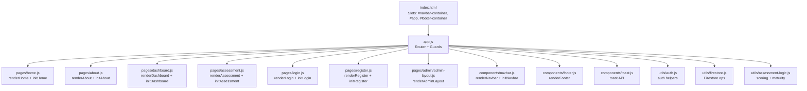
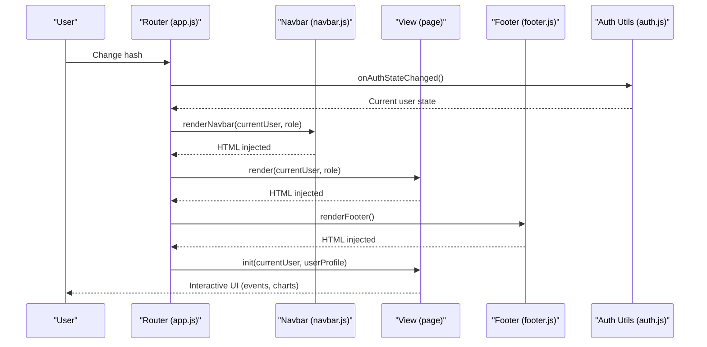
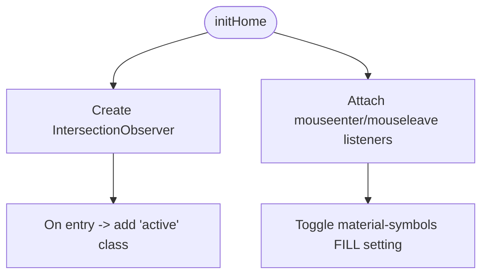
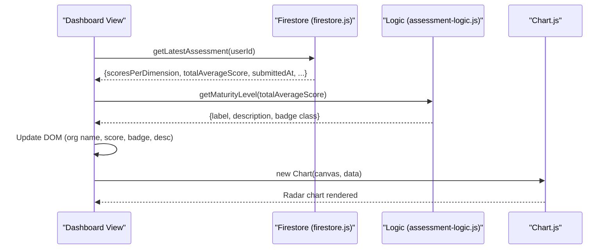
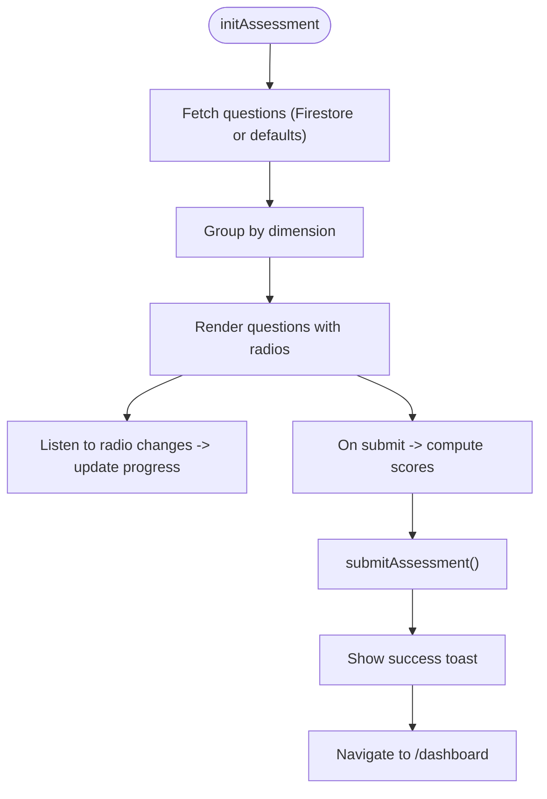
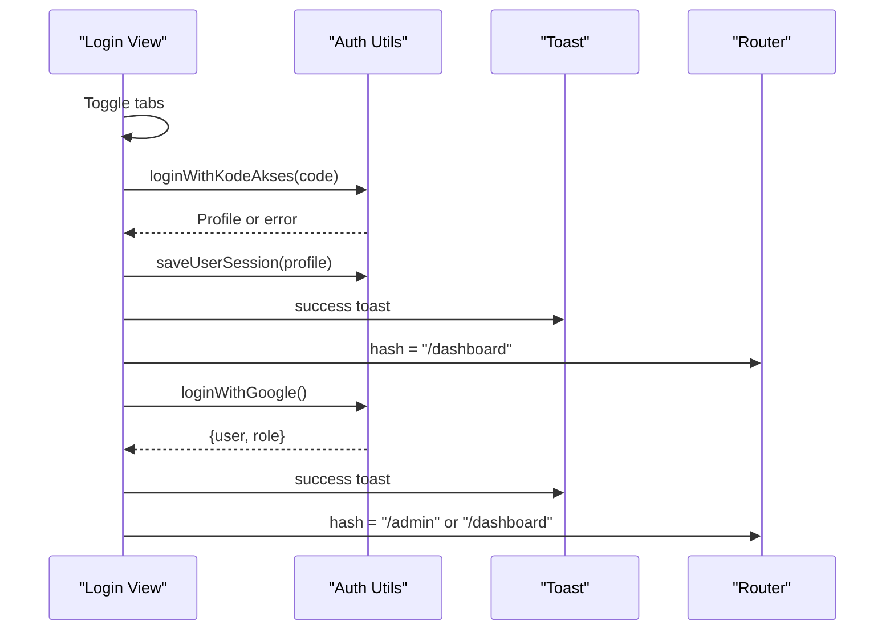
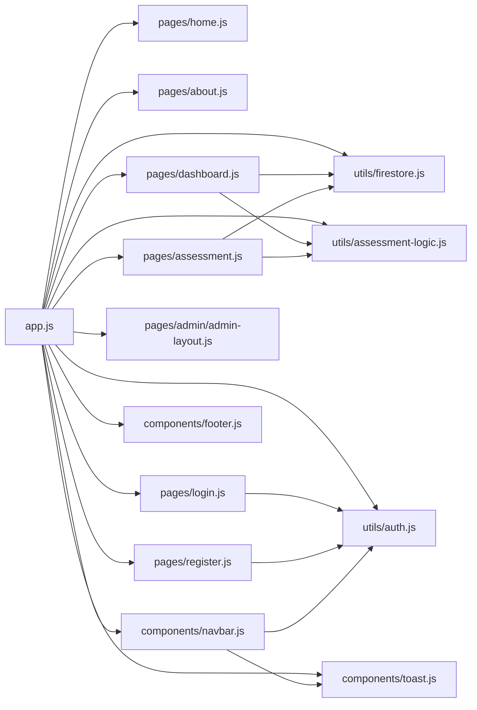

# Page Components

<cite>
**Referenced Files in This Document**
- [index.html](file://index.html)
- [app.js](file://app.js)
- [main.css](file://styles/main.css)
- [home.js](file://pages/home.js)
- [about.js](file://pages/about.js)
- [dashboard.js](file://pages/dashboard.js)
- [assessment.js](file://pages/assessment.js)
- [login.js](file://pages/login.js)
- [register.js](file://pages/register.js)
- [admin-layout.js](file://pages/admin/admin-layout.js)
- [navbar.js](file://components/navbar.js)
- [footer.js](file://components/footer.js)
- [toast.js](file://components/toast.js)
- [auth.js](file://utils/auth.js)
- [assessment-logic.js](file://utils/assessment-logic.js)
- [firestore.js](file://utils/firestore.js)
</cite>

## Table of Contents
1. [Introduction](#introduction)
2. [Project Structure](#project-structure)
3. [Core Components](#core-components)
4. [Architecture Overview](#architecture-overview)
5. [Detailed Component Analysis](#detailed-component-analysis)
6. [Dependency Analysis](#dependency-analysis)
7. [Performance Considerations](#performance-considerations)
8. [Troubleshooting Guide](#troubleshooting-guide)
9. [Conclusion](#conclusion)
10. [Appendices](#appendices)

## Introduction
This document explains the page-level components and UI elements of the CGMI assessment application. It covers the home page, about page, dashboard, assessment questionnaire, login and registration flows, and the admin shell. It also documents shared UI components (navbar, footer, toast notifications), state management, routing and guards, user interaction patterns, responsive design, accessibility, and cross-browser compatibility. The goal is to help developers and stakeholders understand how pages are structured, how state flows through the system, and how to compose and extend components safely.

## Project Structure
The application is a single-page application (SPA) driven by hash-based routing. The HTML template defines three slots: navbar, main content, and footer. The router renders page views and initializes page-specific logic. Shared components are rendered into the navbar and footer slots, while page-specific logic runs after DOM insertion.

**Diagram sources**
- [index.html:63-72](file://index.html#L63-L72)
- [app.js:11-25](file://app.js#L11-L25)
- [home.js:6-157](file://pages/home.js#L6-L157)
- [about.js:6-103](file://pages/about.js#L6-L103)
- [dashboard.js:10-113](file://pages/dashboard.js#L10-L113)
- [assessment.js:10-60](file://pages/assessment.js#L10-L60)
- [login.js:9-44](file://pages/login.js#L9-L44)
- [register.js:47-89](file://pages/register.js#L47-L89)
- [admin-layout.js:6-62](file://pages/admin/admin-layout.js#L6-L62)
- [navbar.js:9-78](file://components/navbar.js#L9-L78)
- [footer.js:6-45](file://components/footer.js#L6-L45)
- [toast.js:41-83](file://components/toast.js#L41-L83)
- [auth.js:32-172](file://utils/auth.js#L32-L172)
- [assessment-logic.js:170-211](file://utils/assessment-logic.js#L170-L211)
- [firestore.js:20-89](file://utils/firestore.js#L20-L89)

**Section sources**
- [index.html:63-72](file://index.html#L63-L72)
- [app.js:32-45](file://app.js#L32-L45)

## Core Components
- Router and Guards: Central routing registry, guest-only, authentication, and role-based authorization logic. Renders navbar, page content, and footer; invokes page init hooks.
- Pages:
  - Home: Hero, stats, marquee, feature cards, and summary panels.
  - About: Academic definitions and dimensions overview.
  - Dashboard: Loading skeleton, profile header, overall score and badge, radar chart, recommendations.
  - Assessment: Grouped Likert questions, progress tracker, submission pipeline.
  - Login/Register: Dual-tab interface for user and admin login; registration flow with modal.
  - Admin Shell: Sidebar layout for admin subviews.
- Shared UI:
  - Navbar: Auth-aware links, mobile menu, logout, active link highlighting.
  - Footer: Site branding, navigation, and researcher list.
  - Toast: Non-blocking notifications with icons and close actions.

**Section sources**
- [app.js:32-127](file://app.js#L32-L127)
- [home.js:6-157](file://pages/home.js#L6-L157)
- [about.js:6-103](file://pages/about.js#L6-L103)
- [dashboard.js:10-113](file://pages/dashboard.js#L10-L113)
- [assessment.js:10-60](file://pages/assessment.js#L10-L60)
- [login.js:9-44](file://pages/login.js#L9-L44)
- [register.js:47-89](file://pages/register.js#L47-L89)
- [admin-layout.js:6-62](file://pages/admin/admin-layout.js#L6-L62)
- [navbar.js:9-78](file://components/navbar.js#L9-L78)
- [footer.js:6-45](file://components/footer.js#L6-L45)
- [toast.js:41-83](file://components/toast.js#L41-L83)

## Architecture Overview
The SPA uses a hybrid authentication model:
- User sessions stored in localStorage (organization user with Kode Akses).
- Admin sessions via Firebase Auth (Google OAuth) with role resolution.

Routing and initialization:
- Hashchange triggers route resolution and guards.
- Navbar and footer are rendered into slots before page content.
- Page init functions perform async data fetching and DOM manipulation.

**Diagram sources**
- [app.js:63-127](file://app.js#L63-L127)
- [navbar.js:9-78](file://components/navbar.js#L9-L78)
- [footer.js:6-45](file://components/footer.js#L6-L45)
- [auth.js:169-172](file://utils/auth.js#L169-L172)

## Detailed Component Analysis

### Home Page
- Structure: Hero with overlay and CTAs, stats strip, animated marquee, feature cards with hover effects, two-column content panels.
- Interactions:
  - Reveal-on-scroll animations using IntersectionObserver.
  - Hover micro-interactions for icons inside feature cards.
- Accessibility: Semantic headings, sufficient color contrast, reduced motion support for animations.
- Responsive: Grid layouts adapt to breakpoints; hero maintains aspect ratio and spacing.

**Diagram sources**
- [home.js:159-187](file://pages/home.js#L159-L187)
- [main.css:715-724](file://styles/main.css#L715-L724)
- [main.css:726-728](file://styles/main.css#L726-L728)

**Section sources**
- [home.js:6-157](file://pages/home.js#L6-L157)
- [home.js:159-187](file://pages/home.js#L159-L187)
- [main.css:698-747](file://styles/main.css#L698-L747)

### About Page
- Structure: Three informational cards with emoji, organized dimensions list.
- Interactions: None; static informational layout.
- Accessibility: Clear typography hierarchy and readable line heights.

**Section sources**
- [about.js:6-103](file://pages/about.js#L6-L103)

### Dashboard
- Structure: Loading skeleton, profile header, score and badge, maturity description, radar chart canvas, recommendations panel, empty state.
- State Management:
  - Async fetch of latest assessment by current user ID.
  - Population of DOM nodes for organization name, date, score, badge, and recommendations.
- Rendering:
  - Chart.js radar initialized with labels and values derived from assessment scores.
- Error Handling: Toast errors on failures.

**Diagram sources**
- [dashboard.js:117-236](file://pages/dashboard.js#L117-L236)
- [firestore.js:67-77](file://utils/firestore.js#L67-L77)
- [assessment-logic.js:157-162](file://utils/assessment-logic.js#L157-L162)

**Section sources**
- [dashboard.js:10-113](file://pages/dashboard.js#L10-L113)
- [dashboard.js:117-236](file://pages/dashboard.js#L117-L236)
- [firestore.js:67-77](file://utils/firestore.js#L67-L77)
- [assessment-logic.js:157-162](file://utils/assessment-logic.js#L157-L162)

### Assessment
- Structure: Progress tracker, grouped questions by dimension, Likert 1–5 radios, submit panel.
- State Management:
  - Real-time progress updates on radio change.
  - Submission computes per-dimension averages and total average, determines maturity level, persists to Firestore.
- Validation: Ensures all questions are answered before submission.

**Diagram sources**
- [assessment.js:62-192](file://pages/assessment.js#L62-L192)
- [assessment-logic.js:170-195](file://utils/assessment-logic.js#L170-L195)
- [firestore.js:55-59](file://utils/firestore.js#L55-L59)

**Section sources**
- [assessment.js:10-60](file://pages/assessment.js#L10-L60)
- [assessment.js:62-192](file://pages/assessment.js#L62-L192)
- [assessment-logic.js:170-195](file://utils/assessment-logic.js#L170-L195)
- [firestore.js:55-59](file://utils/firestore.js#L55-L59)

### Login and Registration
- Login:
  - Dual tabs: user (Kode Akses) and admin (Google).
  - User login validates 6-digit code, saves session to localStorage, navigates to dashboard.
  - Admin login uses popup, resolves role, navigates to admin or dashboard.
- Registration:
  - Organization selection, years of service, position.
  - Saves profile, stores session, shows modal with generated Kode Akses, navigates to dashboard.

**Diagram sources**
- [login.js:46-131](file://pages/login.js#L46-L131)
- [auth.js:32-104](file://utils/auth.js#L32-L104)

**Section sources**
- [login.js:9-44](file://pages/login.js#L9-L44)
- [login.js:46-131](file://pages/login.js#L46-L131)
- [register.js:47-89](file://pages/register.js#L47-L89)
- [register.js:91-160](file://pages/register.js#L91-L160)
- [auth.js:32-104](file://utils/auth.js#L32-L104)

### Admin Shell
- Structure: Layout header, sidebar navigation, dynamic content area.
- Behavior: Builds sidebar links based on active sub-tab and applies active class.

**Section sources**
- [admin-layout.js:6-62](file://pages/admin/admin-layout.js#L6-L62)

### Navbar
- Structure: Brand, desktop links, avatar and logout for authenticated users, guest buttons, mobile hamburger menu.
- State Management:
  - Highlights active link based on hash.
  - Mobile menu toggling and automatic closure on link click.
  - Logout clears localStorage and Firebase session, then redirects to home.

**Section sources**
- [navbar.js:9-78](file://components/navbar.js#L9-L78)
- [navbar.js:80-117](file://components/navbar.js#L80-L117)
- [auth.js:107-114](file://utils/auth.js#L107-L114)

### Footer
- Structure: Brand logo, description, navigation links, researcher list, copyright.
- Behavior: Static content rendered into footer slot.

**Section sources**
- [footer.js:6-45](file://components/footer.js#L6-L45)

### Toast Notifications
- Structure: Singleton container appended to body; each toast is a flexible bar with icon, message, and close button.
- Behavior: Staggered entrance, optional auto-dismiss, manual close, pointer events disabled on container.

**Section sources**
- [toast.js:41-83](file://components/toast.js#L41-L83)
- [main.css:603-660](file://styles/main.css#L603-L660)

## Dependency Analysis
- Router depends on:
  - Page renderers and initializers.
  - Navbar and footer renderers.
  - Auth utilities for session and role resolution.
- Pages depend on:
  - Firestore utilities for data persistence and retrieval.
  - Assessment logic for scoring and maturity computation.
  - Toast for user feedback.
- Shared components depend on:
  - Auth utilities for logout and user metadata.
  - CSS for styling and responsive behavior.

**Diagram sources**
- [app.js:11-25](file://app.js#L11-L25)
- [dashboard.js:6-8](file://pages/dashboard.js#L6-L8)
- [assessment.js:6-8](file://pages/assessment.js#L6-L8)
- [login.js:6-7](file://pages/login.js#L6-L7)
- [register.js:6-7](file://pages/register.js#L6-L7)
- [navbar.js:6-7](file://components/navbar.js#L6-L7)
- [toast.js:6-6](file://components/toast.js#L6-L6)
- [auth.js:6-15](file://utils/auth.js#L6-L15)
- [assessment-logic.js:6-13](file://utils/assessment-logic.js#L6-L13)
- [firestore.js:6-10](file://utils/firestore.js#L6-L10)

**Section sources**
- [app.js:11-25](file://app.js#L11-L25)
- [dashboard.js:6-8](file://pages/dashboard.js#L6-L8)
- [assessment.js:6-8](file://pages/assessment.js#L6-L8)
- [login.js:6-7](file://pages/login.js#L6-L7)
- [register.js:6-7](file://pages/register.js#L6-L7)
- [navbar.js:6-7](file://components/navbar.js#L6-L7)
- [toast.js:6-6](file://components/toast.js#L6-L6)
- [auth.js:6-15](file://utils/auth.js#L6-L15)
- [assessment-logic.js:6-13](file://utils/assessment-logic.js#L6-L13)
- [firestore.js:6-10](file://utils/firestore.js#L6-L10)

## Performance Considerations
- Rendering:
  - Skeleton loaders on dashboard and assessment reduce perceived latency.
  - Chart initialization occurs after data is ready; existing instances are destroyed before recreation.
- Interaction:
  - Debounced progress updates during assessment.
  - Minimal DOM manipulation; bulk innerHTML updates for lists.
- Network:
  - Firestore queries use ordering and limits where appropriate.
- Assets:
  - CDN-hosted Chart.js and Tailwind; ensure caching and preconnect for fonts.

[No sources needed since this section provides general guidance]

## Troubleshooting Guide
- Navigation does not highlight active link:
  - Verify hash-based active class logic in navbar init.
- Logout does not redirect:
  - Confirm both localStorage and Firebase logout are invoked and success toast is shown.
- Dashboard shows empty state unexpectedly:
  - Ensure user is authenticated and assessment exists; check Firestore permissions.
- Assessment submission fails:
  - Validate all questions are answered; confirm scoring and submission functions are called.
- Toast not visible:
  - Ensure singleton container is appended and styles applied.

**Section sources**
- [navbar.js:108-116](file://components/navbar.js#L108-L116)
- [auth.js:107-114](file://utils/auth.js#L107-L114)
- [dashboard.js:124-134](file://pages/dashboard.js#L124-L134)
- [assessment.js:153-191](file://pages/assessment.js#L153-L191)
- [toast.js:41-83](file://components/toast.js#L41-L83)

## Conclusion
The application’s page components are modular, state-driven, and designed for clarity and maintainability. The router coordinates shared UI and page-specific logic, while utilities encapsulate authentication, data access, and assessment computation. The design system and CSS provide consistent responsive behavior and accessibility characteristics. Extending pages involves adding render/init pairs, wiring routes, and leveraging shared components and utilities.

[No sources needed since this section summarizes without analyzing specific files]

## Appendices

### Props and Event Handling Summary
- Navbar:
  - Props: currentUser, currentRole.
  - Events: hamburger toggle, logout click, link clicks in mobile menu.
- Dashboard:
  - Props: none (reads current user).
  - Events: none (init performs async work).
- Assessment:
  - Props: none.
  - Events: radio changes (progress), form submit (validation and scoring).
- Login/Register:
  - Props: none.
  - Events: tab switches, form submits, Google login click.
- Toast:
  - API: toast.success/info/warning/error(message, duration?).

**Section sources**
- [navbar.js:9-78](file://components/navbar.js#L9-L78)
- [navbar.js:80-117](file://components/navbar.js#L80-L117)
- [dashboard.js:117-236](file://pages/dashboard.js#L117-L236)
- [assessment.js:62-192](file://pages/assessment.js#L62-L192)
- [login.js:46-131](file://pages/login.js#L46-L131)
- [register.js:91-160](file://pages/register.js#L91-L160)
- [toast.js:77-83](file://components/toast.js#L77-L83)

### Responsive Design and Accessibility Notes
- Responsive:
  - Grids and flex layouts adapt across breakpoints; mobile-first navbar with hamburger menu.
- Accessibility:
  - Proper heading hierarchy, focusable controls, semantic labels, and reduced motion support.
- Cross-browser:
  - Uses modern APIs (IntersectionObserver, Chart.js, Tailwind Play CDN); ensure polyfills if targeting older browsers.

**Section sources**
- [main.css:293-303](file://styles/main.css#L293-L303)
- [main.css:742-747](file://styles/main.css#L742-L747)
- [index.html:44-55](file://index.html#L44-L55)