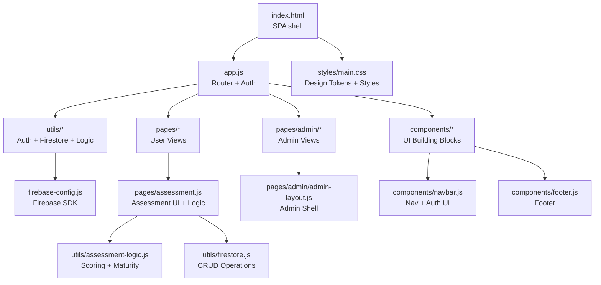
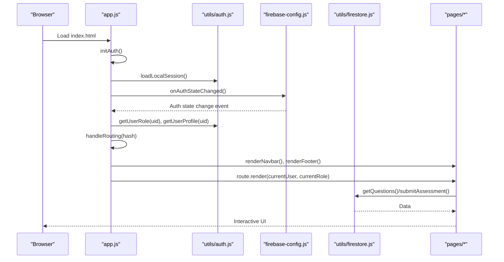
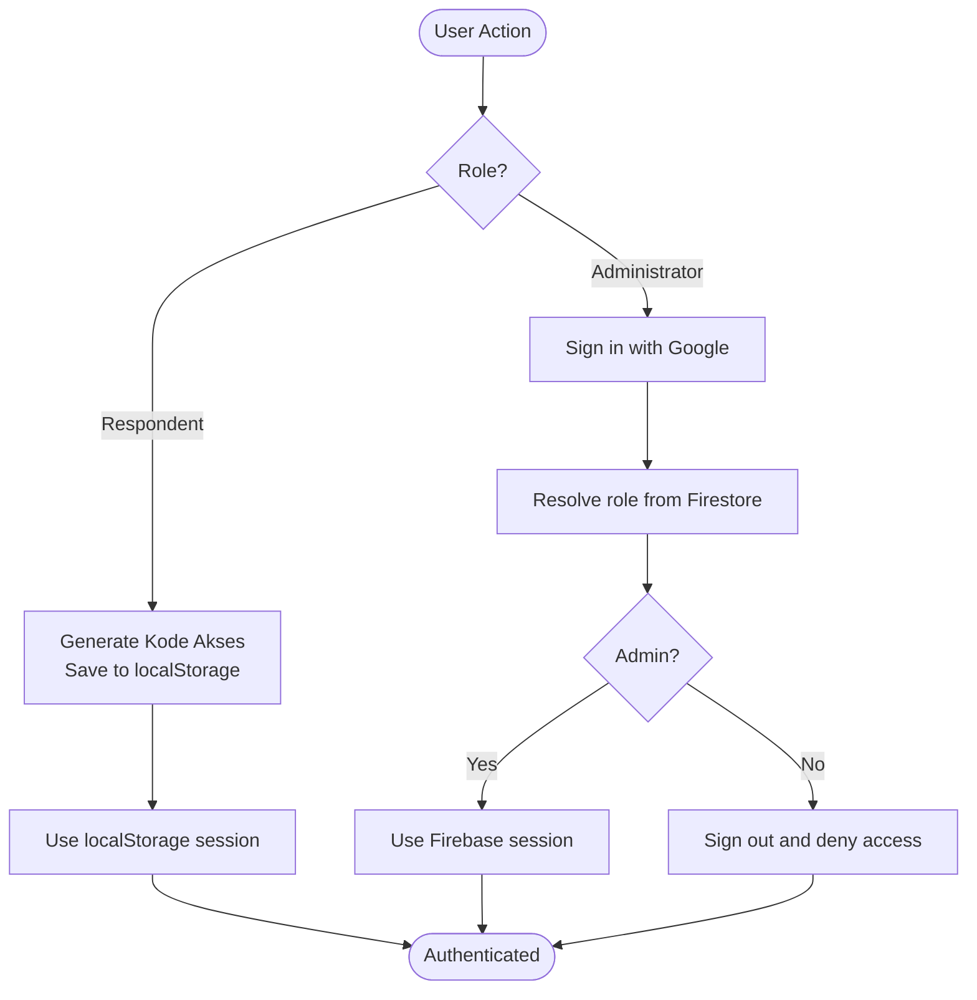
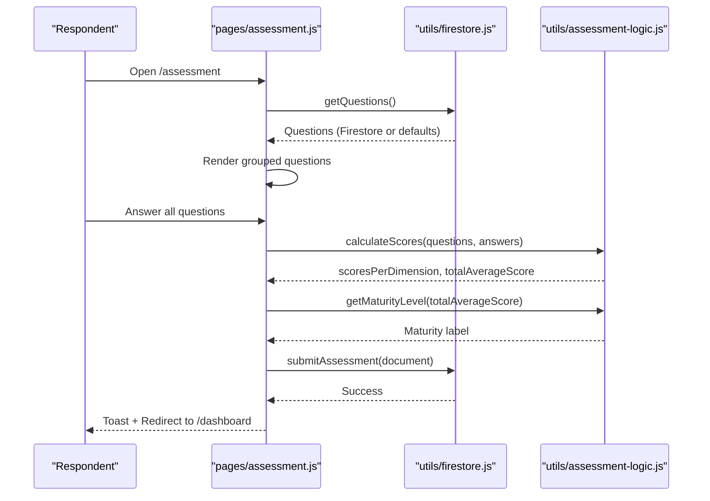
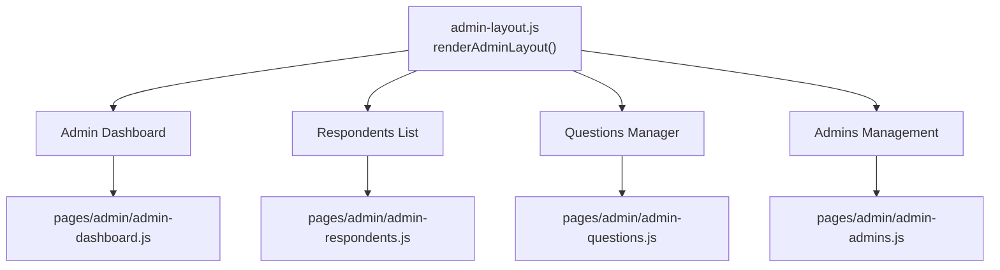
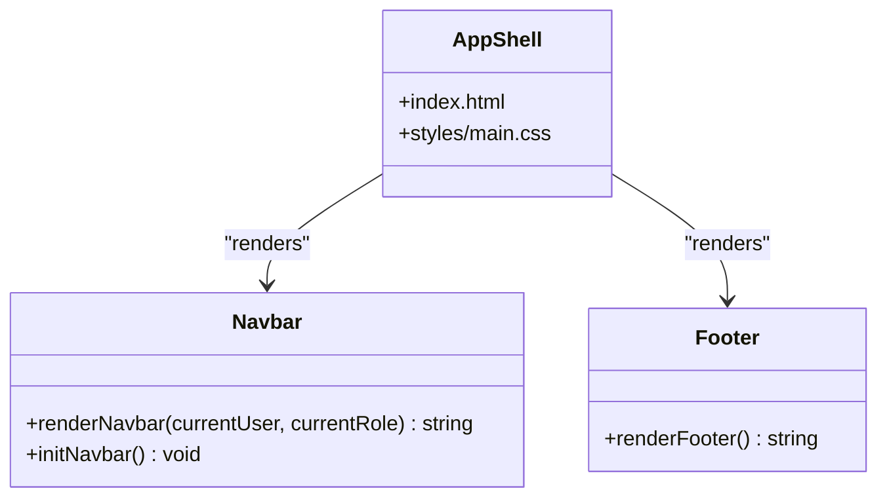
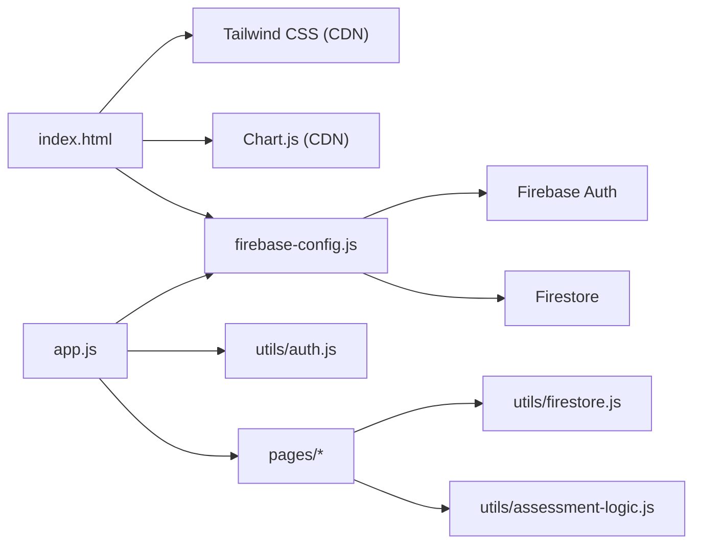

# Project Overview

<cite>
**Referenced Files in This Document**
- [README.md](file://README.md)
- [DESIGN.md](file://DESIGN.md)
- [package.json](file://package.json)
- [index.html](file://index.html)
- [app.js](file://app.js)
- [firebase-config.js](file://firebase-config.js)
- [utils/auth.js](file://utils/auth.js)
- [utils/firestore.js](file://utils/firestore.js)
- [utils/assessment-logic.js](file://utils/assessment-logic.js)
- [pages/assessment.js](file://pages/assessment.js)
- [pages/admin/admin-layout.js](file://pages/admin/admin-layout.js)
- [components/navbar.js](file://components/navbar.js)
- [components/footer.js](file://components/footer.js)
- [styles/main.css](file://styles/main.css)
</cite>

## Table of Contents
1. [Introduction](#introduction)
2. [Project Structure](#project-structure)
3. [Core Components](#core-components)
4. [Architecture Overview](#architecture-overview)
5. [Detailed Component Analysis](#detailed-component-analysis)
6. [Dependency Analysis](#dependency-analysis)
7. [Performance Considerations](#performance-considerations)
8. [Troubleshooting Guide](#troubleshooting-guide)
9. [Conclusion](#conclusion)

## Introduction
The CGMI Assessment App is a Collaboration Governance Maturity Index platform designed for Indonesian public organizations. Its mission is to improve collaboration governance capabilities through a structured, data-driven assessment process. The application enables respondents to complete a standardized questionnaire across six dimensions of collaboration governance, calculates maturity scores, and provides actionable recommendations. Administrators can manage assessments, questions, and users through a dedicated admin panel powered by Firebase.

Target audience:
- Public sector employees and officials completing assessments
- Administrators managing the assessment ecosystem (questions, users, and admin accounts)

Key features:
- Dual authentication system (respondents via Kode Akses; administrators via Google OAuth)
- Structured assessment system with Likert-scale questions and automated scoring
- Administrative panel for managing questions, respondents, and admin users
- Real-time progress tracking during assessments
- Dashboard for displaying results and maturity insights

Technology stack:
- Frontend: Vanilla JavaScript (ES modules), Tailwind CSS (via CDN), Chart.js (CDN)
- Backend: Firebase (Authentication, Firestore, Hosting)
- Styling: Carbon-inspired design tokens and custom CSS

## Project Structure
The project follows a modular, feature-based structure with clear separation of concerns:
- Root HTML bootstraps the SPA and loads shared components and third-party libraries
- app.js orchestrates routing, authentication, and page rendering
- utils/ contains reusable logic for authentication, Firestore operations, and assessment calculations
- pages/ holds page-level modules for user and admin views
- components/ provides shared UI building blocks (navigation, footer, notifications)
- styles/ defines Carbon-inspired design tokens and component styles
- assets/ contains static resources (icons, images)

**Diagram sources**
- [index.html:1-79](file://index.html#L1-L79)
- [app.js:1-168](file://app.js#L1-L168)
- [utils/auth.js:1-172](file://utils/auth.js#L1-L172)
- [utils/firestore.js:1-180](file://utils/firestore.js#L1-L180)
- [utils/assessment-logic.js:1-211](file://utils/assessment-logic.js#L1-L211)
- [pages/assessment.js:1-193](file://pages/assessment.js#L1-L193)
- [pages/admin/admin-layout.js:1-63](file://pages/admin/admin-layout.js#L1-L63)
- [components/navbar.js:1-117](file://components/navbar.js#L1-L117)
- [components/footer.js:1-46](file://components/footer.js#L1-L46)
- [styles/main.css:1-748](file://styles/main.css#L1-L748)

**Section sources**
- [index.html:1-79](file://index.html#L1-L79)
- [app.js:1-168](file://app.js#L1-L168)

## Core Components
- Single Page Application router with hash-based navigation and route guards
- Authentication subsystem supporting two user roles:
  - Respondents authenticated via a local Kode Akses session stored in localStorage
  - Administrators authenticated via Google OAuth with role resolution in Firestore
- Assessment engine with predefined questions, scoring, and maturity classification
- Admin panel with navigation and CRUD operations for questions, users, and admins
- Shared UI components for navigation, footer, and toast notifications

Practical examples:
- A respondent logs in using a generated Kode Akses, completes the assessment, and receives a maturity score and recommendations
- An administrator signs in with Google, seeds default questions, manages users, and reviews aggregated results

**Section sources**
- [app.js:32-45](file://app.js#L32-L45)
- [utils/auth.js:32-56](file://utils/auth.js#L32-L56)
- [utils/auth.js:59-104](file://utils/auth.js#L59-L104)
- [utils/assessment-logic.js:24-96](file://utils/assessment-logic.js#L24-L96)
- [pages/admin/admin-layout.js:6-62](file://pages/admin/admin-layout.js#L6-L62)

## Architecture Overview
The application uses a SPA architecture with a hybrid authentication model:
- Client-side routing with hash fragments
- Route guards enforcing guest-only, authentication, and role-based access
- Firebase Authentication for admin sessions and Firestore for persistent data
- Local storage for respondent sessions to enable offline-like behavior

**Diagram sources**
- [app.js:124-161](file://app.js#L124-L161)
- [utils/auth.js:121-166](file://utils/auth.js#L121-L166)
- [firebase-config.js:14-27](file://firebase-config.js#L14-L27)
- [utils/firestore.js:20-88](file://utils/firestore.js#L20-L88)
- [pages/assessment.js:62-192](file://pages/assessment.js#L62-L192)

## Detailed Component Analysis

### Authentication and Session Management
The authentication system supports two distinct flows:
- Respondent login: generates a random 6-digit Kode Akses and stores a lightweight profile in localStorage
- Administrator login: uses Google OAuth; resolves role and profile from Firestore

**Diagram sources**
- [utils/auth.js:32-56](file://utils/auth.js#L32-L56)
- [utils/auth.js:59-104](file://utils/auth.js#L59-L104)
- [utils/auth.js:132-149](file://utils/auth.js#L132-L149)
- [utils/auth.js:152-166](file://utils/auth.js#L152-L166)

**Section sources**
- [utils/auth.js:17-29](file://utils/auth.js#L17-L29)
- [utils/auth.js:32-56](file://utils/auth.js#L32-L56)
- [utils/auth.js:59-104](file://utils/auth.js#L59-L104)
- [utils/auth.js:132-166](file://utils/auth.js#L132-L166)

### Assessment Engine
The assessment module renders a Likert-scale questionnaire, tracks progress, validates completion, computes scores, and persists results.

**Diagram sources**
- [pages/assessment.js:62-192](file://pages/assessment.js#L62-L192)
- [utils/firestore.js:20-88](file://utils/firestore.js#L20-L88)
- [utils/assessment-logic.js:170-195](file://utils/assessment-logic.js#L170-L195)
- [utils/assessment-logic.js:157-162](file://utils/assessment-logic.js#L157-L162)

**Section sources**
- [pages/assessment.js:10-60](file://pages/assessment.js#L10-L60)
- [pages/assessment.js:62-192](file://pages/assessment.js#L62-L192)
- [utils/assessment-logic.js:6-13](file://utils/assessment-logic.js#L6-L13)
- [utils/assessment-logic.js:24-96](file://utils/assessment-logic.js#L24-L96)
- [utils/assessment-logic.js:157-162](file://utils/assessment-logic.js#L157-L162)

### Admin Panel
The admin panel provides a sidebar navigation shell and dynamic subviews for managing assessments, questions, and administrators.

**Diagram sources**
- [pages/admin/admin-layout.js:6-62](file://pages/admin/admin-layout.js#L6-L62)

**Section sources**
- [pages/admin/admin-layout.js:6-62](file://pages/admin/admin-layout.js#L6-L62)

### Navigation and UI Shell
The navigation bar adapts to user roles and provides responsive behavior, while the footer displays institutional information and links.

**Diagram sources**
- [components/navbar.js:9-78](file://components/navbar.js#L9-L78)
- [components/footer.js:6-45](file://components/footer.js#L6-L45)
- [index.html:63-78](file://index.html#L63-L78)
- [styles/main.css:80-336](file://styles/main.css#L80-L336)

**Section sources**
- [components/navbar.js:9-78](file://components/navbar.js#L9-L78)
- [components/footer.js:6-45](file://components/footer.js#L6-L45)
- [styles/main.css:80-336](file://styles/main.css#L80-L336)

## Dependency Analysis
External dependencies and integrations:
- Firebase SDK for Authentication and Firestore
- Chart.js for visualization (used in dashboards)
- Tailwind CSS via CDN for utility-first styling
- IBM Plex Sans for typography

**Diagram sources**
- [index.html:43-61](file://index.html#L43-L61)
- [firebase-config.js:10-27](file://firebase-config.js#L10-L27)
- [app.js:7-24](file://app.js#L7-L24)
- [utils/firestore.js:6-10](file://utils/firestore.js#L6-L10)

**Section sources**
- [package.json:6-10](file://package.json#L6-L10)
- [index.html:43-61](file://index.html#L43-L61)
- [firebase-config.js:10-27](file://firebase-config.js#L10-L27)

## Performance Considerations
- Client-side routing minimizes server requests; ensure route initialization is efficient
- Firestore queries are ordered and filtered; consider caching frequently accessed data
- Assessment rendering uses grouped questions; keep question lists manageable
- Chart.js usage should be scoped to dashboard contexts to avoid unnecessary overhead
- Tailwind utilities are neutralized to enforce flat design; avoid excessive utility classes

## Troubleshooting Guide
Common issues and resolutions:
- Authentication conflicts: If a user is logged in as an admin but localStorage still contains a user session, the admin session takes precedence and clears the user session automatically
- Missing questions: If Firestore is unavailable, the assessment falls back to default questions
- Admin access denied: If a Google account is not whitelisted, the system signs out and throws an error message
- Assessment submission errors: Validation ensures all questions are answered; submission failures surface user-friendly error messages

**Section sources**
- [app.js:124-161](file://app.js#L124-L161)
- [pages/assessment.js:70-79](file://pages/assessment.js#L70-L79)
- [utils/auth.js:101-104](file://utils/auth.js#L101-L104)
- [pages/assessment.js:164-190](file://pages/assessment.js#L164-L190)

## Conclusion
The CGMI Assessment App delivers a robust, role-aware SPA for Indonesian public organizations to assess and improve collaboration governance. Its hybrid authentication model, structured assessment engine, and admin panel provide a scalable foundation for data-driven governance improvement. The Carbon-inspired design system and modular architecture support maintainability and extensibility.