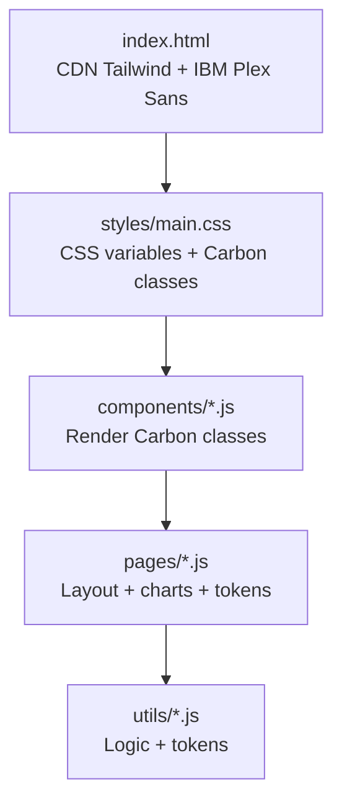
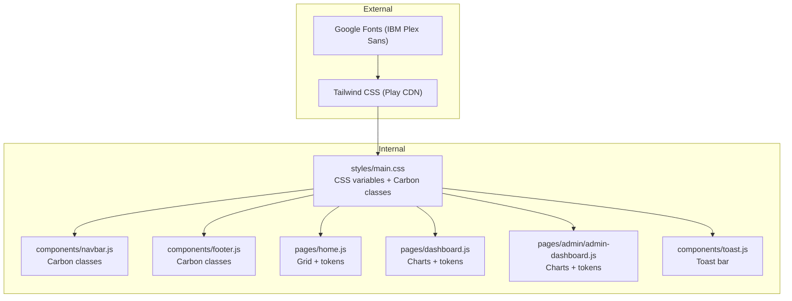
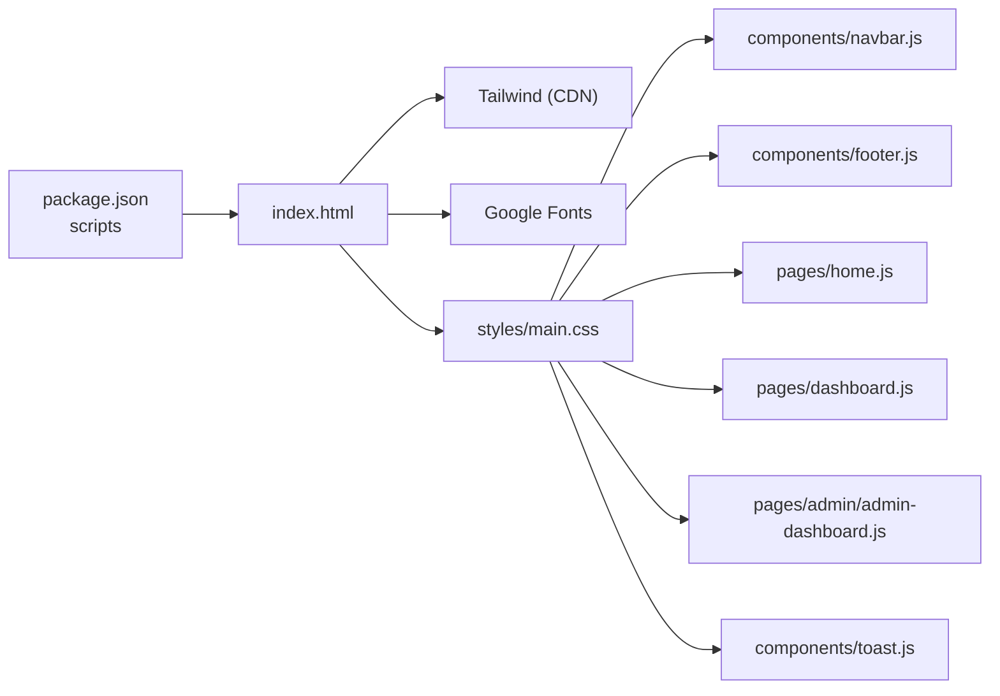

# Styling & Design System

<cite>
**Referenced Files in This Document**
- [main.css](file://styles/main.css)
- [DESIGN.md](file://DESIGN.md)
- [index.html](file://index.html)
- [package.json](file://package.json)
- [navbar.js](file://components/navbar.js)
- [footer.js](file://components/footer.js)
- [toast.js](file://components/toast.js)
- [home.js](file://pages/home.js)
- [dashboard.js](file://pages/dashboard.js)
- [admin-dashboard.js](file://pages/admin/admin-dashboard.js)
- [assessment-logic.js](file://utils/assessment-logic.js)
- [firestore.js](file://utils/firestore.js)
</cite>

## Table of Contents
1. [Introduction](#introduction)
2. [Project Structure](#project-structure)
3. [Core Components](#core-components)
4. [Architecture Overview](#architecture-overview)
5. [Detailed Component Analysis](#detailed-component-analysis)
6. [Dependency Analysis](#dependency-analysis)
7. [Performance Considerations](#performance-considerations)
8. [Troubleshooting Guide](#troubleshooting-guide)
9. [Conclusion](#conclusion)
10. [Appendices](#appendices)

## Introduction
This document describes the styling and design system implementation for the CGMI Assessment Application. It explains how IBM Carbon Design System principles are applied, how Tailwind CSS is configured and neutralized for design consistency, and how custom CSS overrides enforce a flat, enterprise-grade aesthetic. It documents the typography system using IBM Plex Sans, color schemes, spacing guidelines, and responsive patterns. It also covers component styling approaches, theme implementation, accessibility considerations, design token usage, breakpoints, cross-browser compatibility, best practices, performance optimization, and maintenance guidelines.

## Project Structure
The styling system is organized around:
- A central design specification (DESIGN.md) that defines tokens for colors, typography, spacing, shapes, and component behaviors.
- A global stylesheet (styles/main.css) that defines CSS custom properties (design tokens), base styles, component classes, and responsive patterns.
- HTML entry (index.html) that loads Tailwind CSS via CDN and extends its theme with IBM Plex Sans, then applies the custom stylesheet last to override defaults.
- Components and pages that apply Carbon-inspired class names and tokens consistently across the UI.

**Diagram sources**
- [index.html:43-61](file://index.html#L43-L61)
- [main.css:1-27](file://styles/main.css#L1-L27)
- [navbar.js:19-76](file://components/navbar.js#L19-L76)
- [home.js:10-156](file://pages/home.js#L10-L156)
- [assessment-logic.js:6-119](file://utils/assessment-logic.js#L6-L119)

**Section sources**
- [index.html:43-61](file://index.html#L43-L61)
- [main.css:1-27](file://styles/main.css#L1-L27)

## Core Components
This section outlines the foundational design system elements and how they are implemented.

- Design tokens
  - CSS custom properties define Carbon colors, typography, spacing, and corner radius tokens. These are consumed by component classes and page layouts.
  - Tokens include primary brand color, text colors, surfaces, semantic colors, font family, spacing units, and max content width.

- Typography system
  - IBM Plex Sans is the single font family across display, body, and caption scales.
  - Carbon’s letter-spacing and line-height guidance is followed for readability and brand voice.

- Color scheme
  - Canvas (white), Surface 1 (light gray), Surface 2 (medium gray), Hairline borders, and Ink text colors form the core palette.
  - Semantic colors (success, warning, error) support status states.
  - Primary brand color is used for accents, links, and primary actions.

- Spacing and layout
  - A 4px base grid drives spacing tokens and component paddings/margins.
  - Max content width is standardized to align with Carbon’s grid system.

- Component classes
  - Carbon-inspired classes encapsulate common UI patterns: buttons, panels, cards, inputs, tabs, alerts, modals, and badges.
  - Hover, focus, and active states are styled consistently with tokens.

- Responsive patterns
  - Breakpoints and grid behaviors are aligned with Carbon’s desktop/tablet/mobile expectations.
  - Media queries adjust component layouts and typography at key widths.

**Section sources**
- [main.css:1-27](file://styles/main.css#L1-L27)
- [DESIGN.md:6-127](file://DESIGN.md#L6-L127)
- [DESIGN.md:314-351](file://DESIGN.md#L314-L351)
- [main.css:292-472](file://styles/main.css#L292-L472)
- [main.css:576-580](file://styles/main.css#L576-L580)
- [main.css:293-303](file://styles/main.css#L293-L303)

## Architecture Overview
The design system architecture blends external styling (Tailwind) with internal design tokens and Carbon-inspired components.

**Diagram sources**
- [index.html:35-61](file://index.html#L35-L61)
- [main.css:661-689](file://styles/main.css#L661-L689)
- [navbar.js:19-76](file://components/navbar.js#L19-L76)
- [footer.js:6-45](file://components/footer.js#L6-L45)
- [home.js:10-156](file://pages/home.js#L10-L156)
- [dashboard.js:10-112](file://pages/dashboard.js#L10-L112)
- [admin-dashboard.js:10-75](file://pages/admin/admin-dashboard.js#L10-L75)
- [toast.js:41-82](file://components/toast.js#L41-L82)

## Detailed Component Analysis

### IBM Carbon Design System Integration
- Flat geometry and minimal decoration
  - Square corners (radius tokens) and 1px hairlines dominate UI elements.
  - No shadows, gradients, or blur utilities are used in the design system.
- Component parity
  - Buttons, inputs, cards, tabs, and badges follow Carbon’s chrome and interaction patterns.
- Accessibility alignment
  - Focus indicators and color contrasts are maintained for keyboard navigation and screen readers.

**Section sources**
- [DESIGN.md:262-280](file://DESIGN.md#L262-L280)
- [main.css:661-689](file://styles/main.css#L661-L689)
- [main.css:355-382](file://styles/main.css#L355-L382)
- [main.css:396-413](file://styles/main.css#L396-L413)

### Tailwind CSS Configuration and Overrides
- CDN-based Tailwind
  - Tailwind is loaded via CDN and extended to use IBM Plex Sans as the default sans font.
- Neutralization of conflicting utilities
  - Gradient, shadow, blur, and rounded utilities are neutralized to preserve the Carbon flat aesthetic.
- Local stylesheet precedence
  - The custom stylesheet is linked after Tailwind to override defaults and enforce design tokens.

**Section sources**
- [index.html:43-55](file://index.html#L43-L55)
- [index.html:61](file://index.html#L61)
- [main.css:661-689](file://styles/main.css#L661-L689)

### Typography System Using IBM Plex Sans
- Single font family across display, body, and caption scales.
- Letter-spacing and line-height tokens are applied consistently.
- Headlines emphasize weight 300 for display sizes to achieve the brand’s light-weight voice.

**Section sources**
- [DESIGN.md:29-108](file://DESIGN.md#L29-L108)
- [DESIGN.md:314-351](file://DESIGN.md#L314-L351)
- [index.html:35-41](file://index.html#L35-L41)

### Color Schemes and Semantic States
- Core palette
  - Canvas, Surface 1/2, Hairline, Ink, and Inverse surfaces define the interface.
- Brand and semantic colors
  - Primary blue for links and primary actions.
  - Success, warning, and error colors for feedback and status.

**Section sources**
- [DESIGN.md:6-27](file://DESIGN.md#L6-L27)
- [DESIGN.md:292-312](file://DESIGN.md#L292-L312)
- [main.css:1-16](file://styles/main.css#L1-L16)

### Spacing Guidelines and Grid System
- 4px base grid governs spacing tokens and component paddings.
- Max content width aligns with Carbon’s grid system.
- Responsive grid adjustments ensure content density and readability across breakpoints.

**Section sources**
- [DESIGN.md:118-127](file://DESIGN.md#L118-L127)
- [DESIGN.md:352-368](file://DESIGN.md#L352-L368)
- [main.css:25-26](file://styles/main.css#L25-L26)
- [main.css:576-580](file://styles/main.css#L576-L580)

### Responsive Design Patterns
- Breakpoints and collapsing strategies
  - Navigation collapses to a hamburger menu; utility bar hides on small screens.
  - Card grids adapt from 4-up to 1-up across breakpoints.
- Typography scaling
  - Display sizes scale appropriately on mobile while retaining brand weights.

**Section sources**
- [DESIGN.md:504-534](file://DESIGN.md#L504-L534)
- [main.css:293-303](file://styles/main.css#L293-L303)

### Component Styling Approaches
- Navigation bar
  - Uses Carbon classes for topbar, links, buttons, avatar, and mobile menu.
- Footer
  - Dark surface with Carbon-inspired grid and link styles.
- Toast notifications
  - Toast bars adopt Carbon’s panel and badge patterns with semantic borders.

**Section sources**
- [navbar.js:19-76](file://components/navbar.js#L19-L76)
- [footer.js:6-45](file://components/footer.js#L6-L45)
- [toast.js:41-82](file://components/toast.js#L41-L82)
- [main.css:548-646](file://styles/main.css#L548-L646)

### Theme Implementation and Design Tokens
- CSS custom properties
  - Centralized tokens for colors, typography, spacing, and radius enable consistent theming.
- Token-driven components
  - Component classes consume tokens for background, border, text, and spacing.

**Section sources**
- [main.css:1-27](file://styles/main.css#L1-L27)
- [main.css:250-270](file://styles/main.css#L250-L270)
- [main.css:337-382](file://styles/main.css#L337-L382)

### Accessibility Compliance
- Focus management
  - Inputs and buttons maintain visible focus states aligned with Carbon’s focus ring guidance.
- Contrast and readability
  - Tokens ensure sufficient contrast for text and interactive elements.
- Reduced motion support
  - Animations respect reduced motion preferences.

**Section sources**
- [main.css:410-413](file://styles/main.css#L410-L413)
- [main.css:742-747](file://styles/main.css#L742-L747)

### Cross-Browser Compatibility
- CDN-hosted Tailwind ensures modern CSS support.
- IBM Plex Sans is loaded via Google Fonts for broad browser availability.
- CSS custom properties are widely supported; fallbacks can be considered for older environments.

**Section sources**
- [index.html:35-41](file://index.html#L35-L41)
- [index.html:43-55](file://index.html#L43-L55)

### Design Token Usage Across Pages
- Dashboard and admin dashboards
  - Utilize Carbon panels, badges, and skeleton loaders.
  - Charts integrate with Carbon’s color tokens for consistent visuals.

**Section sources**
- [dashboard.js:10-112](file://pages/dashboard.js#L10-L112)
- [admin-dashboard.js:10-75](file://pages/admin/admin-dashboard.js#L10-L75)
- [assessment-logic.js:98-119](file://utils/assessment-logic.js#L98-L119)

## Dependency Analysis
The styling system depends on:
- Tailwind CSS (via CDN) for utility-first CSS.
- Google Fonts for IBM Plex Sans.
- Custom CSS for design tokens and Carbon classes.
- Component and page scripts that apply Carbon classes and tokens.

**Diagram sources**
- [package.json:2-4](file://package.json#L2-L4)
- [index.html:43-61](file://index.html#L43-L61)
- [main.css:661-689](file://styles/main.css#L661-L689)

**Section sources**
- [package.json:2-4](file://package.json#L2-L4)
- [index.html:43-61](file://index.html#L43-L61)

## Performance Considerations
- Minimize paint and layout thrashing by avoiding excessive dynamic class toggling.
- Prefer CSS custom properties for theming to reduce repaint costs.
- Keep animations lightweight and respect reduced motion preferences.
- Consolidate and deduplicate component classes to reduce CSS bundle size.

## Troubleshooting Guide
- Tailwind utilities overridden unexpectedly
  - Ensure the custom stylesheet is linked after Tailwind and uses sufficient specificity.
- Typography inconsistencies
  - Verify IBM Plex Sans is loaded and Tailwind’s font family extension is applied.
- Focus visibility issues
  - Confirm focus styles are not neutralized by global resets and that tokens provide adequate contrast.

**Section sources**
- [index.html:61](file://index.html#L61)
- [index.html:43-55](file://index.html#L43-L55)
- [main.css:661-689](file://styles/main.css#L661-L689)

## Conclusion
The CGMI Assessment Application enforces a strict, Carbon-aligned design system through centralized CSS custom properties, Carbon-inspired component classes, and a neutralized Tailwind configuration. IBM Plex Sans, a 4px spacing grid, and a constrained color palette deliver a cohesive, accessible, and scalable UI. Consistent application of tokens across components and pages ensures maintainability and predictable visual outcomes.

## Appendices

### Design Token Reference
- Colors: primary, on-primary, ink, ink-muted, ink-subtle, canvas, surface-1, surface-2, inverse-canvas, inverse-surface-1, inverse-ink, inverse-ink-muted, hairline, hairline-strong, semantic-success, semantic-warning, semantic-error, semantic-info.
- Typography: display scales (76–32px), headline, card-title, subhead, body-lg/body, body-sm/body-emphasis, caption, button, eyebrow.
- Spacing: xxs (4px), xs (8px), sm (12px), md (16px), lg (24px), xl (32px), xxl (48px), section (96px).
- Shapes: none (0px), xs (2px), sm (4px), md (6px), lg (8px), pill/full (9999px).
- Max content width: 1584px.

**Section sources**
- [DESIGN.md:6-127](file://DESIGN.md#L6-L127)
- [main.css:1-27](file://styles/main.css#L1-L27)