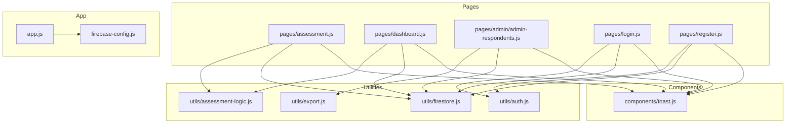
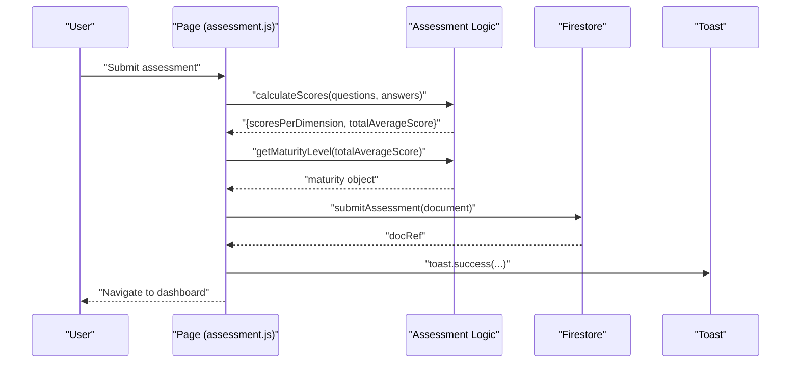
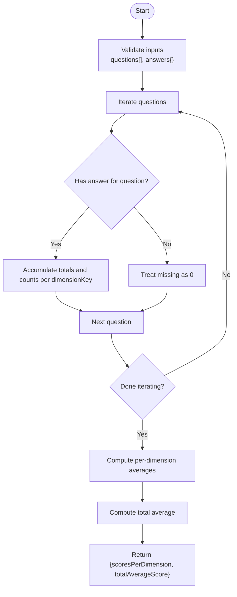
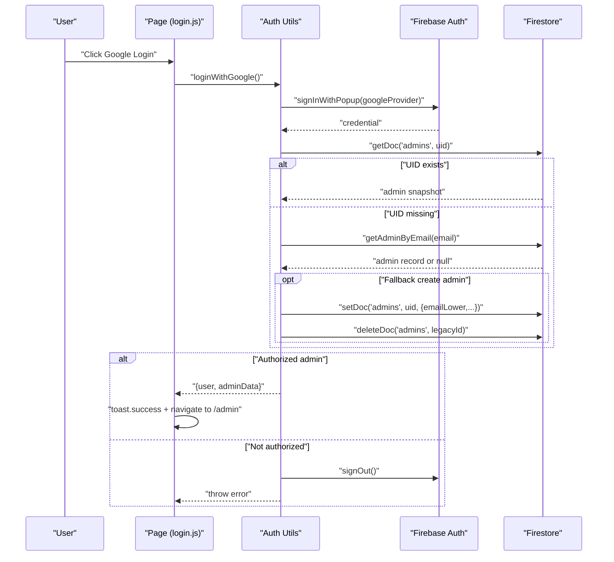
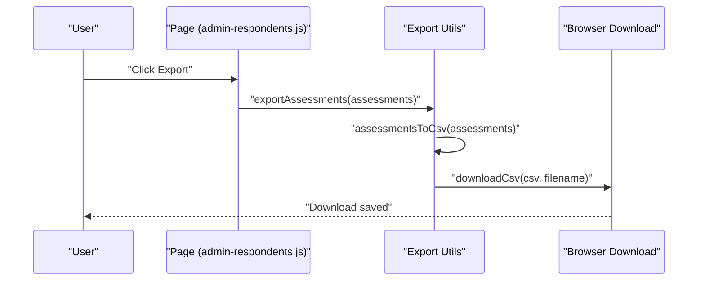
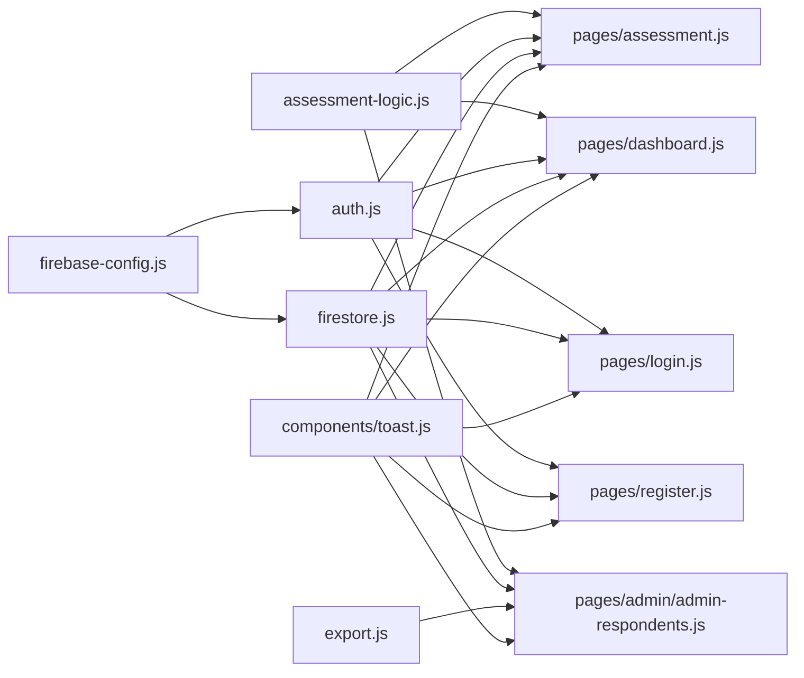

# Utility Modules

<cite>
**Referenced Files in This Document**
- [assessment-logic.js](file://utils/assessment-logic.js)
- [auth.js](file://utils/auth.js)
- [firestore.js](file://utils/firestore.js)
- [export.js](file://utils/export.js)
- [toast.js](file://components/toast.js)
- [app.js](file://app.js)
- [firebase-config.js](file://firebase-config.js)
- [assessment.js](file://pages/assessment.js)
- [dashboard.js](file://pages/dashboard.js)
- [admin-respondents.js](file://pages/admin/admin-respondents.js)
- [login.js](file://pages/login.js)
- [register.js](file://pages/register.js)
</cite>

## Table of Contents
1. [Introduction](#introduction)
2. [Project Structure](#project-structure)
3. [Core Components](#core-components)
4. [Architecture Overview](#architecture-overview)
5. [Detailed Component Analysis](#detailed-component-analysis)
6. [Dependency Analysis](#dependency-analysis)
7. [Performance Considerations](#performance-considerations)
8. [Troubleshooting Guide](#troubleshooting-guide)
9. [Conclusion](#conclusion)
10. [Appendices](#appendices)

## Introduction
This document describes the utility modules and helper functions that power the CGMI Assessment App. It focuses on:
- Authentication utilities for user and admin sessions
- Assessment logic for scoring, maturity classification, and recommendations
- Firestore operations for CRUD and seeding
- Export functionality for CSV generation and downloads
- Toast notification system for user feedback
It also explains module architecture, function signatures, parameter specifications, integration patterns, error handling, and performance considerations.

## Project Structure
The utility modules live under the utils directory and are consumed by pages and components across the application. The authentication and Firestore utilities depend on a shared Firebase configuration.

**Diagram sources**
- [assessment-logic.js](file://utils/assessment-logic.js)
- [auth.js](file://utils/auth.js)
- [firestore.js](file://utils/firestore.js)
- [export.js](file://utils/export.js)
- [toast.js](file://components/toast.js)
- [assessment.js](file://pages/assessment.js)
- [dashboard.js](file://pages/dashboard.js)
- [admin-respondents.js](file://pages/admin/admin-respondents.js)
- [login.js](file://pages/login.js)
- [register.js](file://pages/register.js)
- [app.js](file://app.js)
- [firebase-config.js](file://firebase-config.js)

**Section sources**
- [assessment-logic.js](file://utils/assessment-logic.js)
- [auth.js](file://utils/auth.js)
- [firestore.js](file://utils/firestore.js)
- [export.js](file://utils/export.js)
- [toast.js](file://components/toast.js)
- [assessment.js](file://pages/assessment.js)
- [dashboard.js](file://pages/dashboard.js)
- [admin-respondents.js](file://pages/admin/admin-respondents.js)
- [login.js](file://pages/login.js)
- [register.js](file://pages/register.js)
- [app.js](file://app.js)
- [firebase-config.js](file://firebase-config.js)

## Core Components
- Assessment logic: constants, scoring, maturity levels, and recommendations
- Authentication: user registration/login, admin Google login, session persistence
- Firestore: CRUD for questions, assessments, users, and admins
- Export: CSV conversion and browser download
- Toast notifications: non-blocking UI feedback

**Section sources**
- [assessment-logic.js](file://utils/assessment-logic.js)
- [auth.js](file://utils/auth.js)
- [firestore.js](file://utils/firestore.js)
- [export.js](file://utils/export.js)
- [toast.js](file://components/toast.js)

## Architecture Overview
The app initializes Firebase, sets up routing and guards, and integrates utilities for authentication, assessment scoring, data persistence, and exports. Pages import and use these utilities to implement user flows.

**Diagram sources**
- [assessment.js](file://pages/assessment.js)
- [assessment-logic.js](file://utils/assessment-logic.js)
- [firestore.js](file://utils/firestore.js)
- [toast.js](file://components/toast.js)

## Detailed Component Analysis

### Assessment Logic Utilities
Responsibilities:
- Define assessment dimensions, Likert labels, default questions, maturity thresholds, and recommendations
- Compute per-dimension averages and overall average
- Classify maturity level by score range
- Generate targeted recommendations for low-scoring dimensions

Key exports and parameters:
- Constants
  - DIMENSIONS: array of { key, label }
  - LIKERT_LABELS: mapping of 1..5 to descriptive labels
  - DEFAULT_QUESTIONS: array of question objects with id, dimension, dimensionKey, order, text
  - MATURITY_LEVELS: array of { min, max, level, label, color, bg, badge, icon, description }
  - RECOMMENDATIONS: object keyed by dimension key with label, threshold, text, icon
- Functions
  - getMaturityLevel(score): returns maturity object by score range
  - calculateScores(questions, answers): returns { scoresPerDimension, totalAverageScore }
  - getRecommendations(scoresPerDimension): returns array of recommendation objects

Processing logic highlights:
- Scoring aggregates Likert answers per dimension and computes averages
- Maturity classification uses inclusive bounds per level range
- Recommendations filter dimensions below threshold and return label, icon, and advice text

Usage examples:
- Pages compute scores and maturity after submission
- Dashboard renders maturity badge and recommendations
- Admin dashboard uses maturity classification for statistics

**Section sources**
- [assessment-logic.js](file://utils/assessment-logic.js)
- [assessment.js](file://pages/assessment.js)
- [dashboard.js](file://pages/dashboard.js)
- [admin-respondents.js](file://pages/admin/admin-respondents.js)

#### Scoring Algorithm Flow

**Diagram sources**
- [assessment-logic.js](file://utils/assessment-logic.js)

### Authentication Utilities
Responsibilities:
- User registration with generated UUID and 6-digit Kode Akses
- User login via Kode Akses lookup
- Admin login via Google OAuth with UID or email whitelist fallback
- Session persistence in localStorage for users
- Role and profile retrieval from Firestore
- Auth state listener for reactive UI updates

Key exports and parameters:
- registerUser({ instansi, lamaBekerja, jabatan }): returns { uuid, kodeAkses, ... }
- loginWithKodeAkses(kodeAkses): resolves to user profile or throws
- loginWithGoogle(): resolves to { user, adminData } or throws
- logout(): Firebase sign-out
- logoutUser(): clears localStorage
- saveUserSession(profile)
- getUserSession(): returns parsed profile or null
- getUserRole(uid): returns 'admin' or 'user'
- getUserProfile(uid): returns merged admin/user profile
- onAuthStateChanged(callback): subscribes to auth state changes

Integration patterns:
- Pages call registerUser and loginWithKodeAkses during onboarding and login
- App initializes auth state listener and route guards
- Admin Google login triggers role resolution and navigation

**Section sources**
- [auth.js](file://utils/auth.js)
- [login.js](file://pages/login.js)
- [register.js](file://pages/register.js)
- [app.js](file://app.js)
- [firebase-config.js](file://firebase-config.js)

#### Authentication Flow (Google Admin)

**Diagram sources**
- [login.js](file://pages/login.js)
- [auth.js](file://utils/auth.js)
- [firebase-config.js](file://firebase-config.js)

### Firestore Utilities
Responsibilities:
- Manage questions: list, add, update, delete, seed defaults
- Manage assessments: submit, list by user, latest, list all, get by id
- Manage users: get, list, find by Kode Akses, save profile
- Manage admins: list, add, delete, check email, get by email (with normalization and fallbacks)

Key exports and parameters:
- Questions
  - getQuestions(): returns ordered questions
  - addQuestion(data): adds with createdAt
  - updateQuestion(id, data)
  - deleteQuestion(id)
  - seedQuestions(defaultQuestions): seeds if empty
- Assessments
  - submitAssessment(data): adds with submittedAt
  - getUserAssessments(userId): list sorted desc
  - getLatestAssessment(userId): single latest
  - getAllAssessments(): list sorted desc
  - getAssessmentById(id)
- Users
  - getUser(uid)
  - getAllUsers()
  - findUserByKodeAkses(kodeAkses)
  - saveUserProfile(uuid, data)
- Admins
  - getAllAdmins()
  - addAdmin(uid, data): normalizes email and adds metadata
  - deleteAdmin(uid)
  - isAdminEmail(email)
  - getAdminByEmail(email): tries direct fetch then query fallbacks

Error handling patterns:
- Graceful fallbacks for admin email lookup
- Defensive checks for existence before operations
- Normalization of emails to reduce duplicates

**Section sources**
- [firestore.js](file://utils/firestore.js)

### Export Utilities
Responsibilities:
- Convert assessment results to CSV with standardized headers
- Trigger browser download of CSV with UTF-8 BOM for Excel compatibility
- One-shot export helper to build and download CSV

Key exports and parameters:
- assessmentsToCsv(assessments): returns CSV string
- downloadCsv(csvContent, filename): creates Blob and triggers download
- exportAssessments(assessments): convenience wrapper

CSV structure:
- Columns include respondent metadata, per-dimension scores, total average, and maturity label

**Section sources**
- [export.js](file://utils/export.js)
- [admin-respondents.js](file://pages/admin/admin-respondents.js)

#### Export Workflow

**Diagram sources**
- [admin-respondents.js](file://pages/admin/admin-respondents.js)
- [export.js](file://utils/export.js)

### Toast Notification System
Responsibilities:
- Create a fixed-position container for toast messages
- Render toasts with icons and close buttons
- Animate appearance/disappearance with CSS transitions
- Provide convenience methods for different message types

Key exports and parameters:
- showToast(message, type = 'info', duration = 4000)
- toast.success / error / info / warning

Integration patterns:
- Used across pages for user feedback on successful actions, warnings, and errors

**Section sources**
- [toast.js](file://components/toast.js)
- [assessment.js](file://pages/assessment.js)
- [dashboard.js](file://pages/dashboard.js)
- [admin-respondents.js](file://pages/admin/admin-respondents.js)
- [login.js](file://pages/login.js)
- [register.js](file://pages/register.js)

## Dependency Analysis
Module-level dependencies:
- assessment-logic.js is imported by pages that render dashboards and process assessments
- auth.js depends on firebase-config.js and firestore.js for admin/user lookups
- firestore.js depends on firebase-config.js for database access
- export.js is used by admin pages for CSV export
- toast.js is used by all pages for user feedback

**Diagram sources**
- [firebase-config.js](file://firebase-config.js)
- [auth.js](file://utils/auth.js)
- [firestore.js](file://utils/firestore.js)
- [assessment-logic.js](file://utils/assessment-logic.js)
- [export.js](file://utils/export.js)
- [toast.js](file://components/toast.js)
- [assessment.js](file://pages/assessment.js)
- [dashboard.js](file://pages/dashboard.js)
- [admin-respondents.js](file://pages/admin/admin-respondents.js)
- [login.js](file://pages/login.js)
- [register.js](file://pages/register.js)

**Section sources**
- [assessment-logic.js](file://utils/assessment-logic.js)
- [auth.js](file://utils/auth.js)
- [firestore.js](file://utils/firestore.js)
- [export.js](file://utils/export.js)
- [toast.js](file://components/toast.js)
- [assessment.js](file://pages/assessment.js)
- [dashboard.js](file://pages/dashboard.js)
- [admin-respondents.js](file://pages/admin/admin-respondents.js)
- [login.js](file://pages/login.js)
- [register.js](file://pages/register.js)
- [firebase-config.js](file://firebase-config.js)

## Performance Considerations
- Assessment scoring
  - Aggregation uses a single pass over questions; complexity O(n)
  - Averages computed once per dimension and overall
- Firestore operations
  - Queries use ordering and limits where appropriate to reduce load
  - Email-based admin lookup includes direct fetch and fallback queries
- Export
  - CSV generation is linear in number of assessments
  - Browser download uses Blob URL; ensure large datasets are paginated or batched in UI
- Toast
  - DOM manipulation is minimal; close handlers remove nodes after transitions

[No sources needed since this section provides general guidance]

## Troubleshooting Guide
Common issues and resolutions:
- Authentication
  - Kode Akses not found: ensure correct input and that the user exists in Firestore
  - Google login unauthorized: verify admin whitelist by UID or email
  - Session conflicts: user session stored in localStorage overrides Firebase for non-admins
- Assessment submission
  - Missing answers: ensure all questions answered before submission
  - Score anomalies: verify answers map to Likert scale and questions align with DEFAULT_QUESTIONS
- Export
  - Empty dataset: prompt user to collect assessments first
  - Download fails: check browser support for Blob and download attributes
- Firestore
  - Email lookup failures: rely on fallback query paths; confirm email normalization

**Section sources**
- [assessment.js](file://pages/assessment.js)
- [login.js](file://pages/login.js)
- [register.js](file://pages/register.js)
- [export.js](file://utils/export.js)
- [auth.js](file://utils/auth.js)
- [firestore.js](file://utils/firestore.js)

## Conclusion
The utility modules provide cohesive, reusable functionality across the application:
- Assessment logic encapsulates domain rules for scoring and maturity
- Authentication utilities manage dual-mode login and session persistence
- Firestore utilities centralize data access patterns with robust fallbacks
- Export utilities streamline reporting for administrators
- Toast notifications deliver consistent user feedback

These modules are designed for composability and testability, enabling clear separation of concerns and straightforward integration with page components.

[No sources needed since this section summarizes without analyzing specific files]

## Appendices

### Function Reference Summary
- Assessment Logic
  - getMaturityLevel(score)
  - calculateScores(questions, answers)
  - getRecommendations(scoresPerDimension)
- Authentication
  - registerUser({ instansi, lamaBekerja, jabatan })
  - loginWithKodeAkses(kodeAkses)
  - loginWithGoogle()
  - logout()
  - logoutUser()
  - saveUserSession(profile)
  - getUserSession()
  - getUserRole(uid)
  - getUserProfile(uid)
  - onAuthStateChanged(callback)
- Firestore
  - getQuestions()
  - addQuestion(data)
  - updateQuestion(id, data)
  - deleteQuestion(id)
  - seedQuestions(defaultQuestions)
  - submitAssessment(data)
  - getUserAssessments(userId)
  - getLatestAssessment(userId)
  - getAllAssessments()
  - getAssessmentById(id)
  - getUser(uid)
  - getAllUsers()
  - findUserByKodeAkses(kodeAkses)
  - saveUserProfile(uuid, data)
  - getAllAdmins()
  - addAdmin(uid, data)
  - deleteAdmin(uid)
  - isAdminEmail(email)
  - getAdminByEmail(email)
- Export
  - assessmentsToCsv(assessments)
  - downloadCsv(csvContent, filename)
  - exportAssessments(assessments)
- Toast
  - showToast(message, type, duration)
  - toast.success(message, duration?)
  - toast.error(message, duration?)
  - toast.info(message, duration?)
  - toast.warning(message, duration?)

**Section sources**
- [assessment-logic.js](file://utils/assessment-logic.js)
- [auth.js](file://utils/auth.js)
- [firestore.js](file://utils/firestore.js)
- [export.js](file://utils/export.js)
- [toast.js](file://components/toast.js)